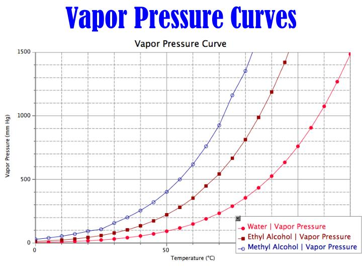

# 蒸发能力与蒸汽压 / Volatility and Vapor Pressure

## 一、核心概念 / Core Concepts

- **蒸发能力（Volatility）**：指物质自液相逃逸至气相的倾向，蒸发能力越高，液体越容易在常温下挥发。  
  Volatility describes a substance's tendency to escape from the liquid phase into the gas phase; higher volatility means easier evaporation at ambient conditions.
- **蒸汽压（Vapor Pressure）**：在封闭体系中，液体与其蒸汽达到动态平衡时的气相压力，反映了液体分子逃逸与回归速率的平衡结果。  
  Vapor pressure is the gas-phase pressure exerted when a liquid and its vapor reach dynamic equilibrium in a closed system; it captures the balance between molecular escape and return.
- **联系 / Relationship**：蒸发能力强的液体在给定温度下拥有更高的平衡蒸汽压，因为更多分子能够克服分子间作用力进入气相。  
  Highly volatile liquids exhibit higher equilibrium vapor pressures at a fixed temperature because more molecules surmount intermolecular attractions to enter the gas phase.

## 二、影响蒸发能力的因素 / Factors Shaping Volatility

- **分子间作用力强度 / Intermolecular Forces**：作用力越弱（见 [[intermolecular_forces]]），越容易蒸发；因此非极性、小分子或仅有分散力的液体通常更易挥发。  
  Weaker intermolecular forces (see [[intermolecular_forces]]) yield higher volatility; nonpolar, low-mass liquids dominated by dispersion forces thus vaporize readily.
- **摩尔质量与分子表面积 / Molar Mass and Surface Area**：较小质量与紧凑表面的分子所需克服的势能较低，易形成高蒸汽压。  
  Molecules with lower molar mass and compact surface area overcome the potential well more easily, producing higher vapor pressure.
- **温度 / Temperature**：温度上升使更多分子拥有足够动能克服束缚，从而同时提升蒸发能力与蒸汽压。  
  As temperature rises, more molecules gain sufficient kinetic energy to escape, boosting both volatility and vapor pressure.

## 三、蒸汽压与温度关系 / Vapor Pressure–Temperature Relationship

- **动态平衡图像 / Dynamic Equilibrium Picture**：
  
- **克劳修斯–克拉珀龙方程 / Clausius–Clapeyron Equation**：  
  $$\ln P=-\frac{\Delta H_{\text{vap}}}{RT}+C$$  
  线性近似表明 $\ln P$ 与 $1/T$ 呈线性关系，斜率由汽化焓决定。  
  The linearized form shows $\ln P$ varies linearly with $1/T$, with slope set by the enthalpy of vaporization.
- **沸点定义 / Boiling Point Definition**：当蒸汽压等于外压时液体开始沸腾；外压降低会降低沸点、提高相对挥发度。  
  Boiling occurs when vapor pressure equals external pressure; lowering external pressure lowers the boiling point and effectively increases volatility.

## 五、学习提示 / Study Tips

- 结合蒸发能力与蒸汽压的定量表达式回顾相图与相变热力学，形成跨章节理解。  
  Pair the quantitative expressions for volatility and vapor pressure with phase diagrams and phase-change thermodynamics for cross-topic insight.
- 本条整理自今日日记 [[journal/2025-10-29]]，可与课堂讲义互证。  
  Notes distilled from today's journal entry [[journal/2025-10-29]], cross-check with lecture materials for reinforcement.

[//begin]: # "Autogenerated link references for markdown compatibility"
[intermolecular_forces]: intermolecular_forces.md "分子间作用力（IMFs）/ Intermolecular Forces (Lecture 19, CHEM 110B)"
[journal/2025-10-29]: ../../journal/2025-10-29.md "2025-10-29"
[//end]: # "Autogenerated link references"
