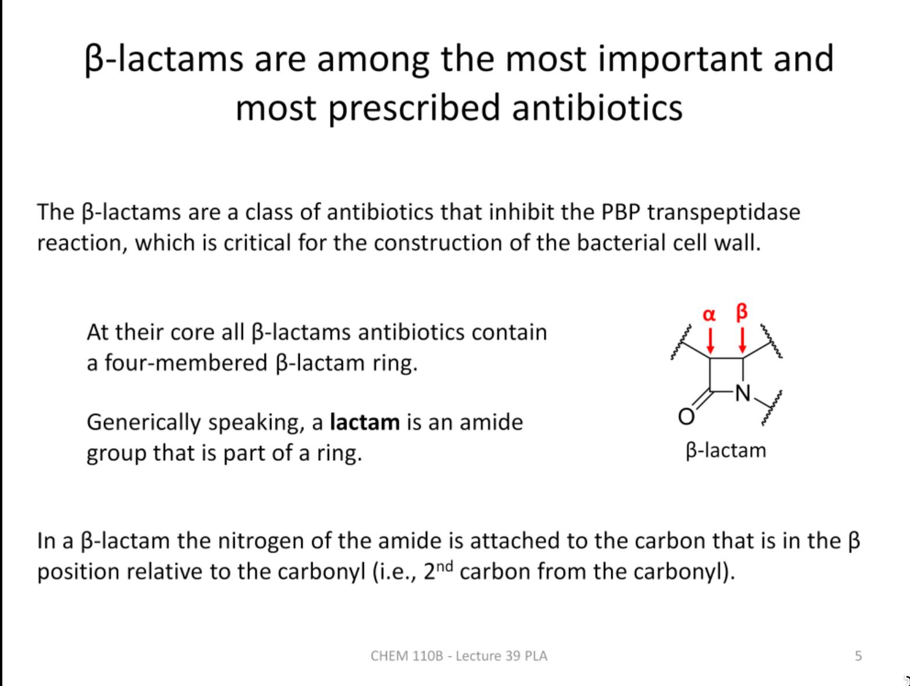
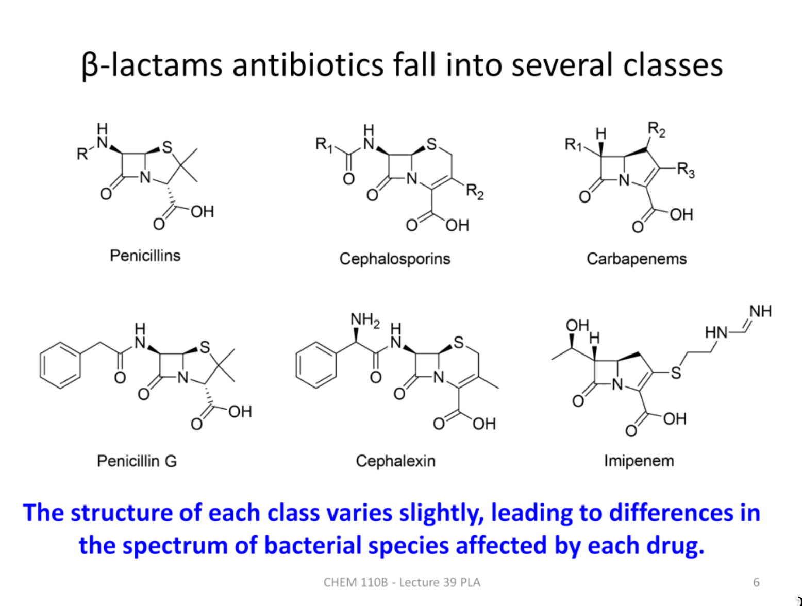
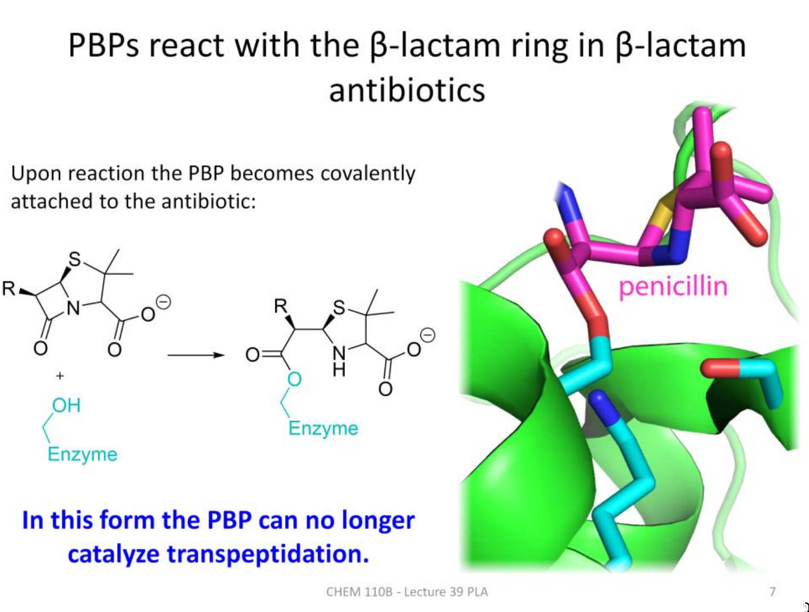

# 抗生素、β-内酰胺与万古霉素 / Antibiotics, β-Lactams, and Vancomycin

## 1. 抗生素概览 / Antibiotic Overview

- 定义：抗生素通常指抑制或杀灭细菌的“小分子药物”（常见分子量<1000g/mol）。  
  Definition: Antibiotics commonly refer to small-molecule drugs that inhibit or kill bacteria (often MW<1000g/mol).
- 历史脉络：1930年代磺胺类开启临床，1940年代青霉素推动“黄金时代”，后续几十年发现大量新抗生素。  
  Timeline: sulfonamides (1930s) → penicillin (1940s) → a “golden age” of discovery.
- 医疗意义：降低感染致死率、显著降低手术风险，并提升寿命与生活质量。  
  Impact: reduced mortality from infection, enabled safer surgery, improved longevity and quality of life.

## 2. 耐药性 / Antibiotic Resistance

- 定义：耐药性源于遗传变异在抗生素选择压力下被快速富集。  
  Definition: resistance arises when genetic variation is enriched under antibiotic selection.
- 常见机制：通透性下降、转运蛋白改变、外排泵、靶点蛋白/RNA微调以降低结合、代谢或化学失活药物。  
  Mechanisms: reduced permeability, transporter changes, efflux pumps, target modification, and drug inactivation.

## 3. β-内酰胺类（β-Lactams）/ β-Lactam Drugs

### 核心结构 / Core Structure

β-内酰胺环为应力四元环；“β”表示从羰基碳算起第二个碳与酰胺氮成环。  
The β-lactam ring is a strained four-member ring; “β” refers to the second carbon from the carbonyl bonding to the amide nitrogen.

### 作用机制 / Mechanism

- 关键靶点：PBP（penicillin-binding proteins）催化细胞壁跨肽化（交联）。  
  Target: PBPs catalyze cell-wall transpeptidation (crosslinking).
- 机理要点：β-内酰胺在形状/化学上模仿细胞壁前体，与PBP活性位结合并开环，形成近不可逆加合物，从而阻断跨肽化。  
  Key idea: β-lactams mimic cell-wall precursors, react at the PBP active site via ring opening, and block transpeptidation.

## 4. β-内酰胺酶 / β-Lactamases

- 功能：以水解方式开环、失活β-内酰胺，从而保护细菌。  
  Function: hydrolyze and inactivate β-lactams.
- 进化线索：序列与折叠与PBP相似，提示可能由PBP演化而来。  
  Evolution: similarity to PBPs suggests evolutionary relatedness.
- 活性位差异：β-内酰胺酶常含额外的催化Glu，有利于释放产物并实现重复催化。  
  Active-site contrast: β-lactamases often include an extra catalytic Glu enabling turnover.

## 5. 万古霉素 / Vancomycin

- 机理：不直接抑制PBP，而是通过多重氢键结合肽聚糖前体的D-Ala-D-Ala末端，物理阻挡跨肽化。  
  Mechanism: binds D-Ala-D-Ala via multiple H-bonds to physically block transpeptidation (instead of targeting PBPs).
- 耐药获得：通过一套基因将末端从D-Ala-D-Ala改为D-Ala-D-Lac，丢失关键氢键，结合亲和力显著下降。  
  Resistance: gene cassette converts D-Ala-D-Ala → D-Ala-D-Lac, losing a key H-bond and lowering binding affinity.

## 6. 速记 / Quick Review

- β-内酰胺：抑制PBP跨肽化；耐药常见β-内酰胺酶开环失活。  
  β-lactams: inhibit PBP transpeptidation; resistance often via β-lactamase hydrolysis.
- 万古霉素：通过结合D-Ala-D-Ala阻断交联；耐药通过D-Ala-D-Lac替换降低结合。  
  Vancomycin: binds D-Ala-D-Ala; resistance via D-Ala-D-Lac substitution.

**来源 / Source**  
[[journal/2025-12-01]] · [[journal/2025-12-03]]

[//begin]: # "Autogenerated link references for markdown compatibility"
[//end]: # "Autogenerated link references"

