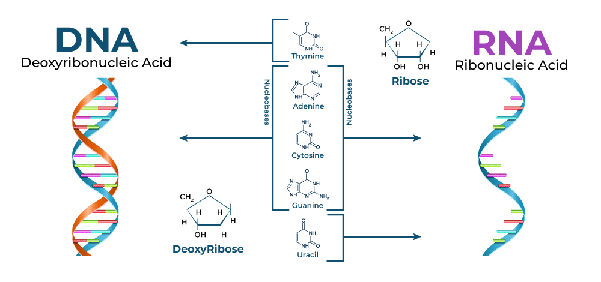
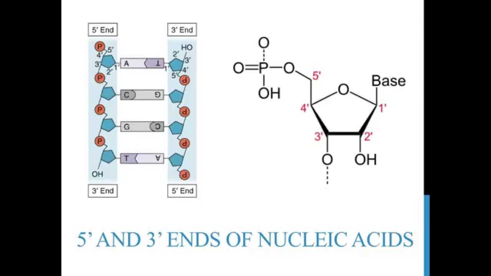

# 核酸与核苷酸基础 / Nucleic Acids and Nucleotides

## 基本概念 / Core Concepts

- 概念：核酸包括 DNA 与 RNA；名称源于最早在细胞核中发现，糖-磷酸骨架呈酸性。  
  Concept: Nucleic acids include DNA and RNA; named for discovery in the nucleus, with an acidic sugar–phosphate backbone.
- 单体：核苷酸由三部分构成——戊糖、磷酸基、含氮碱基；信息由单体连接顺序编码。  
  Monomer: A nucleotide has three parts—pentose sugar, phosphate, and nitrogenous base; information is encoded by monomer order.
- 骨架：糖-磷酸骨架基本不变，变异主要体现在碱基序列。  
  Backbone: The sugar–phosphate backbone is invariant; variation lies in base sequence.

## DNA 与 RNA 的关键差异 / Key DNA–RNA Differences

- 糖的差异：RNA 为核糖，DNA 为 2'-脱氧核糖（2' 位 H 取代 OH）。  
  Sugar: RNA uses ribose; DNA uses 2'-deoxyribose (H replaces OH at 2').
- 链数差异：细胞中 DNA 通常双链，RNA 通常单链。  
  Strandedness: Cellular DNA is typically double‑stranded, RNA single‑stranded.
- 记号与方向：糖碳编号用撇号（1'–5'），用于描述多核苷酸链的方向性。  
  Notation & direction: Sugar carbons use primes (1'–5'), underpinning chain directionality.

## 含氮碱基 / Nitrogenous Bases

- 两大类：嘌呤（双环）与嘧啶（单环）。  
  Two classes: purines (bicyclic) and pyrimidines (single ring).
- 名称：嘌呤 A、G；嘧啶 C、T、U（T 主要见于 DNA，U 主要见于 RNA）。  
  Names: Purines A,G; pyrimidines C,T,U (T in DNA, U in RNA).
- 芳香性与平面性：多为 sp2 杂化，平面结构有利于堆叠与配对。  
  Aromatic planarity: mostly sp2; planarity favors stacking and pairing.

## 相关 / Related

- 概览：[[Chemistry/7.Biological_Macromolecules/biological_macromolecules_overview]]  
  Overview: [[Chemistry/7.Biological_Macromolecules/biological_macromolecules_overview]]
- 回链 / Backlink：[[journal/2025-10-17]]  
  Backlink to source: [[journal/2025-10-17]]

[//begin]: # "Autogenerated link references for markdown compatibility"
[Chemistry/7.Biological_Macromolecules/biological_macromolecules_overview]: biological_macromolecules_overview.md "生物大分子概览 / Biological Macromolecules Overview"
[//end]: # "Autogenerated link references"
