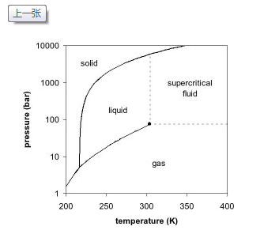

# CO2 相图 / CO2 Phase Diagram

## 坐标与相界 / Axes and Boundaries
- 横轴：温度 $T$（K）；纵轴：压力 $P$（atm，对数刻度） / Horizontal axis: temperature $T$ (K); vertical axis: pressure $P$ (atm, logarithmic scale).
- 升华线自固相区域通向三相点；汽化线连接三相点与临界点；熔化线近乎竖直向上延伸 / The sublimation line links the solid region to the triple point; the vaporization line runs from the triple point to the critical point; the fusion line climbs almost vertically upward.
- 三相点右上方为超临界流体，液气边界消失；各区域标注为 Solid、Liquid、Gas / Above and to the right of the critical point lies the supercritical fluid where the liquid-gas boundary vanishes; regions are labeled Solid, Liquid, Gas.

## 关键数值 / Key Numbers
- 三相点：216.58 K，5.117 atm（约 -56.6 °C）→ $P<5.12$ atm 时不存在液态 CO2 / Triple point: 216.58 K, 5.117 atm (~ -56.6 °C) → when $P<5.12$ atm liquid CO2 cannot exist.
- 临界点：304.18 K，72.835 atm（约 31.0 °C）→ 超过该点进入超临界 CO2 / Critical point: 304.18 K, 72.835 atm (~31.0 °C) → beyond this point the fluid becomes supercritical CO2.
- 1 atm 下干冰约 194.7 K（-78.5 °C）升华→ 沿升华线固→气，无液态 / At 1 atm dry ice sublimates near 194.7 K (-78.5 °C) → it follows the sublimation line from solid to gas with no liquid phase.

## 情景判断 / Scenario Checks
- 等压升温：若压强低于 5.12 atm，横向穿过升华线，固体直接升华 / Isobaric heating: if pressure is below 5.12 atm, moving right crosses the sublimation line and solid goes straight to gas.
- 等温升压：要获得液态 CO2，需升至约 60–70 atm 接近汽化线 / Isothermal compression: to obtain liquid CO2, raise pressure to roughly 60–70 atm near the vaporization boundary.
- 固态加压：CO2 熔化线正斜率，升压抬高熔点，无法像冰那样靠压强快速融化 / Pressurizing the solid: CO2 has a positive-slope fusion line, so increasing pressure elevates the melting point rather than melting like ice.

## 与水比较 / Comparison with Water
- 水的固-液线负斜率，压强升高促使冰熔化；CO2 的固-液线正斜率，升压反而抬高熔点 / Water’s solid-liquid line slopes negatively so more pressure melts ice; CO2’s fusion line slopes positively so pressure raises the melting point.
- Clapeyron 方程：$\tfrac{dP}{dT}=\tfrac{\Delta H}{T\Delta V}$；CO2 熔化 $\Delta V>0$ 因固体更致密故斜率>0，水的 $\Delta V<0$ 导致斜率<0 / Clapeyron equation: $\tfrac{dP}{dT}=\tfrac{\Delta H}{T\Delta V}$; for CO2 melting $\Delta V>0$ because the solid is denser so the slope is positive, while for water $\Delta V<0$ giving a negative slope.

## 概念术语 / Key Terms
- 升华：固⇄气，常温常压下干冰自发升华 / Sublimation: solid⇄gas; at ambient conditions dry ice sublimates spontaneously.
- 汽化/凝结：液⇄气，仅在 $P\geq5.12$ atm 且 $T<304$ K 的汽化线上发生 / Vaporization/condensation: liquid⇄gas transitions occur only along the vaporization curve when $P\geq5.12$ atm and $T<304$ K.
- 超临界 CO2 兼具气体扩散性与液体溶解力，应用于脱咖啡因、超临界萃取、精密清洗、灭火系统 / Supercritical CO2 combines gas-like diffusivity with liquid-like solvency, used in decaffeination, supercritical extraction, precision cleaning, and fire suppression.

## 作图答题思路 / Problem Approach
1. 明确题目给定的 $(T,P)$ 落在哪个区域或相界 / Identify which region or boundary contains the specified $(T,P)$ conditions.
2. 若路径跨越相界，指出对应的相变并命名（升华、熔化、汽化等） / When the path crosses a boundary, name the associated phase change (sublimation, fusion, vaporization, etc.).
3. 等压或等温过程中，追踪轨迹与哪条相界相交来判断何时发生转变 / For isobaric or isothermal moves, track where the path intersects boundaries to locate phase transitions.
4. 涉及压强影响时，通过固-液线斜率方向判定升压是否促进熔化 / When discussing pressure effects, use the fusion-line slope direction to decide whether higher pressure promotes melting.

## 记忆锚点 / Memory Hooks
- “5.12 atm 才见到液态，31 °C 与 73 atm 是终点” / “Liquid appears only above 5.12 atm; 31 °C and 73 atm mark the endpoint.”
- “CO2 固-液线向上倾，升压只会抬熔点” / “CO2’s fusion line tilts upward, so pressure only raises the melting point.”
- “常压干冰只固⇄气，无液态停留” / “At ambient pressure dry ice cycles solid⇄gas with no liquid stop.”

## 相关 / Related
- [[Chemistry/8.Gases/gases_and_kmt]]

## 来源 / Sources
- 日志反链 / Backlink: [[journal/2025-10-29]]
- 图示参照课堂相图或实验测定数据 / Diagram reference: consult lecture phase diagram or experimental datasets.

[//begin]: # "Autogenerated link references for markdown compatibility"
[Chemistry/8.Gases/gases_and_kmt]: gases_and_kmt.md "气体与动理论 / Gases and Kinetic Molecular Theory"
[journal/2025-10-29]: ../../journal/2025-10-29.md "2025-10-29"
[//end]: # "Autogenerated link references"
