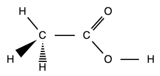

# 基础化学概念：原子与摩尔

> 本笔记整理自 [[Daily Notes/2025-08-27|2025-08-27 日记]]

## 原子基础 / Atomic Basics

### 什么是原子？ / What is an atom?

原子是构成物质的基本单位。每个原子由原子核和核外电子组成。原子核由带正电的质子和不带电的中子组成，电子带负电，围绕原子核运动。不同元素的原子具有不同数量的质子，这决定了元素的性质。原子是化学反应中不可再分的最小粒子，但在核反应中可以进一步分解。

An atom is the basic unit of matter. Each atom consists of a nucleus and electrons outside the nucleus. The nucleus is made up of positively charged protons and neutral neutrons, while negatively charged electrons move around the nucleus. Atoms of different elements have different numbers of protons, which determines the properties of the element. Atoms are the smallest particles that cannot be further divided in chemical reactions, but they can be split in nuclear reactions.

---

## 原子质量单位 / Atomic Mass Unit

### 原子质量单位（AMU）是什么？ / What is Atomic Mass Unit (AMU)?

原子质量单位（AMU，Atomic Mass Unit），也称为统一原子质量单位（u），是用于表示原子和分子质量的标准单位。1 AMU 被定义为一个碳-12 原子质量的 1/12。

The atomic mass unit (AMU), also called unified atomic mass unit (u), is a standard unit for expressing the mass of atoms and molecules. 1 AMU is defined as one twelfth of the mass of a carbon-12 atom.

- 1 AMU ≈ $1.660 \times 10^{-27}$ 千克 (kg)
- 1 AMU ≈ $1.660 \times 10^{-24}$ 克 (g)

---

## 原子质量的组成 / What makes up the atomic mass?

原子的质量主要由原子核中的质子和中子决定。电子的质量非常小，可以忽略不计。

The mass of an atom is mainly determined by the protons and neutrons in the nucleus. The mass of electrons is very small and can be neglected.

- 质子质量 ≈ 1 AMU  
  Mass of a proton ≈ 1 AMU
- 中子质量 ≈ 1 AMU  
  Mass of a neutron ≈ 1 AMU
- 电子质量 ≈ 0.0005 AMU（极小）  
  Mass of an electron ≈ 0.0005 AMU (very small)

因此，原子的相对原子质量（atomic mass）大约等于其质子数和中子数之和。

Therefore, the relative atomic mass of an atom is approximately equal to the sum of its protons and neutrons.

### 例子 / Example:
- 氢原子（1 个质子，0 个中子）：原子质量约为 1 AMU  
  Hydrogen atom (1 proton, 0 neutron): atomic mass ≈ 1 AMU
- 碳-12 原子（6 个质子，6 个中子）：原子质量约为 12 AMU  
  Carbon-12 atom (6 protons, 6 neutrons): atomic mass ≈ 12 AMU

---

## 相对丰度 / Relative Abundances

### 什么是相对丰度？ / What is Relative Abundances?

相对丰度是指元素的不同同位素在自然界中的存在百分比。

Relative abundances refer to the percentages of different isotopes of an element found in nature.

用于计算平均原子质量：平均原子质量 = Σ(同位素质量 × 相对丰度)

Used to calculate average atomic mass: Average atomic mass = Σ(isotope mass × relative abundance)

### 例子：氯 / Example: Chlorine
- 氯-35: 75.8%, 氯-37: 24.2%
- 平均原子质量 = (34.97 × 0.758) + (36.97 × 0.242) = 35.45 AMU

---

## 分子表示法 / Molecular Representation

### 分子式（Molecular Formula）
表示分子中各元素的种类和数量。  
Shows the types and numbers of atoms in a molecule.  
例/Example：水 H₂O，二氧化碳 CO₂

### 结构式（Structural Formula）
表示原子在分子中的连接方式。  
Shows how atoms are connected in a molecule.

---

## 摩尔概念 / The Concept of Mole

### 摩尔（mol）的概念 / The Concept of Mole (mol)

摩尔（mol）是物质的量的基本单位。1 mol 表示含有 $6.02 \times 10^{23}$ 个微粒（如原子、分子、离子等），这个数叫做阿伏伽德罗常数。

Mole (mol) is the basic unit for the amount of substance. 1 mol means $6.02 \times 10^{23}$ particles (such as atoms, molecules, ions, etc.), which is called Avogadro's number.

- 1 mol 水分子 = $6.02 \times 10^{23}$ 个水分子  
  1 mol of water molecules = $6.02 \times 10^{23}$ water molecules

### 摩尔质量（Molar Mass）
1 mol 物质的质量，单位：g/mol。数值等于相对分子质量。

Mass of 1 mol of substance, unit: g/mol. Equal to relative molecular mass.

- 例如：H₂O 的摩尔质量 = 18 g/mol  
  Example: Molar mass of H₂O = 18 g/mol

### 摩尔的用途 / Uses of Mole
摩尔用于计算物质的量、微粒数和质量之间的关系。

Mole is used to calculate the relationship between amount of substance, number of particles, and mass.

- 质量 = 摩尔数 × 摩尔质量  
  Mass = Moles × Molar mass
- 微粒数 = 摩尔数 × 阿伏伽德罗常数  
  Number of particles = Moles × Avogadro's number

---

[//begin]: # "Autogenerated link references for markdown compatibility"
[Daily Notes/2025-08-27|2025-08-27 日记]: <../Daily Notes/2025-08-27.md> "2025-08-27"
[//end]: # "Autogenerated link references"
