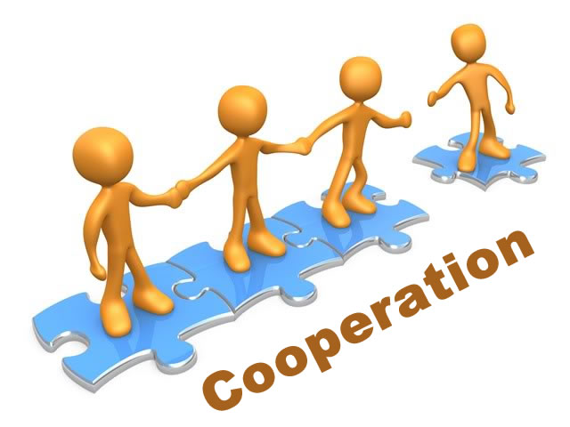
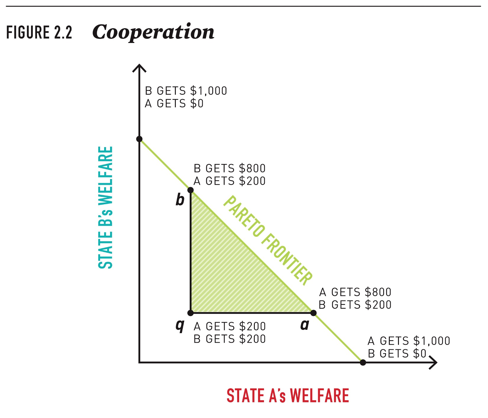
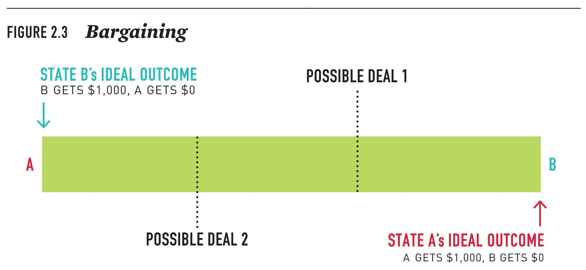
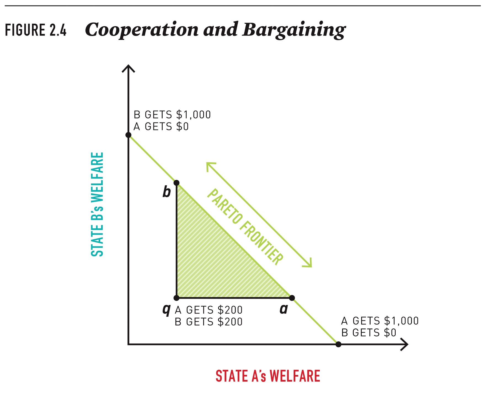
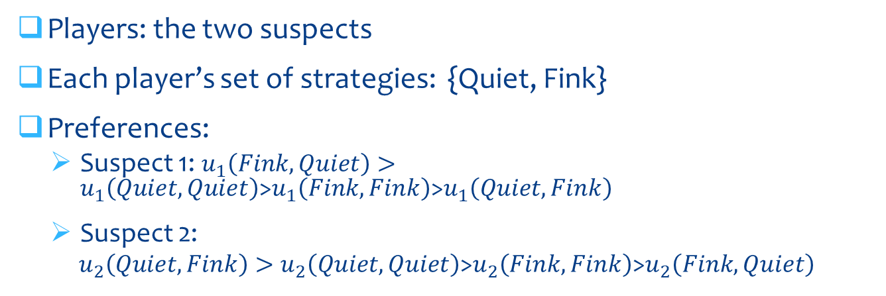
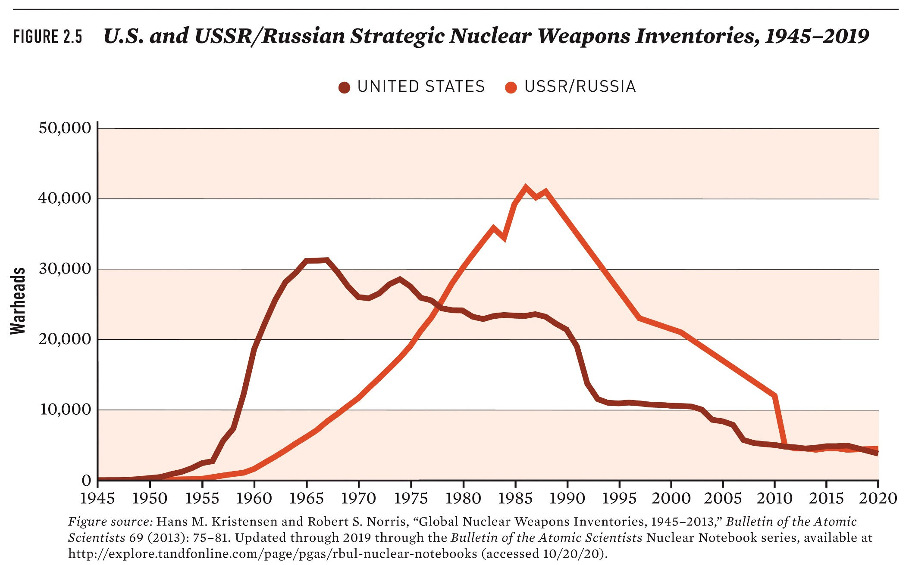
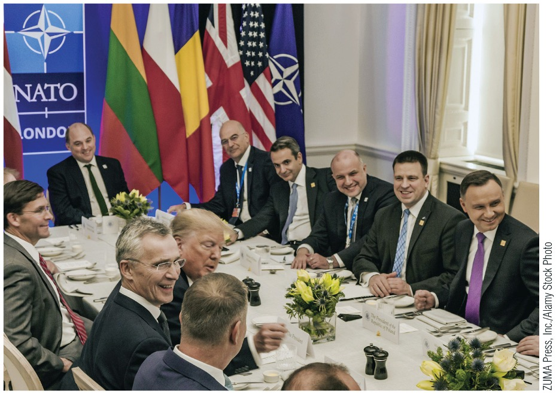
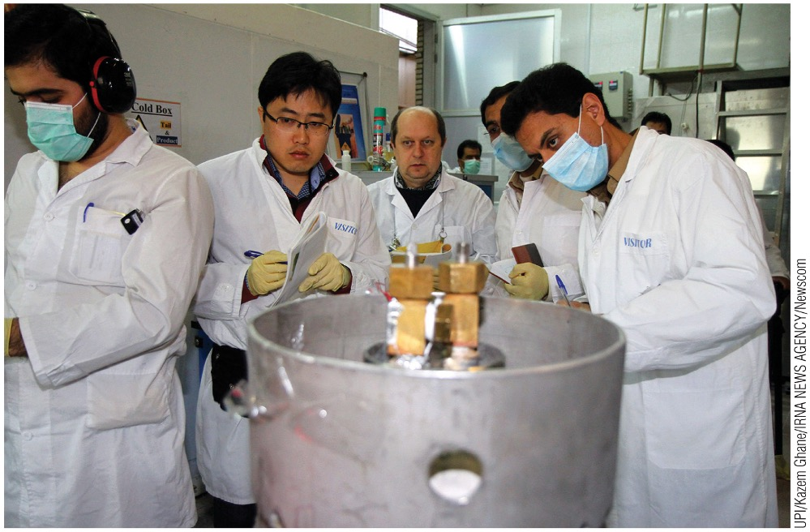
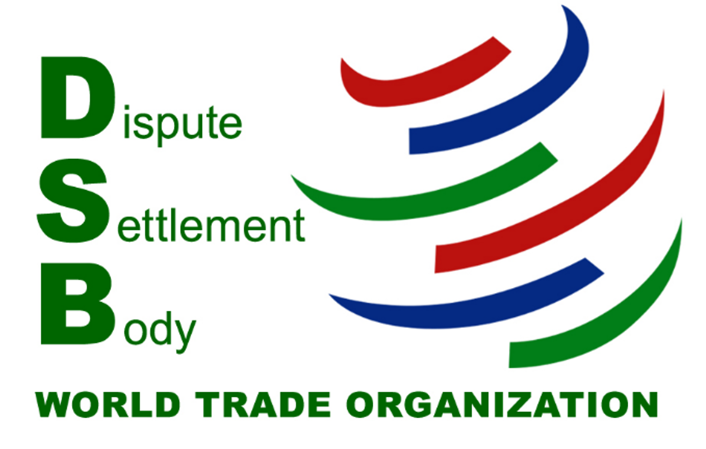

# 利益、互动与制度 / Interests, Interactions, and Institutions

- 课程 / Course：[[Courses/2026_fall/plsc_14/course_overview|PLSC 14: International Relations]]
- 教师 / Instructor：Professor Boliang Zhu
- 原始课件 / Original deck：[week_01_interests_interactions_institutions.pptx](../../files/week_01_interests_interactions_institutions.pptx)
- Canvas 文件 / Canvas file：[Week1_Interests, Interactions and Institutions.pptx](https://psu.instructure.com/courses/2478621/files/194679767)
- 转写日期 / Transcribed：2026-08-27

> 本笔记按原课件的 39 张幻灯片逐页转写；中文是辅助译文，英文保留原意。课件中的信息性图片已提取到 `assets/`，表格与收益矩阵已转换为可检索的 Markdown 表格。
>
> This note follows all 39 source slides in order. Chinese text is an aid to reading, while the English preserves the source meaning. Informational images are extracted to `assets/`, and tables and payoff matrices are converted into searchable Markdown tables.

## 幻灯片 1：利益、互动与制度 / Slide 1: Interests, Interactions, and Institutions

- PLSC 14：利益、互动与制度 / PLSC 14: Interests, Interactions and Institutions
- 教师：Boliang Zhu 教授 / Professor Boliang Zhu

## 幻灯片 2：分析框架 / Slide 2: Analytical Framework

- 谜题：什么解释了世界政治中的各种模式？ / The puzzle: What explains the patterns of world politics?
- 分析框架 / Analytical framework:
  - 利益：行为体及其偏好。 / Interests: actors and preferences.
  - 互动：为什么行为体不能总是得到自己想要的结果？ / Interactions: Why can actors not always get what they want?
  - 制度：一套规则，即“游戏规则”。 / Institutions: sets of rules, or the “rules of the game.”
- 为什么利益、互动和制度在国际关系中如此重要？ / Why do interests, interactions, and institutions matter in international relations?

## 幻灯片 3：俄乌战争示例 / Slide 3: The Russia–Ukraine War

## 幻灯片 4：国际体系 / Slide 4: International System

- 无政府状态：不存在一个能够制定并执行对所有行为体都有约束力之法律的中央权威。 / Anarchy: the absence of a central authority with the ability to make and enforce laws that bind all actors.
- 世界政府并不存在。 / There is no world government.
  - 国际体系缺乏统领性的权威与执行机制。 / The international system lacks overarching authority and enforcement.
- 自助原则意味着行为体寻求权力与安全。 / Self-help means that actors seek power and security.

## 幻灯片 5：利益 / Slide 5: Interests

- 利益：行为体拥有的目标，以及它们希望通过政治行动获得的结果。 / Interests: goals that actors have and outcomes they hope to obtain through political action.
  - 利益涉及行为体和偏好。 / Interests involve actors and preferences.
  - 偏好可以排序。 / Preferences can be ranked.
- 行为体：拥有共同利益的个人或群体。 / Actors: individuals or groups of people with common interests.
  - 行为体是分析国际政治的基本单位。 / Actors are the basic unit for the analysis of international politics.

## 幻灯片 6：国家与利益 / Slide 6: States and Interests

- 国家：在特定领土内有能力制定并执行法律、规则和决定的中央权威。 / State: a central authority that can make and enforce laws, rules, and decisions within a specific territory.
- 主权：国家在其领土边界内拥有法律和政治上的最高权威。 / Sovereignty: states have legal and political supremacy within their territorial boundaries.
  - 这一原则由结束三十年战争的《威斯特伐利亚和约》确立。 / This principle was enshrined by the Peace of Westphalia, which ended the Thirty Years’ War.
- 国家具有国家利益，即归于国家本身的利益，通常包括安全和权力。 / States have national interests, or interests attributed to the state itself, usually security and power.

## 幻灯片 7：权力与安全 / Slide 7: Power and Security

- 权力：让某个行为体去做其通常不会做之事的能力。 / Power: the ability to get an actor to do something it ordinarily would not do.
- 安全：行为体寻求保护自己的过程。 / Security: the process by which actors seek to protect themselves.
- 权力的形式 / Forms of power:
  - 硬实力：军事力量。 / Hard power: military force.
  - 软实力：其他形式的力量，包括经济、外交、政治与文化。 / Soft power: other forms, including economic, diplomatic, political, and cultural power.
- 国家运用权力的方式 / Ways states use power:
  - 强制：使用武力、威胁使用武力，或威胁施加不利后果。 / Coercion: force, the threat of force, or the threat of adverse consequences.
  - 结构性或制度性权力：制度规则与规范。 / Structural or institutional power: institutional rules and norms.

## 幻灯片 8：行为体与利益的主要类别 / Slide 8: Key Categories of Actors and Interests

| 行为体 / Actor | 通常归属的利益 / Commonly ascribed interests | 示例 / Examples |
| --- | --- | --- |
| 国家 / States | 安全、权力、领土、财富、意识形态 / Security, power, territory, wealth, ideology | 美国、加拿大、中国、瑞士、印度、乌拉圭 / United States, Canada, China, Switzerland, India, Uruguay |
| 政治人物 / Politicians | 连任或留任、意识形态、政策目标 / Reelection or retention of office, ideology, policy goals | 美国总统、印度总理、美国众议院议长 / President of the United States, prime minister of India, Speaker of the U.S. House of Representatives |
| 企业、行业或商业协会 / Firms, industries, or business associations | 财富、利润 / Wealth, profit | 通用汽车、索尼、制药业、美国全国制造商协会、商业圆桌会议 / General Motors, Sony, the pharmaceutical industry, National Association of Manufacturers, Business Roundtable |
| 阶级或生产要素 / Classes or factors of production | 物质福祉、财富 / Material well-being, wealth | 资本、劳动、土地、人力资本 / Capital, labor, land, human capital |
| 官僚机构 / Bureaucracies | 预算最大化、影响力、政策偏好；常用“立场取决于位置”概括 / Budget maximization, influence, policy preferences; often summarized by “where you stand depends on where you sit” | 国防部、商务部、国家安全委员会、外交部 / Department of Defense, Department of Commerce, National Security Council, Ministry of Foreign Affairs |
| 国际组织 / International organizations | 作为国家的集合体，按成员国投票权反映其利益；作为组织，其利益通常被视为类似国内官僚机构 / As composites of states, they reflect member-state interests according to voting power; as organizations, they are treated as similar to domestic bureaucracies | 联合国、国际货币基金组织、万国邮政联盟、经济合作与发展组织 / United Nations, International Monetary Fund, Universal Postal Union, Organisation for Economic Co-operation and Development |
| 非政府组织，成员和活动范围往往跨国或国际化 / Nongovernmental organizations, often transnational or international in scope and membership | 道德、意识形态或政策目标；人权、环境、宗教 / Moral, ideological, or policy goals; human rights, the environment, religion | 红十字会、国际特赦组织、绿色和平组织、天主教会 / Red Cross, Amnesty International, Greenpeace, the Catholic Church |

## 幻灯片 9：互动 / Slide 9: Interactions

- 政治结果不仅取决于一个行为体的选择，也取决于其他行为体的选择。 / Outcomes depend not only on one actor’s choices but also on the choices of others.
- 互动是两个或更多行为体的选择相互结合并产生政治结果的方式。 / Interactions are the ways in which the choices of two or more actors combine to produce political outcomes.

## 幻灯片 10：有目的且具有战略性的互动 / Slide 10: Purposive and Strategic Interactions

- 研究互动的两个主要假设 / Two main assumptions in studying interactions:
  - 行为体以产生期望结果为目的而行动。 / Actors behave with the intention of producing a desired result.
  - 行为体会根据其对他者利益和可能行动的判断来选择战略。 / Actors adopt strategies according to what they believe to be the interests and likely actions of others.
- 行为体是有目的的：它们会制定自己认为最能回应他者预期战略的战略。 / Actors are purposive: they develop strategies they believe are the best response to the anticipated strategies of others.
- 互动具有战略性：每个行为体的战略或行动计划都取决于其对他者战略的预期。 / Interactions are strategic: each actor’s strategy or plan of action depends on the anticipated strategies of others.

## 幻灯片 11：互动的形式 / Slide 11: Forms of Interactions

- 合作。 / Cooperation.
- 谈判。 / Bargaining.
- 合作与谈判：多数互动都需要两者的结合。 / Cooperation and bargaining: most interactions require a combination of both.

## 幻灯片 12：合作 / Slide 12: Cooperation

- 合作：两个或更多行为体采取政策，使至少一个行为体相对于现状变得更好，同时不使其他行为体变得更差。 / Cooperation: an interaction in which two or more actors adopt policies that make at least one actor better off relative to the status quo without making others worse off.
  - 帕累托最优。 / Pareto optimal.
  - 创造额外价值。 / Create additional value.
  - 合作会使直接参与者受益，但也可能伤害未参与的行为体。 / Cooperation benefits directly involved actors, but it may also harm actors who are not involved.

- 图中文字：`Cooperation`。 / Figure text: `Cooperation`.

## 幻灯片 13：合作与帕累托前沿 / Slide 13: Cooperation and the Pareto Frontier

- 图题：`FIGURE 2.2 Cooperation`。 / Figure title: `FIGURE 2.2 Cooperation`.
- 坐标轴：纵轴为 `STATE B'S WELFARE`，横轴为 `STATE A'S WELFARE`；斜线标为 `PARETO FRONTIER`。 / Axes: `STATE B'S WELFARE` vertically and `STATE A'S WELFARE` horizontally; the diagonal is the `PARETO FRONTIER`.
- 图中分配包括：B 获得 $1,000、A 获得 $0；B 获得 $800、A 获得 $200；A 和 B 各获得 $200；A 获得 $800、B 获得 $200；A 获得 $1,000、B 获得 $0。 / Labeled allocations range from B receiving $1,000 and A $0 to A receiving $1,000 and B $0, with intermediate allocations shown.

## 幻灯片 14：谈判 / Slide 14: Bargaining

- 谈判：两个或更多行为体必须决定如何分配某种有价值事物的互动。 / Bargaining: an interaction in which two or more actors must decide how to distribute something of value.
- 谈判具有分配冲突的特征。 / Bargaining is characterized by distributional conflict.
  - 每个行为体都试图以牺牲对方为代价获得更大的份额。 / Each actor seeks a greater share of the good at the expense of the other.
- 为达成协议，双方都必须认为协议优于替代结果。 / To reach a bargain, both sides must decide that a deal is better than the alternative.

## 幻灯片 15：谈判区间 / Slide 15: Bargaining Range

- 图题：`FIGURE 2.3 Bargaining`。 / Figure title: `FIGURE 2.3 Bargaining`.
- 左端是 B 国的理想结果：B 获得 $1,000、A 获得 $0；右端是 A 国的理想结果：A 获得 $1,000、B 获得 $0。中间标有 `POSSIBLE DEAL 1` 与 `POSSIBLE DEAL 2`。 / The left endpoint is State B’s ideal outcome—B receives $1,000 and A $0—while the right endpoint is State A’s ideal outcome—A receives $1,000 and B $0. `POSSIBLE DEAL 1` and `POSSIBLE DEAL 2` lie between them.

## 幻灯片 16：合作与谈判 / Slide 16: Cooperation and Bargaining

- 图题：`FIGURE 2.4 Cooperation and Bargaining`。 / Figure title: `FIGURE 2.4 Cooperation and Bargaining`.
- 坐标轴分别是 A 国与 B 国的福利，图中标出帕累托前沿以及 `a`、`b`、`q` 三点。 / The axes show the welfare of States A and B; the figure labels the Pareto frontier and points `a`, `b`, and `q`.
- 明示分配包括：B 获得 $1,000、A 获得 $0；A 和 B 各获得 $200；A 获得 $1,000、B 获得 $0。 / Explicitly labeled allocations include B receiving $1,000 and A $0, each receiving $200, and A receiving $1,000 and B $0.

## 幻灯片 17：行为体何时能够合作 / Slide 17: When Can Actors Cooperate?

- 协调：一种合作互动；行为体因作出相同选择而受益，之后也没有不遵守的动机。 / Coordination: a cooperative interaction in which actors benefit from making the same choices and subsequently have no incentive not to comply.
  - 合作能够自我维持，因为任何一方都无法通过背离获益。 / Cooperation is self-sustaining because no one can benefit by defecting.
  - 例如，所有人都在道路左侧或右侧行驶。 / Example: everyone drives on the left or right side of the road.
- 协作：行为体通过共同努力获益，但仍有不遵守协议之动机的合作互动。 / Collaboration: a cooperative interaction in which actors gain from working together but nonetheless have incentives not to comply with an agreement.
  - 囚徒困境是典型例子。 / The Prisoners’ Dilemma is the standard example.

## 幻灯片 18：囚徒困境情境 / Slide 18: The Prisoners’ Dilemma Scenario

- 两名重大犯罪嫌疑人被关在不同牢房。现有证据足以判定两人各自犯有轻罪，却不足以判定任何一人犯有重大罪行，除非其中一人告发对方。 / Two suspects in a major crime are held in separate cells. There is enough evidence to convict each of a minor offense, but not enough to convict either of the major crime unless one informs on the other.
- 如果两人都保持沉默，各自因轻罪入狱 1 年。 / If both stay quiet, each is convicted of the minor offense and spends one year in prison.
- 如果只有一人告发，告发者获释并作为证人，另一人入狱 5 年。 / If one and only one finks, that person is freed and used as a witness, while the other spends five years in prison.
- 如果两人都告发，各自入狱 3 年。 / If both fink, each spends three years in prison.

## 幻灯片 19：战略博弈的构成 / Slide 19: Components of a Strategic Game

- 战略博弈的构成 / Components of a strategic game:
  - 一组参与者。 / A set of players.
  - 每个参与者的一组战略或行动。 / A set of strategies or actions for each player.
    - 占优战略：无论其他条件如何，总能比其他战略选择带来更高收益的单一战略。 / Dominant strategy: a single strategy that always returns a higher payoff than all other strategy choices.
  - 对各种行动组合的偏好。 / Preferences over the set of action profiles.
- 囚徒困境描述一种局面：合作能够产生收益，但无论另一方怎么做，每一方都有“搭便车”的动机。 / The Prisoners’ Dilemma models a situation in which there are gains from cooperation, but each player has an incentive to free ride regardless of what the other does.

## 幻灯片 20：囚徒困境的参与者、偏好与结果 / Slide 20: Players, Preferences, and Outcomes

- 参与者：两名嫌疑人。 / Players: the two suspects.
- 每名参与者的战略集合：`{Quiet, Fink}`，即保持沉默或告发。 / Each player’s strategy set is `{Quiet, Fink}`.
- 偏好排序 / Preference ordering:
  - 嫌疑人 1：$u_1(Fink,Quiet)>u_1(Quiet,Quiet)>u_1(Fink,Fink)>u_1(Quiet,Fink)$。 / Suspect 1 has the stated ordering from best to worst.
  - 嫌疑人 2：$u_2(Quiet,Fink)>u_2(Quiet,Quiet)>u_2(Fink,Fink)>u_2(Fink,Quiet)$。 / Suspect 2 has the stated ordering from best to worst.

表中数值表示两名嫌疑人的入狱年数，数值越低越好。 / The table entries represent years in prison for the two suspects, so lower values are better.

| 嫌疑人 1（行）/ Suspect 1 (rows)；嫌疑人 2（列）/ Suspect 2 (columns) | 沉默 / Quiet | 告发 / Fink |
| --- | --- | --- |
| 沉默 / Quiet | $(1,1)$ | $(5,0)$ |
| 告发 / Fink | $(0,5)$ | $(3,3)$ |

## 幻灯片 21：囚徒困境的结果 / Slide 21: The Prisoners’ Dilemma Outcome

- 结果：`(Fink, Fink)`，即双方都告发。 / The outcome is `(Fink, Fink)`.
- 两个重要特征 / Two important characteristics:
  - 纳什均衡：任何参与者都没有单方面改变战略的动机。 / Nash equilibrium: an outcome at which neither player has an incentive to change strategies unilaterally.
  - 帕累托次优：如果不使至少一个行为体变差，就无法使任何行为体变好，则结果为帕累托最优；双方告发不满足这一条件。 / Pareto suboptimal: an outcome is Pareto optimal when no actor can be made better off without making another actor worse off; mutual defection does not satisfy this condition.

## 幻灯片 22：另一组囚徒困境收益矩阵 / Slide 22: Another Prisoners’ Dilemma Payoff Matrix

| 参与者 1（行）/ Player 1 (rows)；参与者 2（列）/ Player 2 (columns) | A | B |
| --- | --- | --- |
| A | $(15,1)$ | $(2,2)$ |
| B | $(3,4)$ | $(0,8)$ |

## 幻灯片 23：核军备竞争示例 / Slide 23: Nuclear Arms Competition Example

- 图题：`FIGURE 2.5 U.S. and USSR/Russian Strategic Nuclear Weapons Inventories, 1945–2019`。 / Figure title: `FIGURE 2.5 U.S. and USSR/Russian Strategic Nuclear Weapons Inventories, 1945–2019`.
- 图例为 `UNITED STATES` 与 `USSR/RUSSIA`；纵轴为核弹头数量 `Warheads`，横轴覆盖 1945—2020 年。 / The legend identifies `UNITED STATES` and `USSR/RUSSIA`; the vertical axis is `Warheads`, and the horizontal axis spans 1945–2020.
- 图中来源：Hans M. Kristensen and Robert S. Norris, “Global Nuclear Weapons Inventories, 1945–2013,” *Bulletin of the Atomic Scientists* 69 (2013): 75–81；课件注明数据通过 *Nuclear Notebook* 系列更新至 2019 年。 / Figure source: Hans M. Kristensen and Robert S. Norris, “Global Nuclear Weapons Inventories, 1945–2013,” *Bulletin of the Atomic Scientists* 69 (2013): 75–81; the slide states that the data were updated through 2019 using the *Nuclear Notebook* series.

## 幻灯片 24：军备竞赛中的囚徒困境 / Slide 24: A Prisoners’ Dilemma in an Arms Race

| 苏联或俄罗斯（行）/ USSR or Russia (rows)；美国（列）/ United States (columns) | 扩建 / Build | 停止 / Stop |
| --- | --- | --- |
| 扩建 / Build | `(Build, Build)` | `(Build, Stop)` |
| 停止 / Stop | `(Stop, Build)` | `(Stop, Stop)` |

## 幻灯片 25：协作问题与公共品 / Slide 25: Collaboration Problems and Public Goods

- 物品的特征 / Characteristics of goods:
  - 非排他性：无法阻止某人使用该物品。 / Non-excludability: a person cannot be prevented from using the good.
  - 非竞争性：一人消费该物品不会阻碍他人消费。 / Non-rivalry: one person’s consumption does not prevent consumption by others.
- 公共品：非排他且非竞争，例如国防和新鲜空气。 / Public goods are non-excludable and non-rival, such as national defense and fresh air.
- 私人物品：可排他且具有竞争性，例如个人电脑和汽车。 / Private goods are excludable and rival, such as personal computers and cars.

## 幻灯片 26：集体行动与搭便车 / Slide 26: Collective Action and Free Riding

- 集体行动问题：行为体有协作动机，但每一方都期待他者承担合作成本时出现的合作障碍。 / Collective action problems: obstacles to cooperation that occur when actors have incentives to collaborate but each expects others to pay the costs of cooperation.
- 搭便车：不为公共品作出贡献，却享受他者贡献带来的利益。 / Free riding: failure to contribute to a public good while benefiting from the contributions of others.
  - 搭便车者：获得物品利益却避免为之付费的人。 / Free rider: a person who receives the benefit of a good but avoids paying for it.
- 因为人们有搭便车的动机，即使大群体拥有共同利益，协作仍可能无法发生。 / Because people have incentives to free ride, collaboration may fail even when a large group shares common interests.

## 幻灯片 27：北约中的协作与公共品问题 / Slide 27: Collaboration and Public Goods in NATO

- 图中可见文字：`NATO`、`LONDON`；图片署名为 `ZUMA Press, Inc./Alamy Stock Photo`。 / Visible text: `NATO` and `LONDON`; photo credit: `ZUMA Press, Inc./Alamy Stock Photo`.

## 幻灯片 28：数量、重复互动、议题挂钩与信息 / Slide 28: Numbers, Iteration, Linkage, and Information

- 数量：行为体越多，达成妥协越困难。 / Numbers: the more actors there are, the more difficult compromise becomes.
- 重复互动、议题挂钩与互惠 / Iteration, linkage, and reciprocity:
  - 重复互动：与相同伙伴反复互动。 / Iteration: repeated interactions with the same partners.
  - 议题挂钩：把一个议题上的合作与第二个议题上的互动联系起来。 / Linkage: linking cooperation on one issue to interactions on a second issue.
  - 对等惩罚：以牙还牙。 / Reciprocal punishment: tit for tat.
- 信息能够帮助行为体判断应该采取什么行动。 / Information can help actors determine what to do.

## 幻灯片 29：谈判中的赢家与输家 / Slide 29: Winners and Losers in Bargaining

- 谈判会产生赢家和输家。 / Bargaining creates winners and losers.
- 什么决定谈判结果？ / What determines the outcome of bargaining?
- 权力是行为体 A 让行为体 B 去做其原本不会做之事的能力；也就是迫使对方让步并避免自己让步的能力。 / Power is Actor A’s ability to get Actor B to do something B would otherwise not do—the ability to make the other side concede while avoiding concessions oneself.
  - 权力有时本身就是一种利益或目的。 / Power is sometimes an interest or an end in itself.
  - 权力有时是一组塑造或限制选择的环境条件。 / Sometimes power is a set of circumstances that structure or constrain choice.

## 幻灯片 30：谈判权力——回归结果与强制 / Slide 30: Bargaining Power—Reversion and Coercion

- 回归结果：未能达成协议时出现的结果，即现状。 / Reversion outcome: the outcome that occurs when no bargain is achieved, or the status quo.
  - 对回归结果更满意的行为体通常更没有动机作出让步。 / The actor more satisfied with the reversion outcome generally has less incentive to make concessions.
- 强制：通过施加或威胁施加成本，促使其他行为体改变行为的战略。 / Coercion: a strategy of imposing or threatening costs on other actors to induce a change in behavior.
  - 军事力量。 / Military force.
  - 经济制裁。 / Economic sanctions.

## 幻灯片 31：谈判权力——外部选项与议程设置 / Slide 31: Bargaining Power—Outside Options and Agenda Setting

- 外部选项：不与某个特定行为体谈判时可选择的替代方案。 / Outside options: alternatives to bargaining with a specific actor.
  - 对拥有外部选项的一方而言，回归结果就是次优替代方案。 / The reversion outcome is the next-best alternative for the party with the outside option.
- 议程设置：在谈判之前或期间采取行动，使回归结果对某一方更有利。 / Agenda setting: actions taken before or during bargaining that make the reversion outcome more favorable for one party.
  - 这可以成为杠杆，因为先行动的一方能够改变他者可用的选择。 / This can be a source of leverage because the party acting first can alter the choices available to others.

## 幻灯片 32：制度——规则在世界政治中重要吗 / Slide 32: Institutions—Do Rules Matter in World Politics?

- 制度：相关共同体已知且共享的一套规则，以特定方式组织互动。 / Institutions: sets of rules, known and shared by the relevant community, that structure interactions in specific ways.
  - 正式制度：通过明确规则和条例治理行为的既定、成文化体系，例如条约和国际组织。 / Formal institutions: established, codified systems that govern behavior through explicit rules and regulations, such as treaties and international organizations.
  - 非正式制度：影响行为的不成文、社会共享的规则、规范和惯例，例如人权与全球环境保护。 / Informal institutions: unwritten, socially shared rules, norms, and conventions that influence behavior, such as human rights and global environmental protection.

## 幻灯片 33：制度如何影响合作 / Slide 33: How Do Institutions Affect Cooperation?

- 制度通过执行或惩罚来促进合作。 / Enforcement or punishment is used by institutions to promote cooperation.
  - 国际制度通常缺乏惩罚国家的能力。 / International institutions generally lack the capacity to impose punishment on states.
- 自我执行的协议不会给参与者留下背离的动机。 / Self-enforcing agreements leave no incentive to defect.
- 国际制度通过以下方式促进合作 / International institutions facilitate cooperation by:
  - 设定行为标准。 / Setting standards of behavior.
  - 核实遵守情况。 / Verifying compliance.
  - 降低共同决策成本。 / Reducing the costs of joint decision making.
  - 解决争端。 / Resolving disputes.

## 幻灯片 34：行为标准与合规核查 / Slide 34: Standards and Compliance Verification

- 设定行为标准 / Setting standards of behavior:
  - 帮助判断行为体是否违反协议。 / Help determine whether an actor has violated an agreement.
  - 帮助确保各方遵守共同同意的标准。 / Help ensure parties’ adherence to agreed standards.
- 核实遵守情况 / Verifying compliance:
  - 可以依靠自行报告或监管。 / Verification may be self-reported or regulated.
  - 使参与国能够相互“检查”对方的遵守情况。 / It allows participating states to check up on one another’s compliance.

## 幻灯片 35：国际原子能机构 / Slide 35: International Atomic Energy Agency

- 国际原子能机构检查员检查伊朗的铀浓缩设施，以核实其合规情况。 / IAEA inspectors examine Iran’s uranium-enrichment facilities to verify compliance.

- 图中可辨文字包括 `Cold Box` 和防护服上的 `VISITOR`；另一处标牌只能不确定地辨认为 `Tax & Product`。 / Legible text includes `Cold Box` and `VISITOR` on protective clothing; another sign is only tentatively readable as `Tax & Product`.
- 图片署名：`UPI/Kazem Ghane/IRNA NEWS AGENCY/Newscom`。 / Photo credit: `UPI/Kazem Ghane/IRNA NEWS AGENCY/Newscom`.

## 幻灯片 36：共同决策成本与争端解决 / Slide 36: Joint Decision Costs and Dispute Resolution

- 没有标准时，共同决策成本很高。 / Joint decision-making costs are high without standards.
  - 政治制度，即政治游戏规则，规定共同决定如何作出。 / Political institutions, or the rules of the political game, define how joint decisions are made.
  - 国际制度通过确定议题处理方式来降低共同决策成本。 / International institutions reduce joint decision-making costs by establishing how issues are addressed.
- 争端解决：没有执行权的机制。 / Resolving disputes: mechanisms without enforcement.
  - 制度为争端解决提供机制。 / Institutions provide mechanisms for dispute resolution.
  - 但这些制度缺乏执行裁决的权力。 / They lack the power to enforce their rulings.

## 幻灯片 37：世界贸易组织争端解决机制 / Slide 37: WTO Dispute Settlement Mechanism

- 图中文字：`Dispute Settlement Body`、`WORLD TRADE ORGANIZATION`。 / Figure text: `Dispute Settlement Body` and `WORLD TRADE ORGANIZATION`.

## 幻灯片 38：制度使谁受益 / Slide 38: Who Benefits from Institutions?

- 制度可能带有偏向。 / Institutions can have biases.
  - 这种偏向是促成制度产生之合作与谈判的产物。 / Bias is a product of the cooperation and bargaining that brought institutions into being.
  - 获胜者能够制定规则，或至少对规则拥有不成比例的发言权。 / Winners wrote the rules, or at least had a disproportionate say over them.
  - 例如联合国安全理事会和国际货币基金组织。 / Examples include the UN Security Council and the IMF.
- 大多数国家在大多数时间都会遵守规则。 / Most states follow the rules most of the time.
  - 制度促成了原本不太可能发生的合作。 / Institutions facilitate cooperation that would have been unlikely without them.
  - 即使现有制度并不完美，使用它们的成本通常仍低于建立新制度。 / Even if existing institutions are imperfect, using them is usually less costly than establishing new ones.

## 幻灯片 39：分析框架回顾 / Slide 39: Analytical Framework Recap

- 利益是政治的基础。 / Interests are the foundation of politics.
- 合作与谈判是战略互动。 / Cooperation and bargaining are forms of strategic interaction.
- 制度是约束并促进互动的规则。 / Institutions are rules that constrain and enable interaction.
  - 制度并非中立。 / Institutions are not neutral.
  - 行为体会努力使制度向有利于自己的方向倾斜。 / Actors struggle to tilt institutions in their favor.

## 来源与关联 / Sources and Links

- [[Courses/2026_fall/plsc_14/course_overview|PLSC 14 课程概览 / Course Overview]]
- [Canvas 原始课件 / Original Canvas deck](https://psu.instructure.com/courses/2478621/files/194679767)

[//begin]: # "Autogenerated link references for markdown compatibility"

[//end]: # "Autogenerated link references"
