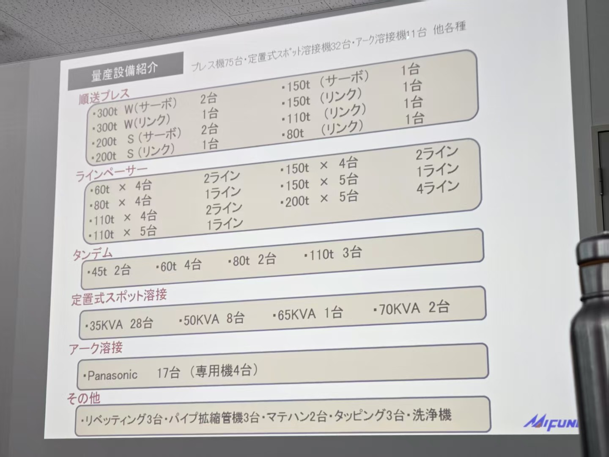
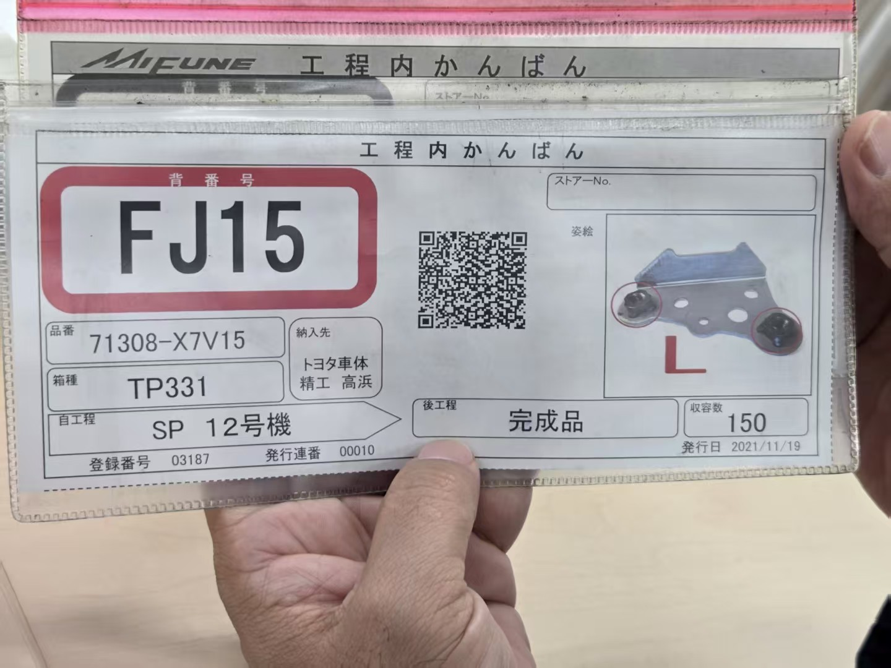

# 2025-06-16
# 日本_工厂_MiFune

8:27 老板吹牛
8:39 自我介绍

## 公司简介
生产丰田的汽车零部件,对接非丰田总装厂,属于二级供应商,但可以得到丰田的生产计划.
制造外围配件
### 制造设备情况

 2000种类,900w个,每日40w,1200种类

## TPS

| 支柱                         | 关键含义                               | 常用工具                              | 要点                                                                                            |
| -------------------------- | ---------------------------------- | --------------------------------- | --------------------------------------------------------------------------------------------- |
| **JIT （Just-in-Time，准时化）** | 只在需要的时间生产需要的数量，追求**零库存**与**节拍一致**  | 看板（Kanban）、Heijunka 均衡化、Takt Time | 通过“拉动式”补货，让下道工序向上道工序发出补货信号，避免过量或过早生产(最小库存,不等于零库存) ([sohu.com][1], [sohu.com][2])                          |
| **Jidoka （自働化/自动化带人性）**    | 当出现异常立即**停线**并**暴露问题**，让质量“内建”在流程中 | Andon 灯、停线绳、Poka-Yoke（防错）         | 人与设备均被赋权“看到→停下→纠正→防止复发”，先治“完美流程”再谈速度 ([centerforlean.com][3], [6sigma.us][4], [lean.org][5]) |

[1]: https://www.sohu.com/a/898263801_121123735?utm_source=chatgpt.com "丰田如何用TPS减少50%库存？这套方法中国企业也能复制 - 搜狐"
[2]: https://www.sohu.com/a/805739274_121990478?utm_source=chatgpt.com "全面了解丰田精益管理--TPS管理模式的理论框架| 全球博士联合会GDA"
[3]: https://centerforlean.com/what-is-jidoka-and-just-in-time/?utm_source=chatgpt.com "What is Jidoka and Just in Time | Detailed guide"
[4]: https://www.6sigma.us/manufacturing/jidoka-toyota-production-system/?utm_source=chatgpt.com "Jidoka - Toyota Production System. A Complete Guide (2024)"
[5]: https://www.lean.org/lexicon-terms/jidoka/?utm_source=chatgpt.com "Jidoka - Lean Enterprise Institute"

### JIT
MiFune:原料->现金:60天,库存6天,账期30天

库存6天: 材料-2天->冲压-2天->喷漆-1天->组装-0.5天->出货-0.5天->下级

针对目前:
 材料-7天->成型
 出货-15天->T1
 !需要改善
 生产看板:
 

### Jidoka(自働化)
发现 → 停止(立即停线) → 纠正 → 防再发

 纠正:设备改良-->反馈设备厂/现场员工trick
 重点:每个工序100%良品, 最终无需QC
 对于有人工序,需要有防呆装置及容错设计

## 厂非常离谱
