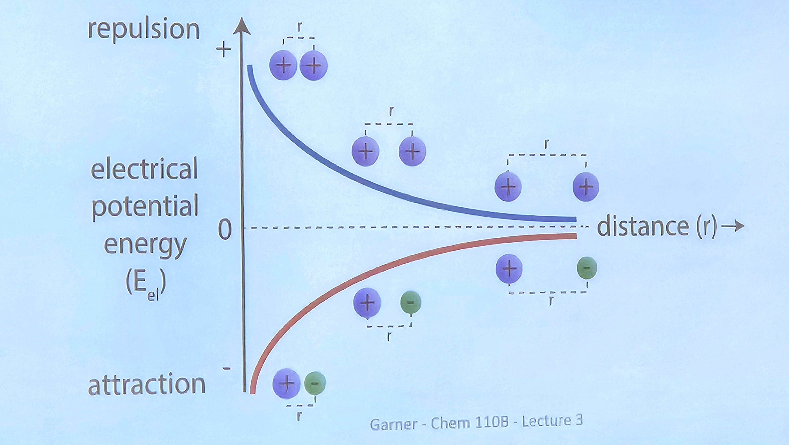

# 2025-08-29
## 有理函数 / Rational Function

**定义 / Definition：**  
有理函数是指可以表示为两个多项式之比的函数。  
A rational function is a function that can be expressed as the ratio of two polynomials.

一般形式：  
General form:  
$$
f(x) = \frac{P(x)}{Q(x)}
$$
其中 $P(x)$ 和 $Q(x)$ 都是多项式，且 $Q(x) \neq 0$。  
where $P(x)$ and $Q(x)$ are polynomials, and $Q(x) \neq 0$.

---

**性质 / Properties：**

- 定义域：$Q(x) \neq 0$ 的所有 $x$。  
  Domain: All $x$ such that $Q(x) \neq 0$.
- 当 $Q(x)=0$ 时，函数无定义，通常在这些点有“竖直渐近线”。  
  The function is undefined where $Q(x)=0$, usually resulting in "vertical asymptotes" at these points.
- 若分子次数小于分母次数，$x \to \infty$ 时有水平渐近线 $y=0$。  
  If the degree of the numerator is less than that of the denominator, there is a horizontal asymptote at $y=0$ as $x \to \infty$.
- 若分子次数等于分母次数，$x \to \infty$ 时有水平渐近线 $y=$ 分子最高次项系数/分母最高次项系数。  
  If the degrees are equal, the horizontal asymptote is $y=$ (leading coefficient of numerator)/(leading coefficient of denominator).

---

**例子 / Examples：**

1. $f(x) = \frac{1}{x}$  
   - 定义域：$x \neq 0$  
   - Domain: $x \neq 0$

2. $f(x) = \frac{x^2+1}{x-2}$  
   - 定义域：$x \neq 2$  
   - Domain: $x \neq 2$

3. $f(x) = \frac{2x+3}{x^2-1}$  
   - 定义域：$x \neq 1, -1$  
   - Domain: $x \neq 1, -1$

---
## 函数的复合 / Composition of Function

**定义 / Definition：**  
函数的复合是指将一个函数的输出作为另一个函数的输入，形成一个新的函数。  
The composition of functions means using the output of one function as the input of another, forming a new function.

设有两个函数 $f(x)$ 和 $g(x)$，则 $f$ 与 $g$ 的复合记作 $f(g(x))$ 或 $(f \circ g)(x)$，表示先对 $x$ 应用 $g$，再对结果应用 $f$。  
Given two functions $f(x)$ and $g(x)$, the composition is denoted as $f(g(x))$ or $(f \circ g)(x)$, which means applying $g$ to $x$ first, then applying $f$ to the result.

**一般形式 / General form：**  
$$
(f \circ g)(x) = f(g(x))
$$

**注意：复合函数的顺序很重要，通常 $f(g(x)) \neq g(f(x))$。**  
Note: The order of composition matters; usually $f(g(x)) \neq g(f(x))$。

## 三角函数 / Trigonometric Functions

**定义 / Definition：**  
三角函数是描述角与边之间关系的函数，常用于直角三角形和单位圆中。  
Trigonometric functions describe the relationships between angles and sides, commonly used in right triangles and the unit circle.

### 主要三角函数 / Main Trigonometric Functions

- 正弦（Sine）：$\sin\theta = \dfrac{\text{对边}}{\text{斜边}}$  
  Sine: $\sin\theta = \dfrac{\text{opposite}}{\text{hypotenuse}}$
- 余弦（Cosine）：$\cos\theta = \dfrac{\text{邻边}}{\text{斜边}}$  
  Cosine: $\cos\theta = \dfrac{\text{adjacent}}{\text{hypotenuse}}$
- 正切（Tangent）：$\tan\theta = \dfrac{\text{对边}}{\text{邻边}}$  
  Tangent: $\tan\theta = \dfrac{\text{opposite}}{\text{adjacent}}$

### 单位圆定义 / Unit Circle Definition

在单位圆（半径为1的圆）中，角$\theta$的三角函数值为：  
On the unit circle (radius 1), for angle $\theta$:

- $\sin\theta$：$y$ 坐标 / $y$-coordinate
- $\cos\theta$：$x$ 坐标 / $x$-coordinate
- $\tan\theta = \dfrac{y}{x}$

### 常用角的三角函数值 / Common Angles

| 角度 (°) | 弧度 (rad) | $\sin\theta$ | $\cos\theta$ | $\tan\theta$ |
|:--------:|:----------:|:------------:|:------------:|:------------:|
| 0        | 0          | 0            | 1            | 0            |
| 30       | $\dfrac{\pi}{6}$ | $\dfrac{1}{2}$ | $\dfrac{\sqrt{3}}{2}$ | $\dfrac{1}{\sqrt{3}}$ |
| 45       | $\dfrac{\pi}{4}$ | $\dfrac{\sqrt{2}}{2}$ | $\dfrac{\sqrt{2}}{2}$ | 1 |
| 60       | $\dfrac{\pi}{3}$ | $\dfrac{\sqrt{3}}{2}$ | $\dfrac{1}{2}$ | $\sqrt{3}$ |
| 90       | $\dfrac{\pi}{2}$ | 1            | 0            | 不存在 / undefined |

### 基本恒等式 / Fundamental Identities

- $\sin^2\theta + \cos^2\theta = 1$
- $1 + \tan^2\theta = \sec^2\theta$
- $\sin(-\theta) = -\sin\theta$
- $\cos(-\theta) = \cos\theta$

### 例子 / Examples

1. $\sin 30^\circ = \dfrac{1}{2}$
2. $\cos 60^\circ = \dfrac{1}{2}$
3. $\tan 45^\circ = 1$

---
### 正弦定理与余弦定理 / Law of Sines & Law of Cosines

#### 正弦定理 / Law of Sines

在任意三角形中，三边与其对角的正弦之比相等：  
In any triangle, the ratio of the length of a side to the sine of its opposite angle is constant:

$$
\frac{a}{\sin A} = \frac{b}{\sin B} = \frac{c}{\sin C}
$$

其中 $a, b, c$ 分别为三角形的三边，$A, B, C$ 为对应的对角。  
Where $a, b, c$ are the sides, and $A, B, C$ are the opposite angles.

---

#### 余弦定理 / Law of Cosines

在任意三角形中，任一边的平方等于其余两边的平方和减去这两边与夹角余弦的两倍积：  
In any triangle, the square of one side equals the sum of the squares of the other two sides minus twice their product times the cosine of the included angle:

$$
c^2 = a^2 + b^2 - 2ab\cos C
$$

---
### 指数与对数函数 / Exponential and Logarithmic Functions

**指数函数 / Exponential Function：**  
指数函数的标准形式为 $f(x) = a^x$，其中 $a>0$ 且 $a \neq 1$。  
The standard form of the exponential function is $f(x) = a^x$, where $a>0$ and $a \neq 1$.

- 定义域 / Domain：$\mathbb{R}$
- 值域 / Range：$(0, +\infty)$
- 单调性 / Monotonicity：$a>1$ 时递增，$0<a<1$ 时递减  
  Increasing if $a>1$, decreasing if $0<a<1$

**对数函数 / Logarithmic Function：**  
对数函数是指数函数的反函数，形式为 $f(x) = \log_a x$，其中 $a>0$ 且 $a \neq 1$。  
The logarithmic function is the inverse of the exponential function, in the form $f(x) = \log_a x$, where $a>0$ and $a \neq 1$.

- 定义域 / Domain：$(0, +\infty)$
- 值域 / Range：$\mathbb{R}$
- 单调性 / Monotonicity：$a>1$ 时递增，$0<a<1$ 时递减  
  Increasing if $a>1$, decreasing if $0<a<1$

**基本性质 / Basic Properties：**
- $a^{\log_a x} = x$，$x>0$  
  $a^{\log_a x} = x$, $x>0$
- $\log_a(a^x) = x$，$x \in \mathbb{R}$  
  $\log_a(a^x) = x$, $x \in \mathbb{R}$
- $\log_a 1 = 0$，$\log_a a = 1$  
  $\log_a 1 = 0$, $\log_a a = 1$

**常用底数 / Common Bases：**
- $e$：自然对数 $\ln x = \log_e x$
- $10$：常用对数 $\log x = \log_{10} x$

---
## 反函数 / Inverse Function

**定义 / Definition：**  
反函数是指：如果一个函数 $f(x)$ 能够将 $x$ 映射到 $y$，即 $y = f(x)$，那么存在另一个函数 $f^{-1}(x)$，它能将 $y$ 再映射回 $x$，即 $x = f^{-1}(y)$。  
An inverse function is: If a function $f(x)$ maps $x$ to $y$ ($y = f(x)$), then there exists another function $f^{-1}(x)$ that maps $y$ back to $x$ ($x = f^{-1}(y)$).

---

**形式化定义 / Formal Definition：**  
若 $f$ 是从集合 $A$ 到集合 $B$ 的一一映射（即单射且满射），则存在反函数 $f^{-1}: B \to A$，使得：  
If $f$ is a bijection from set $A$ to set $B$ (i.e., both injective and surjective), then there exists an inverse function $f^{-1}: B \to A$ such that:

- $f^{-1}(f(x)) = x$，对于所有 $x \in A$  
  $f^{-1}(f(x)) = x$ for all $x \in A$
- $f(f^{-1}(y)) = y$，对于所有 $y \in B$  
  $f(f^{-1}(y)) = y$ for all $y \in B$

---

**存在条件 / Existence Conditions：**

只有**一一对应（双射）**的函数才有反函数。  
Only **bijective (one-to-one correspondence)** functions have inverse functions.

图像上，$f$ 与 $f^{-1}$ 关于直线 $y = x$ 对称。  
Graphically, $f$ and $f^{-1}$ are symmetric about the line $y = x$.

---

**例子 / Examples：**

1. 线性函数：$f(x) = 2x + 3$，则 $f^{-1}(x) = \dfrac{x-3}{2}$  
   Linear function: $f(x) = 2x + 3$, then $f^{-1}(x) = \dfrac{x-3}{2}$

2. 幂函数：$f(x) = x^3$，则 $f^{-1}(x) = \sqrt[3]{x}$  
   Power function: $f(x) = x^3$, then $f^{-1}(x) = \sqrt[3]{x}$

3. 指数函数：$f(x) = e^x$，则 $f^{-1}(x) = \ln x$  
   Exponential function: $f(x) = e^x$, then $f^{-1}(x) = \ln x$

---

**判断方法 / Determination Methods：**

**1. 数学判断 / Mathematical Determination：**  
判断函数是否为一一对应（单调且无重复值）。  
Determine if the function is bijective (monotonic with no repeated values).

**2. 图形判断 / Graphical Determination：**  
使用水平线检验法（Horizontal Line Test）：任意一条水平线最多与图像相交一次。  
Use the Horizontal Line Test: any horizontal line intersects the graph at most once.

---

**求反函数的步骤 / Steps to Find Inverse Functions：**

1. 设 $y = f(x)$  
   Let $y = f(x)$
2. 解方程得到 $x = g(y)$  
   Solve the equation to get $x = g(y)$
3. 交换 $x$ 和 $y$，得到 $y = g(x)$  
   Interchange $x$ and $y$ to get $y = g(x)$
4. 记作 $f^{-1}(x) = g(x)$  
   Write as $f^{-1}(x) = g(x)$

---

**重要术语对照 / Key Terms:**

- 反函数：Inverse function
- 一一对应：One-to-one correspondence (bijective)
- 单射：Injective (one-to-one)
- 满射：Surjective (onto)
- 双射：Bijective
- 单调：Monotonic
- 水平线检验法：Horizontal line test
- 定义域：Domain
- 值域：Range
## 三角函数的反函数 / Inverse Trigonometric Functions

**概述 / Overview：**  
三角函数的反函数用于求已知三角函数值对应的角度。由于三角函数具有周期性，需要限制定义域使其成为一一对应函数。  
Inverse trigonometric functions are used to find angles corresponding to given trigonometric values. Due to the periodic nature of trigonometric functions, we must restrict their domains to make them bijective.

---

### 主要反三角函数 / Main Inverse Trigonometric Functions

#### 1. 反正弦函数 / Arcsine Function

**记号 / Notation：** $\arcsin x$ 或 $\sin^{-1} x$

**定义 / Definition：**  
$y = \arcsin x$ 当且仅当 $x = \sin y$ 且 $y \in \left[-\frac{\pi}{2}, \frac{\pi}{2}\right]$  
$y = \arcsin x$ if and only if $x = \sin y$ and $y \in \left[-\frac{\pi}{2}, \frac{\pi}{2}\right]$

**性质 / Properties：**
- 定义域：$[-1, 1]$ / Domain: $[-1, 1]$
- 值域：$\left[-\frac{\pi}{2}, \frac{\pi}{2}\right]$ / Range: $\left[-\frac{\pi}{2}, \frac{\pi}{2}\right]$
- 奇函数：$\arcsin(-x) = -\arcsin x$ / Odd function: $\arcsin(-x) = -\arcsin x$

---

#### 2. 反余弦函数 / Arccosine Function

**记号 / Notation：** $\arccos x$ 或 $\cos^{-1} x$

**定义 / Definition：**  
$y = \arccos x$ 当且仅当 $x = \cos y$ 且 $y \in [0, \pi]$  
$y = \arccos x$ if and only if $x = \cos y$ and $y \in [0, \pi]$

**性质 / Properties：**
- 定义域：$[-1, 1]$ / Domain: $[-1, 1]$
- 值域：$[0, \pi]$ / Range: $[0, \pi]$
- 恒等式：$\arccos x + \arcsin x = \frac{\pi}{2}$ / Identity: $\arccos x + \arcsin x = \frac{\pi}{2}$

---

#### 3. 反正切函数 / Arctangent Function

**记号 / Notation：** $\arctan x$ 或 $\tan^{-1} x$

**定义 / Definition：**  
$y = \arctan x$ 当且仅当 $x = \tan y$ 且 $y \in \left(-\frac{\pi}{2}, \frac{\pi}{2}\right)$  
$y = \arctan x$ if and only if $x = \tan y$ and $y \in \left(-\frac{\pi}{2}, \frac{\pi}{2}\right)$

**性质 / Properties：**
- 定义域：$(-\infty, \infty)$ / Domain: $(-\infty, \infty)$
- 值域：$\left(-\frac{\pi}{2}, \frac{\pi}{2}\right)$ / Range: $\left(-\frac{\pi}{2}, \frac{\pi}{2}\right)$
- 奇函数：$\arctan(-x) = -\arctan x$ / Odd function: $\arctan(-x) = -\arctan x$
- 水平渐近线：$y = \pm\frac{\pi}{2}$ / Horizontal asymptotes: $y = \pm\frac{\pi}{2}$

---

### 常用值 / Common Values

#### 反正弦和反余弦的常用值 / Common Values for Arcsine and Arccosine

| $x$ | $\arcsin x$ | $\arccos x$ |
|:---:|:-----------:|:-----------:|
| $-1$ | $-\frac{\pi}{2}$ ($-90°$) | $\pi$ ($180°$) |
| $-\frac{\sqrt{3}}{2}$ | $-\frac{\pi}{3}$ ($-60°$) | $\frac{5\pi}{6}$ ($150°$) |
| $-\frac{\sqrt{2}}{2}$ | $-\frac{\pi}{4}$ ($-45°$) | $\frac{3\pi}{4}$ ($135°$) |
| $-\frac{1}{2}$ | $-\frac{\pi}{6}$ ($-30°$) | $\frac{2\pi}{3}$ ($120°$) |
| $0$ | $0$ ($0°$) | $\frac{\pi}{2}$ ($90°$) |
| $\frac{1}{2}$ | $\frac{\pi}{6}$ ($30°$) | $\frac{\pi}{3}$ ($60°$) |
| $\frac{\sqrt{2}}{2}$ | $\frac{\pi}{4}$ ($45°$) | $\frac{\pi}{4}$ ($45°$) |
| $\frac{\sqrt{3}}{2}$ | $\frac{\pi}{3}$ ($60°$) | $\frac{\pi}{6}$ ($30°$) |
| $1$ | $\frac{\pi}{2}$ ($90°$) | $0$ ($0°$) |

#### 反正切的常用值 / Common Values for Arctangent

| $x$ | $\arctan x$ | 度数 / Degrees |
|:---:|:-----------:|:--------------:|
| $-\sqrt{3}$ | $-\frac{\pi}{3}$ | $-60°$ |
| $-1$ | $-\frac{\pi}{4}$ | $-45°$ |
| $-\frac{1}{\sqrt{3}}$ | $-\frac{\pi}{6}$ | $-30°$ |
| $0$ | $0$ | $0°$ |
| $\frac{1}{\sqrt{3}}$ | $\frac{\pi}{6}$ | $30°$ |
| $1$ | $\frac{\pi}{4}$ | $45°$ |
| $\sqrt{3}$ | $\frac{\pi}{3}$ | $60°$ |

---

### 其他反三角函数 / Other Inverse Trigonometric Functions

#### 4. 反余切函数 / Arccotangent Function
**记号 / Notation：** $\operatorname{arccot} x$ 或 $\cot^{-1} x$  
**定义域 / Domain：** $(-\infty, \infty)$  
**值域 / Range：** $(0, \pi)$

#### 5. 反正割函数 / Arcsecant Function
**记号 / Notation：** $\operatorname{arcsec} x$ 或 $\sec^{-1} x$  
**定义域 / Domain：** $(-\infty, -1] \cup [1, \infty)$  
**值域 / Range：** $[0, \pi] \setminus \{\frac{\pi}{2}\}$

#### 6. 反余割函数 / Arccosecant Function
**记号 / Notation：** $\operatorname{arccsc} x$ 或 $\csc^{-1} x$  
**定义域 / Domain：** $(-\infty, -1] \cup [1, \infty)$  
**值域 / Range：** $[-\frac{\pi}{2}, \frac{\pi}{2}] \setminus \{0\}$

---

### 重要恒等式 / Important Identities

**基本恒等式 / Fundamental Identities：**
- $\sin(\arcsin x) = x$，当 $x \in [-1, 1]$ / $\sin(\arcsin x) = x$ for $x \in [-1, 1]$
- $\cos(\arccos x) = x$，当 $x \in [-1, 1]$ / $\cos(\arccos x) = x$ for $x \in [-1, 1]$
- $\tan(\arctan x) = x$，当 $x \in \mathbb{R}$ / $\tan(\arctan x) = x$ for $x \in \mathbb{R}$

**复合恒等式 / Composition Identities：**
- $\arcsin x + \arccos x = \frac{\pi}{2}$ / $\arcsin x + \arccos x = \frac{\pi}{2}$
- $\arctan x + \operatorname{arccot} x = \frac{\pi}{2}$ / $\arctan x + \operatorname{arccot} x = \frac{\pi}{2}$

---

### 应用示例 / Application Examples

**例1 / Example 1：**  
求 $\arcsin\left(\frac{1}{2}\right)$ 的值。  
Find the value of $\arcsin\left(\frac{1}{2}\right)$.

**解 / Solution：**  
因为 $\sin\frac{\pi}{6} = \frac{1}{2}$ 且 $\frac{\pi}{6} \in \left[-\frac{\pi}{2}, \frac{\pi}{2}\right]$，所以 $\arcsin\left(\frac{1}{2}\right) = \frac{\pi}{6}$。  
Since $\sin\frac{\pi}{6} = \frac{1}{2}$ and $\frac{\pi}{6} \in \left[-\frac{\pi}{2}, \frac{\pi}{2}\right]$, we have $\arcsin\left(\frac{1}{2}\right) = \frac{\pi}{6}$.

**例2 / Example 2：**  
简化 $\sin(\arccos x)$。  
Simplify $\sin(\arccos x)$.

**解 / Solution：**  
设 $\theta = \arccos x$，则 $\cos\theta = x$ 且 $\theta \in [0, \pi]$。  
Let $\theta = \arccos x$, then $\cos\theta = x$ and $\theta \in [0, \pi]$.

由恒等式 $\sin^2\theta + \cos^2\theta = 1$，得到：  
From the identity $\sin^2\theta + \cos^2\theta = 1$, we get:

$\sin\theta = \pm\sqrt{1 - \cos^2\theta} = \pm\sqrt{1 - x^2}$

因为 $\theta \in [0, \pi]$，所以 $\sin\theta \geq 0$，因此：  
Since $\theta \in [0, \pi]$, we have $\sin\theta \geq 0$, therefore:

$\sin(\arccos x) = \sqrt{1 - x^2}$

---

### 重要术语对照 / Key Terms

- 反三角函数：Inverse trigonometric functions
- 反正弦：Arcsine
- 反余弦：Arccosine  
- 反正切：Arctangent
- 反余切：Arccotangent
- 反正割：Arcsecant
- 反余割：Arccosecant
- 主值：Principal value
- 定义域限制：Domain restriction
- 周期性：Periodicity

---
Chemistry:
**能量守恒定律 / Law of Conservation of Energy**  
能量不会凭空产生或消失，只能转化或转移，总量不变。  
Energy cannot be created or destroyed, only transformed or transferred; the total amount remains constant.

**库仑定律 / Coulomb's Law**  
库仑定律描述了两个点电荷之间的静电力大小和方向。  
Coulomb's law describes the magnitude and direction of the electrostatic force between two point charges.

**公式 / Formula：**  
$$
F = k \frac{q_1 q_2}{r^2}
$$

- $F$：两个电荷之间的作用力 / Force between the charges
- $q_1, q_2$：两个点电荷的电量 / Amounts of the two point charges
- $r$：两电荷之间的距离 / Distance between the charges
- $k$：静电力常数 / Electrostatic constant（$k \approx 8.99 \times 10^9\, \mathrm{N \cdot m^2 / C^2}$）

### 化学反应中的 $\Delta E$ / $\Delta E$ in Chemical Reactions

**定义 / Definition：**  
$\Delta E$ 表示化学反应过程中系统内能的变化。  
$\Delta E$ represents the change in internal energy of a system during a chemical reaction.

**公式 / Formula：**  
$$
\Delta E = E_{\text{产物}} - E_{\text{反应物}}
$$
$$
\Delta E = q + w
$$

- $E_{\text{产物}}$：产物的内能 / Internal energy of products  
- $E_{\text{反应物}}$：反应物的内能 / Internal energy of reactants  
- $q$：系统吸收或放出的热量 / Heat absorbed or released by the system  
- $w$：系统对外做的功 / Work done by the system

**正负意义 / Significance of Sign：**  
- $\Delta E > 0$：系统吸收能量（吸能反应）  
  $\Delta E > 0$: System absorbs energy (endothermic reaction)
- $\Delta E < 0$：系统释放能量（放能反应）  
  $\Delta E < 0$: System releases energy (exothermic reaction)

**应用 / Application：**  
$\Delta E$ 是热力学第一定律（能量守恒定律）在化学反应中的具体体现。  
$\Delta E$ is the manifestation of the first law of thermodynamics (law of conservation of energy) in chemical reactions.
### 焓变公式 / Enthalpy Change Formula

**公式 / Formula：**  
$\Delta H = \Delta E + P\Delta V$

- $\Delta H$：焓变 / Enthalpy change  
- $\Delta E$：内能变化 / Change in internal energy  
- $P$：压强 / Pressure  
- $\Delta V$：体积变化 / Change in volume

**解释 / Explanation：**  
在恒压条件下，系统的焓变等于内能变化加上压强与体积变化的乘积。  
Under constant pressure, the enthalpy change of a system equals the change in internal energy plus the product of pressure and change in volume.

[//begin]: # "Autogenerated link references for markdown compatibility"
[//end]: # "Autogenerated link references"

