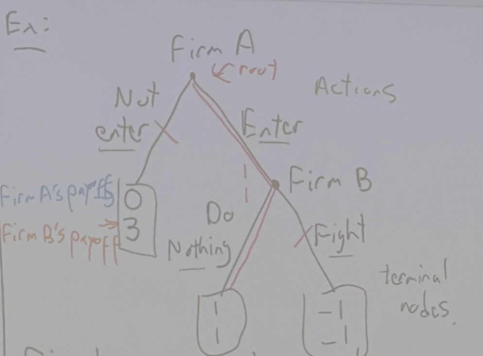

# 2025-10-23
下面是图片中的板书文字转写（尽量保持原样），并附上简要中文整理。

**Ex:**

* **Firm A (root)**

  * **Not enter** → payoffs shown on the left bracket:

    * *Firm A’s payoff:* **0**
    * *Firm B’s payoff:* **3**
  * **Enter** → **Firm B**

    * **Do Nothing**
    * **Fight**
  * (green note near top-right: **Actions**)
  * (note near bottom-right: **terminal nodes**)
  * (circles near terminals show **1** and **-1**)

Text under the tree:

> **First, firm A enters or does not enter. If firm A enters, firm B can either fight or do nothing.**

Right panel title:
**Backward Induction:**

> Starting at the last nodes in the tree, denote what decision that person would make if they were at that node. Repeat this process going backward through the tree until we reach the root.
>
> **In the example:**
> The backward induction **equilibrium** is **(Enter, Do Nothing)**.

---

# 中文整理（意译）

* 先动者为**企业A**（根节点）。

  * 若**不进入**，左侧标注的收益为：A=0，B=3。
  * 若**进入**，则轮到**企业B**选择：**不作为（Do Nothing）**或**战斗（Fight）**。
* **逆向归纳法**：从树的末端节点开始，判断各决策者在该节点会做什么选择，然后一路向上回推直到根节点。
* 本例的逆向归纳均衡为：**(Enter, Do Nothing)**。
