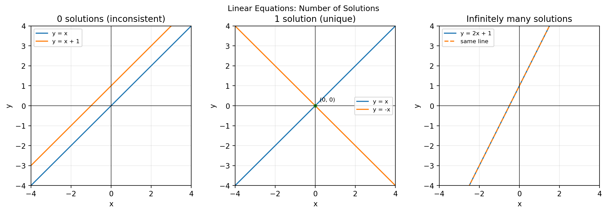

# 2026-01-14
# Meth 220

## Linear System Equations / 线性方程组
正在教解三元一次方程，没有记录必要，跳过。  
Solving 3-variable linear systems in class; no need to record details.

定义：对一个方程组而言，所有解的集合称为该方程组的解集（solution set）。  
Definition: For a system of equations, the set of all solutions is called the solution set of the system.

## Screenshot Notes / 截图要点
- （微积分直觉）“好的/光滑的”函数在局部通常可以用线性函数近似（approximately linear）。  
  (Calculus intuition) “Nice/smooth” functions are locally approximately linear.
- 问题：方程组的解集可能长什么样？  
  Question: What can solution sets look like?
- 先看二维变量的例子（$\\mathbb{R}^2$）：线性方程的解对应平面中的直线。  
  Start with 2 variables in $\\mathbb{R}^2$: solutions to a linear equation form a line in the plane.

## 0 / 1 / Inf Solutions Plot / 解的个数示意图

- 无解：两条不同的平行直线。  
  0 solutions: two distinct parallel lines.
- 唯一解：两条直线相交于一点。  
  1 solution: two lines intersect at one point.
- 无穷多解：两条“直线”重合（其实是同一条线）。  
  Infinitely many solutions: coincident lines (the same line).

### Only Three Possibilities / 只有三种可能
- 一个解（唯一解，unique solution）。  
  One solution (a unique solution).
- 无穷多解（infinitely many solutions）。  
  Infinitely many solutions.
- 无解（no solution）。  
  No solution.

### Consistent vs. Inconsistent / 相容与不相容
- 若方程组至少有一个解，则称为相容（consistent）。  
  If the system has at least one solution, it is consistent.
- 若方程组无解，则称为不相容（inconsistent）。  
  A system with no solution is called inconsistent.

## Augmented Matrix Notation / 增广矩阵记号
记号（Notation）：把方程组写成增广矩阵（augmented matrix）。  
Notation: write the system as an augmented matrix.

$$
\begin{cases}
x_1+3x_2-x_3=4\\
2x_1+x_2-2x_3=-2\\
-x_1+4x_2+2x_3=13
\end{cases}
\;\longrightarrow\;
\left[\begin{array}{ccc|c}jia
1&3&-1&4\\
2&1&-2&-2\\
-1&4&2&13
\end{array}\right].
$$

这是一个增广矩阵。  
This is an augmented matrix.

增广矩阵用来表示方程组；竖线告诉我们“等号”在哪里。  
Augmented matrices represent systems of equations; the vertical bar tells us where the equal signs are.

## Gauss-Jordan Elimination / 高斯-约旦消元（行化简）
允许的行变换（Allowable moves / elementary row operations）：

1) 交换/重排方程（交换两行）：例如$R_1\leftrightarrow R_2$。  
   Swap/reorder equations (swap two rows): e.g. $R_1\leftrightarrow R_2$.
2) 缩放一行（乘以非零常数）：例如$3R_2$或$(-\frac{1}{5})R_3$。  
   Scale a row (multiply by a nonzero factor): e.g. $3R_2$ or $(-\frac{1}{5})R_3$.
3) 消元：把一行的倍数加到另一行：例如$R_2\to R_2+3R_1$。  
   Elimination: add a multiple of one row to another: e.g. $R_2\to R_2+3R_1$.

Each collum (LHS) coresponds to a variable, Each row coresponds to an exquation.
