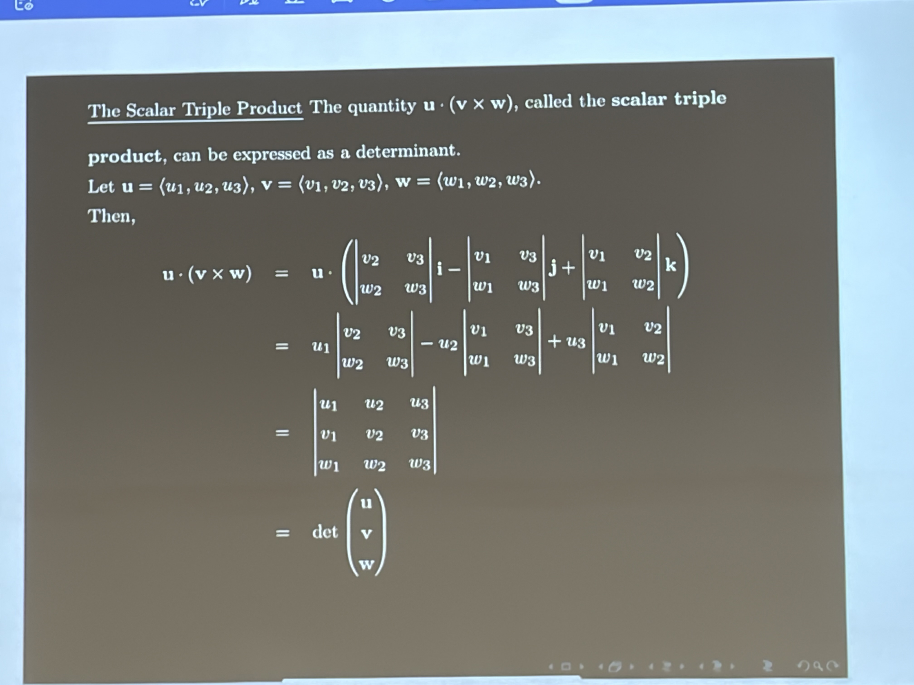

# 2026-08-31

# 数量三重积 / Scalar Triple Product

数量三重积$\mathbf{u}\cdot(\mathbf{v}\times\mathbf{w})$可以写成以三个向量为行的行列式： / The scalar triple product $\mathbf{u}\cdot(\mathbf{v}\times\mathbf{w})$ can be written as a determinant whose rows are the three vectors:

$$
\mathbf{u}\cdot(\mathbf{v}\times\mathbf{w})=
\begin{vmatrix}
u_1 & u_2 & u_3\\
v_1 & v_2 & v_3\\
w_1 & w_2 & w_3
\end{vmatrix}
$$

