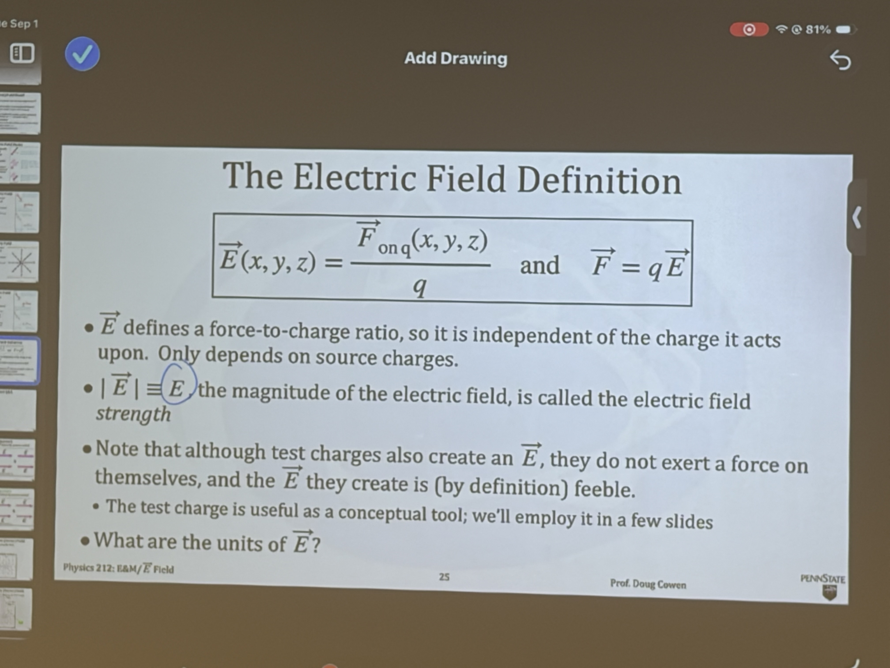

# 2026-09-01

## 今日学习内容 / Today's Learning Content

### 电场的定义 / Definition of the Electric Field

电场定义为单位试探电荷所受的力：$\vec{E}(x,y,z)=\frac{\vec{F}_{\text{on }q}(x,y,z)}{q}$，因此电荷在电场中受到的力为 $\vec{F}=q\vec{E}$。电场由源电荷决定，与用来测量它的试探电荷无关。 / The electric field is the force per unit test charge: $\vec{E}(x,y,z)=\frac{\vec{F}_{\text{on }q}(x,y,z)}{q}$, so a charge in the field experiences $\vec{F}=q\vec{E}$. The field is determined by source charges and is independent of the test charge used to measure it.

- 电场强度是电场的大小 $|\vec{E}|$。 / Electric field strength is the magnitude $|\vec{E}|$.
- 单位为牛顿每库仑（$\mathrm{N/C}$），等价于伏特每米（$\mathrm{V/m}$）。 / Its unit is newtons per coulomb ($\mathrm{N/C}$), equivalent to volts per meter ($\mathrm{V/m}$).
- 正试探电荷受力方向与 $\vec{E}$ 相同，负电荷受力方向与 $\vec{E}$ 相反。 / A positive test charge feels a force along $\vec{E}$, while a negative charge feels a force opposite to $\vec{E}$.

[//begin]: # "Autogenerated link references for markdown compatibility"
[//end]: # "Autogenerated link references"
