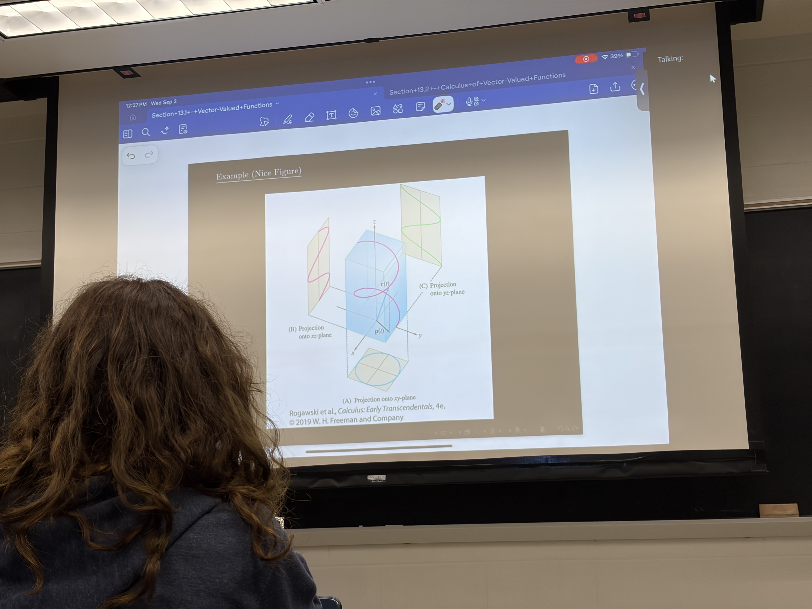
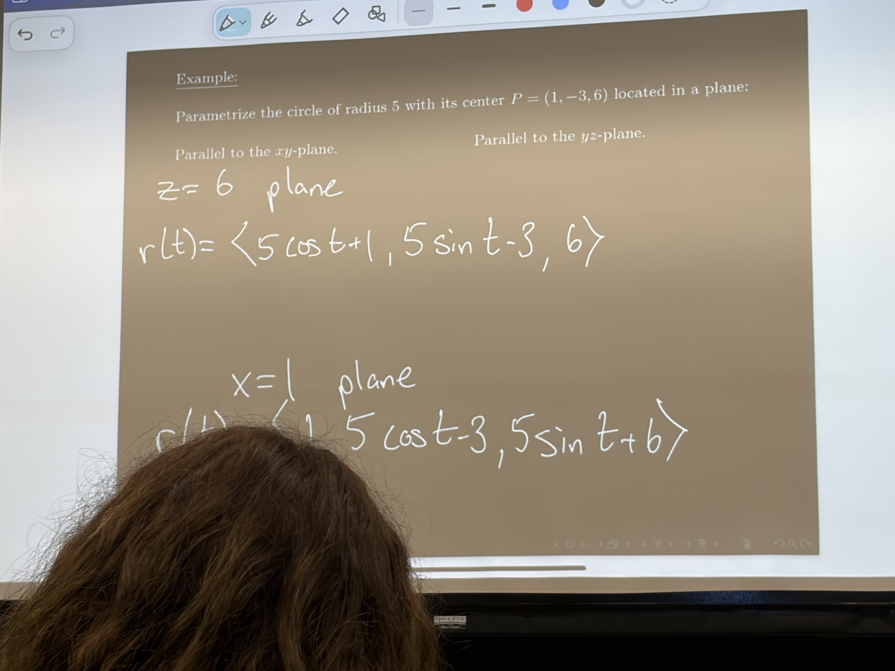

# 2026-09-02

## 今日学习内容 / Today's Learning Content

### 空间曲线的坐标平面投影 / Coordinate-Plane Projections of a Space Curve

三维空间中的向量值函数可以写成 $\vec{r}(t)=\langle x(t),y(t),z(t)\rangle$。当参数 $t$ 变化时，点 $P(t)$ 在空间中移动并描出一条空间曲线。 / A vector-valued function in three-dimensional space can be written as $\vec{r}(t)=\langle x(t),y(t),z(t)\rangle$. As the parameter $t$ changes, the point $P(t)$ moves through space and traces a space curve.

空间曲线在坐标平面上的投影，是通过忽略垂直于该平面的坐标得到的二维曲线： / A coordinate-plane projection of the space curve is obtained by dropping the coordinate perpendicular to that plane:

- 投影到 $xy$ 平面：$\langle x(t),y(t),0\rangle$，等价于观察 $x(t)$ 与 $y(t)$ 的关系。 / Onto the $xy$-plane: $\langle x(t),y(t),0\rangle$, showing the relationship between $x(t)$ and $y(t)$.
- 投影到 $xz$ 平面：$\langle x(t),0,z(t)\rangle$，等价于观察 $x(t)$ 与 $z(t)$ 的关系。 / Onto the $xz$-plane: $\langle x(t),0,z(t)\rangle$, showing the relationship between $x(t)$ and $z(t)$.
- 投影到 $yz$ 平面：$\langle 0,y(t),z(t)\rangle$，等价于观察 $y(t)$ 与 $z(t)$ 的关系。 / Onto the $yz$-plane: $\langle 0,y(t),z(t)\rangle$, showing the relationship between $y(t)$ and $z(t)$.

这些二维投影如同空间曲线在三个坐标平面上的“影子”，可以帮助判断曲线的整体形状、绕轴方式和坐标之间的关系。 / These two-dimensional projections act like the curve's “shadows” on the three coordinate planes, helping reveal its overall shape, how it winds around an axis, and the relationships among its coordinates.

### 空间中圆的参数化 / Parametrizing Circles in Space

例题：参数化一个半径为 $5$、圆心为 $P=(1,-3,6)$ 的圆。关键是先根据圆所在平面确定哪个坐标保持不变，再让另外两个坐标分别用 $5\cos t$ 和 $5\sin t$ 绕圆心变化，其中 $0\leq t<2\pi$。 / Example: Parametrize a circle of radius $5$ centered at $P=(1,-3,6)$. First determine which coordinate remains constant from the plane containing the circle; then vary the other two coordinates around the center using $5\cos t$ and $5\sin t$, where $0\leq t<2\pi$.

- 圆所在平面平行于 $xy$ 平面时，$z=6$ 保持不变：$\vec{r}(t)=\langle1+5\cos t,-3+5\sin t,6\rangle$。 / If the circle lies in a plane parallel to the $xy$-plane, $z=6$ remains constant: $\vec{r}(t)=\langle1+5\cos t,-3+5\sin t,6\rangle$.
- 圆所在平面平行于 $yz$ 平面时，$x=1$ 保持不变：$\vec{r}(t)=\langle1,-3+5\cos t,6+5\sin t\rangle$。 / If the circle lies in a plane parallel to the $yz$-plane, $x=1$ remains constant: $\vec{r}(t)=\langle1,-3+5\cos t,6+5\sin t\rangle$.

检验方法：从参数方程消去 $t$ 后，两种情形分别满足 $(x-1)^2+(y+3)^2=25$、$z=6$，以及 $(y+3)^2+(z-6)^2=25$、$x=1$。 / Check: eliminating $t$ gives $(x-1)^2+(y+3)^2=25$ with $z=6$ in the first case, and $(y+3)^2+(z-6)^2=25$ with $x=1$ in the second.

[//begin]: # "Autogenerated link references for markdown compatibility"
[//end]: # "Autogenerated link references"
