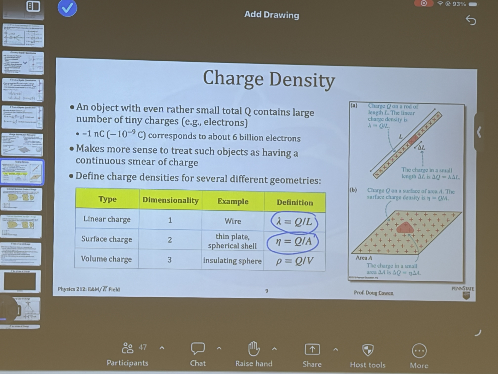
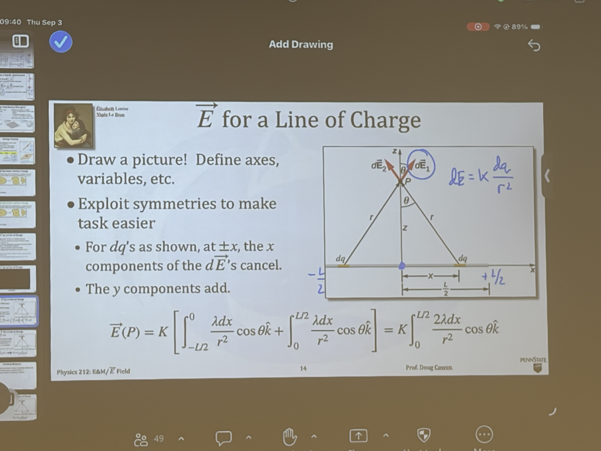
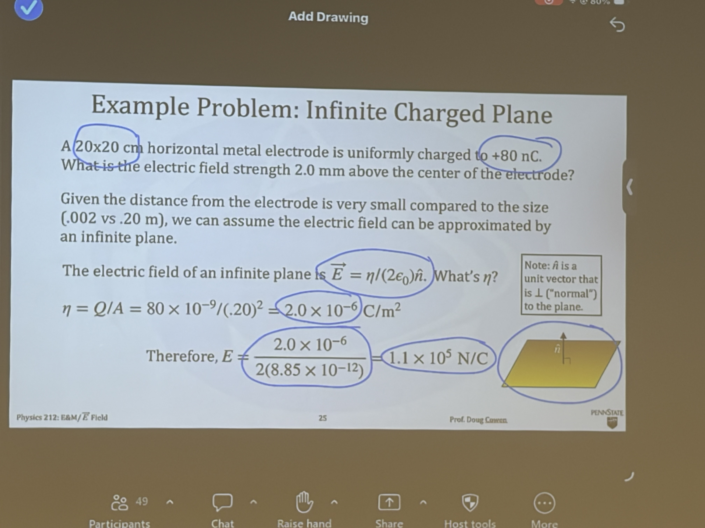

# 2026-09-03

## 今日学习内容 / Today's Learning Content

### 电荷密度 / Charge Density

宏观物体即使只带有很小的总电荷，也包含大量微观带电粒子，因此通常把电荷看作连续分布。电荷密度描述单位长度、单位面积或单位体积内分布了多少电荷。 / Even a macroscopically small total charge consists of many microscopic charged particles, so charge is often modeled as a continuous distribution. Charge density describes the amount of charge distributed per unit length, area, or volume.

- **线电荷密度 / Linear charge density：**均匀分布时 $\lambda=\frac{Q}{L}$，单位为 $\mathrm{C/m}$；一般情况下 $dq=\lambda\,dl$。常见于细导线。 / For a uniform distribution, $\lambda=\frac{Q}{L}$ with units $\mathrm{C/m}$; in general, $dq=\lambda\,dl$. This is commonly used for thin wires.
- **面电荷密度 / Surface charge density：**均匀分布时 $\sigma=\frac{Q}{A}$，单位为 $\mathrm{C/m^2}$；一般情况下 $dq=\sigma\,dA$。常见于薄板或球壳。 / For a uniform distribution, $\sigma=\frac{Q}{A}$ with units $\mathrm{C/m^2}$; in general, $dq=\sigma\,dA$. This is commonly used for thin plates or spherical shells.
- **体电荷密度 / Volume charge density：**均匀分布时 $\rho=\frac{Q}{V}$，单位为 $\mathrm{C/m^3}$；一般情况下 $dq=\rho\,dV$。常见于带电绝缘体。 / For a uniform distribution, $\rho=\frac{Q}{V}$ with units $\mathrm{C/m^3}$; in general, $dq=\rho\,dV$. This is commonly used for charged insulators.

若电荷密度随位置变化，总电荷需要通过积分求得：$Q=\int\lambda\,dl$、$Q=\iint\sigma\,dA$ 或 $Q=\iiint\rho\,dV$。 / If the charge density varies with position, the total charge is found by integration: $Q=\int\lambda\,dl$, $Q=\iint\sigma\,dA$, or $Q=\iiint\rho\,dV$.

### 线电荷与无限带电平面 / Line Charge and an Infinite Charged Plane

求线电荷产生的电场时，先画图并定义坐标、变量和距离，再利用对称性。对于关于观察点对称的线电荷微元，水平方向（如 $x$ 分量）的电场相互抵消，垂直方向分量相加，因此可将积分化为半段的两倍：$\vec E(P)=k\int_0^{L/2}\frac{2\lambda\,dx}{r^2}\,\cos\theta\,\hat{k}$。 / To find the field of a line charge, draw the geometry and define the axes, variables, and distance first, then exploit symmetry. For charge elements symmetric about the observation point, horizontal components (such as $x$ components) cancel while vertical components add, reducing the integral to twice one half: $\vec E(P)=k\int_0^{L/2}\frac{2\lambda\,dx}{r^2}\,\cos\theta\,\hat{k}$.

无限均匀带电平面的电场为
$\vec E=\frac{\sigma}{2\epsilon_0}\hat n$，其中 $\hat n$ 是垂直于平面的单位法向量；正电荷的电场指向远离平面的一侧。 / The field of an infinite uniformly charged plane is
$\vec E=\frac{\sigma}{2\epsilon_0}\hat n$, where $\hat n$ is a unit normal vector to the plane; for positive charge, the field points away from the plane.

例题：$20\times20\,\mathrm{cm}$ 金属电极带电 $Q=+80\,\mathrm{nC}$。由于测量点距电极 $2.0\,\mathrm{mm}$，远小于电极边长 $0.20\,\mathrm{m}$，可近似为无限平面。面电荷密度为
$\sigma=Q/A=80\times10^{-9}/(0.20)^2=2.0\times10^{-6}\,\mathrm{C/m^2}$，故
$E=\sigma/(2\epsilon_0)\approx1.1\times10^5\,\mathrm{N/C}$，方向沿平面法线向上。 / Example: A $20\times20\,\mathrm{cm}$ metal electrode carries $Q=+80\,\mathrm{nC}$. Because the observation point is $2.0\,\mathrm{mm}$ away—much less than the $0.20\,\mathrm{m}$ side length—we approximate it as an infinite plane. The surface density is $\sigma=Q/A=2.0\times10^{-6}\,\mathrm{C/m^2}$, giving $E=\sigma/(2\epsilon_0)\approx1.1\times10^5\,\mathrm{N/C}$, directed upward along the plane's normal.

[//begin]: # "Autogenerated link references for markdown compatibility"
[//end]: # "Autogenerated link references"
