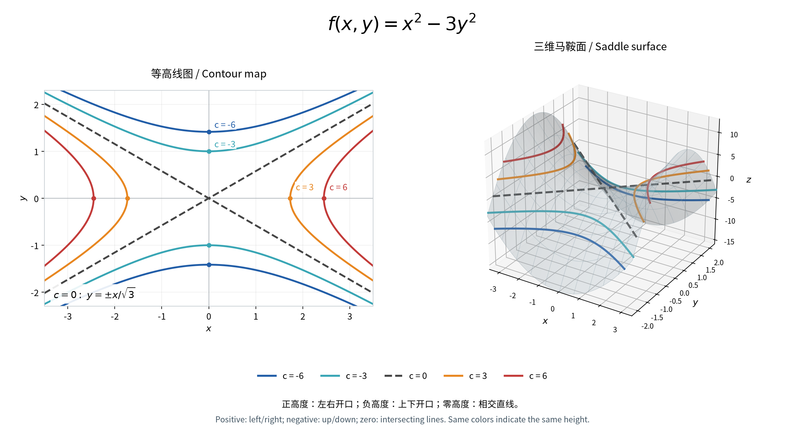

# 2026-09-16

## PHYS 212：静电学复习与推导 / Electrostatics Review and Derivations

课程入口：[[Courses/2026_fall/phys_212/course_overview]]；前置复习：[[Daily Notes/2026-09-03]] 中的电荷密度与平面电场。以下默认真空或可近似为真空的空气、静电场；无限平面与无限长圆柱模型忽略边缘效应。 / Course: [[Courses/2026_fall/phys_212/course_overview]]; prerequisites: charge density and plane fields in [[Daily Notes/2026-09-03]]. Unless stated otherwise, assume electrostatics in vacuum or approximately vacuum-like air; infinite-plane and infinite-cylinder models neglect edge effects.

符号约定：$E=\|\vec E\|\geq0$ 表示场强大小，$E_r=\vec E\cdot\hat r$ 表示有正负号的径向分量（向外为正），$\Delta V=V_f-V_i$。电荷及电荷密度保留正负号，$k=1/(4\pi\epsilon_0)\approx8.99\times10^9\,\mathrm{N\,m^2/C^2}$。 / Notation: $E=\|\vec E\|\geq0$ is the field magnitude; $E_r=\vec E\cdot\hat r$ is the signed radial component, positive outward; $\Delta V=V_f-V_i$. Charges and charge densities retain their signs, and $k=1/(4\pi\epsilon_0)\approx8.99\times10^9\,\mathrm{N\,m^2/C^2}$.

### 1. 高斯定律与高斯面的选择 / Gauss's Law and Gaussian Surfaces

电通量衡量电场穿过曲面的程度；闭合面的面积向量指向外侧。高斯定律中的电荷是高斯面内的净电荷： / Electric flux measures the field passing through a surface; area vectors on a closed surface point outward. The charge in Gauss's law is the net enclosed charge:

$$\Phi_E=\oint_S\vec E\cdot d\vec A=\oint_S E\cos\theta\,dA=\frac{Q_{\mathrm{enc}}}{\epsilon_0}.$$

从库仑定律理解：对点电荷 $q$，面元通量为 $d\Phi_E=kq\,d\Omega$，其中 $d\Omega$ 是带方向的立体角。若电荷在闭合面内，$\oint d\Omega=4\pi$，所以 $\Phi_E=4\pi kq=q/\epsilon_0$；若在面外，净立体角为零。对所有电荷叠加即得到高斯定律。 / From Coulomb's law, a point charge $q$ contributes $d\Phi_E=kq\,d\Omega$, where $d\Omega$ is the oriented solid angle. An enclosed charge gives $\oint d\Omega=4\pi$, hence $\Phi_E=4\pi kq=q/\epsilon_0$; an external charge gives zero net solid angle. Superposition gives Gauss's law for general charge distributions.

高斯定律普遍成立，但只有足够对称时，才能方便地将电场从积分中提出。面外电荷虽然不贡献净通量，仍可影响高斯面上各点的电场；$Q_{\mathrm{enc}}=0$ 只说明净通量为零，不能直接推出 $E=0$。 / Gauss's law is always valid, but extracting the field from the integral is convenient only with sufficient symmetry. External charges can affect the field on the surface even though they contribute zero net flux; $Q_{\mathrm{enc}}=0$ does not by itself imply $E=0$.

| 对称性 / Symmetry | 高斯面 / Gaussian surface | 通量化简 / Simplified flux |
| --- | --- | --- |
| 球对称 / Spherical | 同心球面 / Concentric sphere | $E_r4\pi r^2$ |
| 无限长圆柱对称 / Infinite cylindrical | 同轴圆柱面 / Coaxial cylinder | $E_r2\pi rL$；端盖通量为零 / Zero end-cap flux |
| 无限大平面对称 / Infinite planar | 跨过平面的薄柱盒 / Pillbox crossing the plane | 两端面贡献，侧面为零 / Two faces contribute; side contributes zero |

### 2. 无限带电平面与两板叠加 / Infinite Sheets and Superposition

对均匀无限薄带电面，取两端面面积均为 $A$ 的对称柱盒。由对称性，电场垂直于平面，两侧大小相等。以 $\sigma>0$ 为例，两端通量均向外： / For a uniform infinite thin sheet, choose a symmetric pillbox whose two faces each have area $A$. Symmetry makes the field perpendicular to the sheet and equal in magnitude on both sides. For $\sigma>0$, both face fluxes are outward:

$$2EA=\frac{\sigma A}{\epsilon_0}\quad\Longrightarrow\quad\boxed{E=\frac{|\sigma|}{2\epsilon_0}}.$$

正面电荷产生远离平面的电场，负面电荷产生指向平面的电场。公式不含距离，因此在无限平面模型下，$0.1d$、$0.25d$ 不改变单个平面的场强；但必须先确定观察点位于哪一侧、两板之间还是外部。 / Positive sheets produce fields away from the sheet; negative sheets produce fields toward it. The magnitude is independent of distance, so distances such as $0.1d$ or $0.25d$ do not change a sheet's field in this model; the point's side and whether it lies between or outside the sheets still matter.

令左板位于 $x=0$，右板位于 $x=d$，$+x$ 向右。由 $\vec E_{\mathrm{net}}=\vec E_1+\vec E_2$，对于 $\sigma>0$： / Put the left sheet at $x=0$ and the right sheet at $x=d$, with $+x$ to the right. From $\vec E_{\mathrm{net}}=\vec E_1+\vec E_2$, for $\sigma>0$:

| 两板电荷密度 / Sheet densities | 左侧 $x<0$ / Left | 板间 $0<x<d$ / Between | 右侧 $x>d$ / Right |
| --- | --- | --- | --- |
| 左 $+\sigma$、右 $+\sigma$ / Both positive | $E_x=-\sigma/\epsilon_0$ | $E_x=0$ | $E_x=+\sigma/\epsilon_0$ |
| 左 $+\sigma$、右 $-\sigma$ / Opposite signs | $E_x=0$ | $E_x=+\sigma/\epsilon_0$ | $E_x=0$ |

例如异号板之间，两场都从正板指向负板，故 $E=\sigma/(2\epsilon_0)+\sigma/(2\epsilon_0)=\sigma/\epsilon_0$。完全抵消需要两板面电荷密度大小相等；有限板只在远离边缘的区域近似满足这些结果。 / Between opposite sheets, both fields point from the positive sheet to the negative sheet, giving $E=\sigma/(2\epsilon_0)+\sigma/(2\epsilon_0)=\sigma/\epsilon_0$. Complete cancellation requires equal density magnitudes; finite plates approximate these results only away from edges.

### 3. 面电荷密度 / Surface Charge Density

一般定义是 $\sigma=dQ/dA$，因此 $Q=\int\sigma\,dA$；均匀分布时才可写成 $\sigma=Q/A$。 / In general, $\sigma=dQ/dA$, so $Q=\int\sigma\,dA$; a uniform distribution allows $\sigma=Q/A$.

$$\boxed{\sigma_{\mathrm{rectangle}}=\frac{Q}{LW}},\qquad\boxed{\sigma_{\mathrm{sphere}}=\frac{Q}{4\pi R^2}}.$$

单位为 $\mathrm{C/m^2}$，符号与该表面的电荷一致。导体薄板若两面都带电，必须明确 $Q$ 是某一面的电荷还是整块板的总电荷；不能自动把总电荷除以单面面积。 / Units are $\mathrm{C/m^2}$, and the sign follows the charge on that surface. If both faces of a conducting plate carry charge, distinguish the charge on one face from the total plate charge before dividing by area.

### 4. 导体静电平衡 / Conductors in Electrostatic Equilibrium

若导体材料内部存在电场，自由电荷会受到 $\vec F=q\vec E$ 而重新分布；达到静电平衡时，内部总电场必须为零。再在金属内部取任意微小高斯面，可知材料内部没有净体电荷，多余电荷位于表面，包括可能存在的空腔内表面。 / A field inside conducting material would exert $\vec F=q\vec E$ on free charges and cause redistribution. At electrostatic equilibrium, the total interior field must vanish. Applying Gauss's law to small surfaces within the metal shows that there is no net bulk charge; excess charge resides on surfaces, including cavity surfaces when present.

$$\boxed{\vec E=\vec0\quad\text{inside conducting material}}.$$

由 $V_B-V_A=-\int_A^B\vec E\cdot d\vec\ell=0$，每个连通导体是等势体。表面切向电场也为零，否则电荷会沿表面移动。“金属材料内部”不等于“空腔内部”；空腔中有电荷时，空腔电场通常不为零。 / Since $V_B-V_A=-\int_A^B\vec E\cdot d\vec\ell=0$, each connected conductor is equipotential. The tangential field at its surface also vanishes, or charges would move along it. Conducting material and an empty cavity region are different: a cavity containing charge generally has a nonzero field.

### 5. 导体空腔中的感应电荷 / Induced Charge on a Cavity

设空腔内电荷总量为 $q$，取完全位于金属内部且包围空腔的高斯面。由于该面处处 $E=0$，得到： / Let the total charge inside a cavity be $q$. Choose a Gaussian surface entirely within the metal and enclosing the cavity. Because $E=0$ everywhere on this surface:

$$0=\oint\vec E\cdot d\vec A=\frac{q+Q_{\mathrm{inner}}}{\epsilon_0}\quad\Longrightarrow\quad\boxed{Q_{\mathrm{inner}}=-q}.$$

若导体本身总电荷为 $Q_{\mathrm{cond}}$，电荷守恒进一步给出 $Q_{\mathrm{outer}}=Q_{\mathrm{cond}}+q$。例如 $q=-2.25\,\mathrm{pC}$，内表面为 $+2.25\,\mathrm{pC}$；若导体原本中性且孤立，外表面为 $-2.25\,\mathrm{pC}$。 / If the conductor's net charge is $Q_{\mathrm{cond}}$, charge conservation gives $Q_{\mathrm{outer}}=Q_{\mathrm{cond}}+q$. For $q=-2.25\,\mathrm{pC}$, the inner surface carries $+2.25\,\mathrm{pC}$; an initially neutral isolated conductor then has $-2.25\,\mathrm{pC}$ on its outer surface.

内表面总电荷为 $-q$ 不要求电荷位于中心；但均匀分布通常需要球形空腔与居中点电荷的对称性。接地导体可与大地交换电荷，因此不能预设其总电荷保持不变。 / The total inner charge is $-q$ even if the charge is off-center; uniformity generally requires a spherical cavity and a centered point charge. A grounded conductor can exchange charge with Earth, so its net charge need not remain fixed.

### 6. 球对称电场：导体球与绝缘球 / Spherical Fields: Conductors and Insulators

球对称时，半径 $r$ 的同心高斯面上径向电场相同： / Under spherical symmetry, the radial field is constant over a concentric Gaussian sphere of radius $r$:

$$E_r4\pi r^2=\frac{Q_{\mathrm{enc}}(r)}{\epsilon_0}\quad\Longrightarrow\quad\boxed{E_r(r)=k\frac{Q_{\mathrm{enc}}(r)}{r^2}}.$$

**导体实心球：**半径为 $R$、总电荷为 $Q$ 的球形导体在无外场破坏对称性时，电荷均匀分布于表面，内部 $E=0$，外部等效为位于球心的点电荷。 / **Solid conducting sphere:** for a sphere of radius $R$ and charge $Q$, with no external field breaking symmetry, charge is uniform on the surface. The interior field is zero, and the exterior field equals that of a point charge at the center.

$$E_r(r)=\begin{cases}0,&r<R,\\kQ/r^2,&r>R.\end{cases}\qquad E(r>R)=k\frac{|Q|}{r^2}.$$

**均匀带电绝缘实心球：**电荷固定分布于整个体积，不能套用“导体内部场为零”。若体密度为 $\rho_0$，则： / **Uniformly charged insulating solid sphere:** charge occupies the volume, so the zero-field rule for conducting material does not apply. For uniform volume density $\rho_0$:

$$Q_{\mathrm{enc}}(r)=\begin{cases}\rho_0\frac43\pi r^3,&r<R,\\\rho_0\frac43\pi R^3=Q,&r>R.\end{cases}$$

$$\boxed{E_r(r)=\begin{cases}\dfrac{\rho_0r}{3\epsilon_0},&r<R,\\\dfrac{\rho_0R^3}{3\epsilon_0r^2},&r>R.\end{cases}}$$

球内大小随 $r$ 线性增加，球外按 $1/r^2$ 衰减；球心为零，$r=R$ 处两式连续，大小最大。若 $\rho_0<0$，$E_r<0$ 表示向内；求大小时用 $|\rho_0|$。 / The magnitude grows linearly inside and falls as $1/r^2$ outside. It is zero at the center, continuous at $r=R$, and maximal there. If $\rho_0<0$, the negative radial component points inward; use $|\rho_0|$ for the magnitude.

### 7. 均匀薄球壳与中心电荷 / Uniform Thin Spherical Shells and Central Charges

半径为 $R$、总电荷为 $Q_s$ 的均匀薄球壳，壳内高斯面不包围电荷；结合球对称性得 $E_r4\pi r^2=0$，故壳内 $E=0$。壳外包围全部电荷： / For a uniform thin shell of radius $R$ and charge $Q_s$, an interior Gaussian sphere encloses no charge. Spherical symmetry then gives $E_r4\pi r^2=0$, so the interior field vanishes. Outside, all shell charge is enclosed:

$$E_r(r)=\begin{cases}0,&r<R,\\kQ_s/r^2,&r>R.\end{cases}$$

若在均匀绝缘薄球壳中心再放置点电荷 $q$，叠加后壳内 $E_r=kq/r^2$（$0<r<R$），壳外 $E_r=k(q+Q_s)/r^2$。若改为有厚度的导体球壳，则空腔、金属、外部必须分区：空腔中可有电场，金属内仍为零，外部在球对称条件下由总包围电荷决定。 / Adding a point charge $q$ at the center of a uniformly charged insulating shell gives $E_r=kq/r^2$ for $0<r<R$ and $E_r=k(q+Q_s)/r^2$ outside. For a conducting shell of finite thickness, distinguish cavity, metal, and exterior: the cavity may have a field, the metal has none, and the spherically symmetric exterior field depends on the total enclosed charge.

### 8. 无限长线电荷 / Infinite Line Charge

对线密度为 $\lambda$ 的无限长直线电荷，取半径 $r$、长度 $L$ 的同轴高斯柱面。电场径向，端盖无通量，侧面电场大小处处相同： / For an infinite straight line of density $\lambda$, choose a coaxial Gaussian cylinder of radius $r$ and length $L$. The radial field gives zero end-cap flux and a constant field magnitude on the curved surface:

$$E_r(2\pi rL)=\frac{\lambda L}{\epsilon_0}\quad\Longrightarrow\quad\boxed{E_r=\frac{\lambda}{2\pi\epsilon_0r}},\qquad\boxed{E=\frac{|\lambda|}{2\pi\epsilon_0r}}.$$

正线电荷向外，负线电荷向内，大小按 $1/r$ 衰减。原因是通量穿过的圆柱侧面积随 $r$ 增长，而球面面积随 $r^2$ 增长。 / Positive line charge gives an outward field and negative line charge an inward field, with magnitude proportional to $1/r$. The cylindrical flux area grows as $r$, whereas a spherical area grows as $r^2$.

### 9. 同轴圆柱导体的分区推导 / Piecewise Fields of Coaxial Conductors

设无限长内导体棒半径为 $r_a$，线电荷密度为 $\lambda_a$；外导体管内、外半径为 $r_b,r_c$，其中 $r_a<r_b<r_c$，管的净线电荷密度为 $\lambda_{\mathrm{tube}}$。外管内、外表面线密度分别为 $\lambda_b,\lambda_c$。 / Let an infinite inner conducting rod have radius $r_a$ and line density $\lambda_a$. An outer conducting tube has inner and outer radii $r_b,r_c$, with $r_a<r_b<r_c$, and net line density $\lambda_{\mathrm{tube}}$. Its inner and outer surfaces carry line densities $\lambda_b,\lambda_c$.

在外管金属中取高斯柱面，$E=0$ 要求 $\lambda_a+\lambda_b=0$。再由外管电荷守恒 $\lambda_b+\lambda_c=\lambda_{\mathrm{tube}}$： / A Gaussian cylinder in the tube's metal has $E=0$, requiring $\lambda_a+\lambda_b=0$. Charge conservation for the tube gives $\lambda_b+\lambda_c=\lambda_{\mathrm{tube}}$, hence:

$$\boxed{\lambda_b=-\lambda_a},\qquad\boxed{\lambda_c=\lambda_{\mathrm{tube}}+\lambda_a}.$$

每个非金属区域用 $E_r2\pi rL=Q_{\mathrm{enc}}/\epsilon_0$，可得完整分段式： / Applying $E_r2\pi rL=Q_{\mathrm{enc}}/\epsilon_0$ in each nonmetal region gives:

$$\boxed{E_r(r)=\begin{cases}0,&r<r_a,\\\dfrac{\lambda_a}{2\pi\epsilon_0r},&r_a<r<r_b,\\0,&r_b<r<r_c,\\\dfrac{\lambda_a+\lambda_{\mathrm{tube}}}{2\pi\epsilon_0r},&r>r_c.\end{cases}}$$

例如 $\lambda_a=-\lambda$、$\lambda>0$，间隙中 $E_r=-\lambda/(2\pi\epsilon_0r)$，负号表示向内。外部场不一定非零：若 $\lambda_{\mathrm{tube}}=-\lambda_a$，总包围电荷为零，外部场也为零。 / For $\lambda_a=-\lambda$ with $\lambda>0$, the gap field is $E_r=-\lambda/(2\pi\epsilon_0r)$, pointing inward. The exterior field need not be nonzero: if $\lambda_{\mathrm{tube}}=-\lambda_a$, the enclosed net charge and exterior field both vanish.

### 10. 圆柱表面电荷密度 / Cylindrical Surface Charge Density

半径 $r$、长度 $L$ 的圆柱侧面积为 $2\pi rL$；若该表面的线电荷密度为 $\lambda_s$，电荷为 $Q_s=\lambda_sL$，因此： / A cylindrical surface of radius $r$ and length $L$ has area $2\pi rL$. If that surface carries line density $\lambda_s$, its charge is $Q_s=\lambda_sL$, so:

$$\boxed{\sigma=\frac{\lambda_s}{2\pi r}},\qquad\sigma_a=\frac{\lambda_a}{2\pi r_a},\quad\sigma_b=\frac{-\lambda_a}{2\pi r_b},\quad\sigma_c=\frac{\lambda_a+\lambda_{\mathrm{tube}}}{2\pi r_c}.$$

这里必须使用对应表面的线电荷密度；不能将整根外管的净线密度直接用于内表面。 / Use the line density of the particular surface, not the tube's net line density for its inner surface.

### 11. 导体表面刚外侧的电场 / Field Immediately Outside a Conductor

用无穷薄柱盒跨过带电表面，并令 $\hat n$ 从导体材料指向外部空间。柱盒厚度趋零时侧面通量消失，高斯定律给出法向场的跳变： / Use an infinitesimal pillbox across a charged surface, with $\hat n$ pointing from the conducting material into the adjacent space. Side flux vanishes as its thickness tends to zero, and Gauss's law gives the normal-field jump:

$$(\vec E_{\mathrm{out}}-\vec E_{\mathrm{in}})\cdot\hat n=\frac{\sigma}{\epsilon_0}.$$

导体内部 $\vec E_{\mathrm{in}}=0$，表面切向场也为零，因此在光滑表面紧邻外侧： / Since $\vec E_{\mathrm{in}}=0$ and the tangential surface field vanishes, immediately outside a smooth conducting surface:

$$\boxed{\vec E_{\mathrm{out}}=\frac{\sigma}{\epsilon_0}\hat n},\qquad\boxed{\sigma=\epsilon_0E_\perp},\qquad E=\frac{|\sigma|}{\epsilon_0}.$$

单个孤立无限薄电荷面两侧都有场，通量为 $2EA$；导体边界内侧无场，通量只有 $E_\perp A$，这解释了因子 $2$ 的区别。对于空腔内表面，$\hat n$ 指向空腔，未必与从轴线或球心向外的 $\hat r$ 同向。 / An isolated infinite sheet has fields on both sides, giving flux $2EA$; a conductor boundary has no interior field, leaving only $E_\perp A$. This explains the factor of two. At a cavity wall, $\hat n$ points into the cavity and may oppose the radial direction $\hat r$.

### 12. 电场图像的判断 / Reading Field Graphs

画图前先确认纵轴是非负的大小 $E$，还是可以为负的分量 $E_r$。分区求包围电荷，再判断零点、幂律、方向和表面跳变。 / Before plotting, distinguish a nonnegative magnitude $E$ from a signed component $E_r$. Determine enclosed charge region by region, then identify zeros, power laws, directions, and surface jumps.

| 区域 / Region | 图像特征 / Graph behavior |
| --- | --- |
| 均匀绝缘实心球内部 / Uniform insulating sphere interior | $E\propto r$，从零线性增长 / Linear growth from zero |
| 球对称分布外部 / Outside a spherical distribution | $E\propto1/r^2$，总电荷非零时 / For nonzero total charge |
| 无限线电荷或同轴间隙 / Infinite line or coaxial gap | $E\propto1/r$ |
| 导体材料内 / Conducting material | $E=0$ |
| 理想无限平面的一侧 / One side of an infinite sheet | $E$ 为常数 / Constant magnitude |

同轴导体常见顺序为 $0\to1/r\to0\to1/r$，最后一段是否为零及其符号由总线电荷决定。负内棒使间隙内的 $E_r$ 位于横轴下方。表面电荷允许法向场跳变；均匀绝缘球只有体电荷、无额外面电荷时，$r=R$ 处电场连续。 / A common coaxial pattern is $0\to1/r\to0\to1/r$, but the last segment's sign and whether it vanishes depend on the net line charge. A negative inner rod puts the gap's $E_r$ below the axis. Surface charge allows jumps in the normal field; a uniformly charged insulating sphere without an extra surface charge has a continuous field at $r=R$.

### 13. 电势与电场方向 / Potential and Field Direction

电势差定义为单位试探电荷电势能的变化。电场力做功为 $W_E=q\int_i^f\vec E\cdot d\vec\ell$，结合 $\Delta U=-W_E$，得到： / Potential difference is the change in potential energy per unit test charge. Electric work is $W_E=q\int_i^f\vec E\cdot d\vec\ell$; using $\Delta U=-W_E$ gives:

$$\boxed{V_f-V_i=-\int_i^f\vec E\cdot d\vec\ell},\qquad dV=-\vec E\cdot d\vec\ell,\qquad\boxed{\vec E=-\nabla V}.$$

沿非零电场移动，点积为正，电势下降；逆电场移动，电势上升；沿等势面移动，电场不做功。电场垂直于等势面，这些结论与试探电荷的正负无关。 / Moving along a nonzero field gives a positive dot product and decreasing potential; moving against it increases potential. Motion along an equipotential involves no electric work. The field is perpendicular to equipotentials, independently of the sign of a test charge.

### 14. 电势能与电荷正负 / Potential Energy and Charge Sign

电荷 $q$ 在外部电势 $V$ 中的电势能为 $U=qV$（需选定参考零点），其变化为： / A charge $q$ in an external potential $V$ has potential energy $U=qV$ for a chosen reference, with change:

$$\boxed{\Delta U=q\Delta V},\qquad\boxed{W_E=-q\Delta V}.$$

| 电荷 / Charge | 电势升高 $\Delta V>0$ / Potential rises | 电势降低 $\Delta V<0$ / Potential falls |
| --- | --- | --- |
| 正电荷，如质子 / Positive, e.g. proton | $\Delta U>0$ | $\Delta U<0$ |
| 负电荷，如电子 / Negative, e.g. electron | $\Delta U<0$ | $\Delta U>0$ |

因此在相同电势变化下，质子与电子的电势能变化符号相反。只受电场力、从静止释放时，正电荷起初沿电场加速，负电荷起初逆电场加速，两者的电势能都减小。 / Protons and electrons have opposite potential-energy changes for the same potential change. Released from rest under electric force alone, positive charges initially accelerate along the field and negative charges against it; both lose potential energy.

### 15. 平行板电势差与击穿条件 / Plate Voltage and Breakdown

均匀电场中，沿电场方向取坐标 $x$，积分直接得到 $V(x)=V(0)-Ex$。相距 $d$ 的两块等势平行板满足： / In a uniform field, choose $x$ along the field. Integration gives $V(x)=V(0)-Ex$. Two equipotential parallel plates separated by $d$ satisfy:

$$\Delta V=-Ed\quad\text{(along the field)},\qquad\boxed{E=\frac{|\Delta V|}{d}}.$$

若固定电压并要求不超过给定击穿场强，条件为 $|\Delta V|/d\leq E_{\mathrm{breakdown}}$，所以临界间距是最小允许间距，而不是最大间距；若固定间距，则可求最大电压： / At fixed voltage, requiring the field not to exceed a specified breakdown threshold gives $|\Delta V|/d\leq E_{\mathrm{breakdown}}$. The threshold separation is a minimum, not a maximum; at fixed spacing, it instead gives a maximum voltage:

$$\boxed{d_{\min}=\frac{|\Delta V|}{E_{\mathrm{breakdown}}}},\qquad\boxed{|\Delta V|_{\max}=E_{\mathrm{breakdown}}d}.$$

这是把击穿场强视为给定常量的理想模型，实际使用通常需低于临界场强。计算时统一使用 SI 单位：$1\,\mathrm{mm}=10^{-3}\,\mathrm m$，$1\,\mathrm{V/m}=1\,\mathrm{N/C}$。 / This idealized model treats the breakdown threshold as a given constant; practical operation generally stays below it. Use consistent SI units: $1\,\mathrm{mm}=10^{-3}\,\mathrm m$ and $1\,\mathrm{V/m}=1\,\mathrm{N/C}$.

### 16. 悬挂带电小球的受力平衡 / Equilibrium of a Suspended Charged Ball

设电场水平，小球质量为 $m$、电荷为 $q$，绳与竖直方向的偏角大小为 $\theta$。平衡时竖直方向张力抵消重力，水平方向张力抵消电场力： / Let the field be horizontal, the ball have mass $m$ and charge $q$, and the string make an angle of magnitude $\theta$ with the vertical. At equilibrium, tension balances gravity vertically and electric force horizontally:

$$T\cos\theta=mg,\qquad T\sin\theta=|q|E.$$

$$\tan\theta=\frac{|q|E}{mg}\quad\Longrightarrow\quad\boxed{E=\frac{mg\tan\theta}{|q|}}.$$

对正电荷可直接将分母写成 $q$；负电荷偏向电场反方向。若场来自单个均匀大薄电荷面，$|\sigma|=2\epsilon_0E$；若来自理想异号平行板的板间区域，$|\sigma|=\epsilon_0E$。面电荷的正负要根据电场方向与小球所在侧另行判断。 / For a positive charge, the denominator is simply $q$; a negative charge deflects opposite the field. A single uniform large thin sheet gives $|\sigma|=2\epsilon_0E$, whereas the gap of ideal oppositely charged plates gives $|\sigma|=\epsilon_0E$. Determine the sign of the surface charge separately from the field direction and the ball's location.

### 17. 带电粒子经过电势差加速 / Charged-Particle Acceleration Through a Voltage

若只有静电力做功，机械能守恒 $K_i+U_i=K_f+U_f$；在非相对论速度下： / If only the electrostatic force does work, $K_i+U_i=K_f+U_f$. At nonrelativistic speeds:

$$\boxed{\Delta K=-q\Delta V},\qquad\frac12m(v_f^2-v_i^2)=-q\Delta V.$$

从静止出发要能加速到终点，必须满足 $q\Delta V<0$。在此前提下，$-q\Delta V=|q\Delta V|$，所以： / Acceleration from rest to the final point requires $q\Delta V<0$. Under this condition, $-q\Delta V=|q\Delta V|$, giving:

$$\boxed{\frac12mv^2=|q\Delta V|},\qquad\boxed{v=\sqrt{\frac{2|q\Delta V|}{m}}}.$$

不要先取绝对值而丢掉运动方向条件：质子从高电势向低电势加速，电子从低电势向高电势加速。若 $q\Delta V>0$，电场使粒子减速，粒子需要足够初动能才能到达终点。 / Do not use absolute values to hide the direction condition: protons accelerate toward lower potential, electrons toward higher potential. If $q\Delta V>0$, the field slows the particle, which needs sufficient initial kinetic energy to reach the endpoint.

两个粒子从静止经过相同大小的加速电压，且电荷大小相等，则动能相同、速度满足 $v\propto1/\sqrt m$。电子与质子的非相对论速度比为： / Two particles starting from rest through equal accelerating voltage magnitudes, with equal charge magnitudes, gain equal kinetic energies and have $v\propto1/\sqrt m$. The nonrelativistic electron-to-proton speed ratio is:

$$\boxed{\frac{v_e}{v_p}=\sqrt{\frac{m_p}{m_e}}\approx\sqrt{1836}\approx42.8}.$$

两者需沿各自的加速方向运动，并非以相同方向经过同一有符号电势差。上述速度公式要求所得 $v\ll c$；能量变化关系 $\Delta K=-q\Delta V$ 本身仍成立。 / Each particle must move in its own accelerating direction, not traverse the same signed potential difference in the same direction. These speed formulas require $v\ll c$; the energy relation $\Delta K=-q\Delta V$ itself remains valid.

### 18. 速判规则与解题顺序 / Quick Rules and Problem-Solving Order

| 情形 / Situation | 速判公式 / Quick rule |
| --- | --- |
| 导体材料静电平衡 / Conducting material in equilibrium | $E=0$，导体等势 / Equipotential conductor |
| 单个均匀无限薄电荷面 / Single uniform infinite sheet | $E=|\sigma|/(2\epsilon_0)$ |
| 光滑导体表面紧邻外侧 / Immediately outside a smooth conductor | $E_\perp=\sigma/\epsilon_0$，保留方向符号 / Signed normal component |
| 等量异号理想平行板之间 / Between equal opposite ideal plates | $E=|\sigma|/\epsilon_0=|\Delta V|/d$ |
| 无限线电荷 / Infinite line | $E\propto1/r$ |
| 球对称电荷分布外部 / Exterior spherical field | $E\propto1/r^2$，总电荷非零时 / For nonzero net charge |
| 均匀绝缘球内部 / Uniform insulating sphere interior | $E\propto r$ |
| 沿电场方向 / Along the field | 电势降低 / Potential decreases |
| 电势能变化 / Potential-energy change | $\Delta U=q\Delta V$ |
| 静电力做功 / Electric work | $\Delta K=-q\Delta V$ |
| 从静止非相对论加速 / Nonrelativistic acceleration from rest | $\frac12mv^2=|q\Delta V|$，要求 $q\Delta V<0$ / Requires $q\Delta V<0$ |

1. **先判断几何对称性与材料：**球、柱还是平面？导体还是绝缘体？ / **Identify symmetry and material:** sphere, cylinder, or plane; conductor or insulator?
2. **选高斯面并分区：**空腔、金属、间隙和外部要分开处理。 / **Choose a Gaussian surface and split regions:** distinguish cavity, metal, gaps, and exterior.
3. **计算净包围电荷：**体电荷用体积，面电荷用面积，线电荷用长度；导体内 $E=0$ 可反推感应电荷。 / **Find net enclosed charge:** use volume, area, or length as appropriate; zero field in metal can determine induced charge.
4. **先求有符号分量，再按题意取大小：**向内的径向场为负，电场大小不能为负。 / **Find signed components before magnitudes:** inward radial fields are negative, but magnitudes are not.
5. **遇到电势或速度，转用积分与能量：**$\Delta V=-\int\vec E\cdot d\vec\ell$，$\Delta K=-q\Delta V$；最后检查单位与适用条件。 / **For potential or speed, use integration and energy:** $\Delta V=-\int\vec E\cdot d\vec\ell$, $\Delta K=-q\Delta V$; then check units and assumptions.

## Math 230：二元函数的截线与等高线图 / Traces and Contour Maps of Functions of Two Variables

课程：[[Courses/2026_fall/math_230/course_overview]]。二元函数 $z=f(x,y)$ 把定义域中的每个点 $(x,y)$ 对应到一个高度 $z$，其图像通常是三维空间中的曲面。截线和等高线图帮助我们通过二维曲线理解曲面的形状。 / Course: [[Courses/2026_fall/math_230/course_overview]]. A function $z=f(x,y)$ assigns a height $z$ to each point $(x,y)$ in its domain; its graph is typically a surface in three-dimensional space. Traces and contour maps help us understand this surface through two-dimensional curves.

### 1. 截线：用平面切曲面 / Traces: Slicing a Surface with a Plane

截线（trace）是曲面与某个平面的交线。对于 $z=f(x,y)$，常见做法是固定 $x$、$y$ 或 $z$，再研究剩下两个变量的关系；所得交集也可能为空或退化为一个点。 / A trace is the intersection of a surface with a plane. For $z=f(x,y)$, we commonly fix $x$, $y$, or $z$ and examine the relationship between the other two variables; the intersection may also be empty or degenerate to a point.

| 固定变量 / Fixed variable | 截线方程 / Trace equation | 所在平面 / Containing plane |
| --- | --- | --- |
| $x=a$ | $z=f(a,y)$ | 平行于 $yz$ 平面的竖直平面 / Vertical plane parallel to the $yz$-plane |
| $y=b$ | $z=f(x,b)$ | 平行于 $xz$ 平面的竖直平面 / Vertical plane parallel to the $xz$-plane |
| $z=c$ | $f(x,y)=c$，且 $z=c$ / With $z=c$ | 平行于 $xy$ 平面的水平平面 / Horizontal plane parallel to the $xy$-plane |

求截线时，先把固定值代入函数，再判断得到的是直线、抛物线、圆还是其他曲线，并注明它位于哪个平面。特别地，$x=0$、$y=0$、$z=0$ 对应三个坐标平面中的截线。 / To find a trace, substitute the fixed value, identify the resulting line, parabola, circle, or other curve, and state its containing plane. In particular, $x=0$, $y=0$, and $z=0$ give traces in the three coordinate planes.

**例：抛物面 $z=x^2+y^2$。**固定 $x=a$ 得到 $z=a^2+y^2$，固定 $y=b$ 得到 $z=x^2+b^2$，都是开口向上的抛物线；固定 $z=c$ 得到 $x^2+y^2=c$。当 $c>0$ 时，水平截线是在高度 $z=c$ 处、半径为 $\sqrt c$ 的圆；$c=0$ 时只有原点；$c<0$ 时无交点。 / **Example: the paraboloid $z=x^2+y^2$.** Fixing $x=a$ gives $z=a^2+y^2$, and fixing $y=b$ gives $z=x^2+b^2$, both upward-opening parabolas. Fixing $z=c$ gives $x^2+y^2=c$: a circle of radius $\sqrt c$ at height $z=c$ for $c>0$, only the origin for $c=0$, and no intersection for $c<0$.

### 2. 等高线与等高线图 / Level Curves and Contour Maps

等高线（level curve / contour）是在 $xy$ 平面内满足同一函数值的点集： / A level curve, or contour, is the set of points in the $xy$-plane having the same function value:

$$\boxed{f(x,y)=c}.$$

水平截线由三维点 $(x,y,c)$ 组成；将它投影到 $xy$ 平面，就得到对应的等高线。选取多个高度 $c_1,c_2,\ldots$，画出各条等高线并标注函数值，就得到等高线图（contour map）。图上的两个坐标轴是 $x,y$，高度由曲线标签表示。 / A horizontal trace consists of three-dimensional points $(x,y,c)$; projecting it onto the $xy$-plane gives the corresponding level curve. Drawing level curves for several heights $c_1,c_2,\ldots$ and labeling their function values produces a contour map. Its axes are $x$ and $y$; height is represented by the curve labels.

对 $f(x,y)=x^2+y^2$，取 $c=0,1,4,9$，得到原点以及半径为 $1,2,3$ 的同心圆，标签分别为 $0,1,4,9$。标签向外增大，说明曲面从中心向外升高。这里高度间隔不相等，因此不能只看这些圆的间距来比较陡峭程度。 / For $f(x,y)=x^2+y^2$, the levels $c=0,1,4,9$ give the origin and concentric circles of radii $1,2,3$, labeled $0,1,4,9$. Increasing labels outward show that the surface rises away from the center. These height intervals are unequal, so circle spacing alone cannot be used to compare steepness.

#### 等高距 / Contour Interval

等高距（contour interval）是等高线图中相邻两个绘制层级的函数值之差的大小，通常取固定值。对于 $z=f(x,y)$，它表示高度 $z$ 的变化量，而不是纸面上两条曲线的水平距离。 / The contour interval is the magnitude of the difference in function value between consecutive plotted levels, usually chosen to be constant. For $z=f(x,y)$, it measures a change in height $z$, not the horizontal distance between curves on the map.

$$\boxed{\Delta c=|c_{i+1}-c_i|}.$$

例如等高线依次标为 $10,20,30,40$，则等高距为 $10$；若标签的单位为米，等高距就是 $10\,\mathrm m$。如果从标为 $10$ 的线到标为 $40$ 的线共跨过三个等高间隔，则 $\Delta c=(40-10)/3=10$，计算时要数间隔而不是线条。 / For contours labeled $10,20,30,40$, the contour interval is $10$; if the labels are in meters, it is $10\,\mathrm m$. Crossing three equal level intervals from the contour labeled $10$ to the one labeled $40$ gives $\Delta c=(40-10)/3=10$: count intervals, not lines.

对于 $f(x,y)=x^2+y^2$，选择 $c=1,2,3,4$ 时，等高距固定为 $1$，对应圆的半径却是 $1,\sqrt2,\sqrt3,2$。越往外圆与圆的水平间距越小，说明相同高度变化发生在更短的水平距离内，曲面更陡。前例中的 $c=0,1,4,9$ 则具有不等的层级差 $1,3,5$，没有统一的等高距。 / For $f(x,y)=x^2+y^2$, choosing $c=1,2,3,4$ gives a constant contour interval of $1$, but the circle radii are $1,\sqrt2,\sqrt3,2$. Their horizontal spacing decreases outward, meaning the same height change occurs over a shorter horizontal distance and the surface is steeper. The earlier levels $c=0,1,4,9$ have unequal differences $1,3,5$, so they do not have a single constant contour interval.

### 3. 如何读等高线图 / How to Read a Contour Map

- **沿一条等高线走，函数值不变：**从一条等高线移动到另一条时，看标签判断高度增加还是减少。 / **The function value stays constant along a contour:** when moving between contours, use their labels to determine whether height increases or decreases.
- **等高差条件下，线密通常表示坡陡：**若相邻线的 $\Delta c$ 相同，沿局部垂直于等高线的方向，较小的水平间距 $\Delta\ell$ 对应较大的平均高度变化率 $|\Delta c|/\Delta\ell$；线疏则较平缓。 / **For equal level intervals, closer contours generally indicate a steeper slope:** along the local direction perpendicular to contours, smaller horizontal spacing $\Delta\ell$ gives a larger average height-change rate $|\Delta c|/\Delta\ell$. Wider spacing indicates gentler slopes.
- **不同高度的等高线不能相交：**同一个 $(x,y)$ 不能同时满足 $f(x,y)=c_1$ 和 $f(x,y)=c_2$，其中 $c_1\ne c_2$；但同一高度的等值集合可以出现交叉分支。 / **Contours of different levels cannot intersect:** a single $(x,y)$ cannot have two distinct function values $c_1\ne c_2$. A level set at one value can, however, have crossing branches.
- **闭合曲线要结合标签判断：**向中心标签升高表示向内升高，标签降低表示向内降低；不能仅凭同心形状就断定是山峰还是低谷。 / **Read labels on closed contours:** increasing labels toward the center indicate rising terrain inward, while decreasing labels indicate falling terrain. Concentric shapes alone do not distinguish a peak from a depression.

### 4. 对比例子：鞍面 / A Contrasting Example: A Saddle

对 $z=x^2-y^2$，在 $y=0$ 平面内的截线为 $z=x^2$，向上开口；在 $x=0$ 平面内的截线为 $z=-y^2$，向下开口。这说明沿两个不同方向看，曲面一个方向上升、另一个方向下降，形成鞍形。 / For $z=x^2-y^2$, the trace in $y=0$ is $z=x^2$, opening upward, whereas the trace in $x=0$ is $z=-y^2$, opening downward. The surface rises in one direction and falls in the other, producing a saddle.

等高线满足 $x^2-y^2=c$：$c>0$ 时双曲线沿 $x$ 方向开口，$c<0$ 时沿 $y$ 方向开口；$c=0$ 时退化为相交直线 $y=\pm x$。这两条直线属于同一个高度 $c=0$，因此不违反“不同高度等高线不相交”的规则。 / The contours satisfy $x^2-y^2=c$: hyperbolas open along the $x$ direction for $c>0$ and along the $y$ direction for $c<0$. At $c=0$, the level set becomes the intersecting lines $y=\pm x$. Both lines have the same level $c=0$, so this does not violate the rule that different levels cannot intersect.

与今日物理的联系：若用 $V(x,y)$ 表示二维电势分布，$V(x,y)=c$ 就是等势线；电场 $\vec E=-\nabla V$ 在梯度非零处垂直于等势线，并指向电势降低的方向。 / Connection to today's physics: if $V(x,y)$ describes a two-dimensional potential, $V(x,y)=c$ gives equipotential contours. Where the gradient is nonzero, $\vec E=-\nabla V$ is perpendicular to these contours and points toward decreasing potential.

### 5. 等高线例题与图示：$f(x,y)=x^2-3y^2$ / Level-Curve Example and Illustration

求等高线时，令 $f(x,y)=c$，即 $x^2-3y^2=c$，再根据 $c$ 的正负化成标准式。左图是 $xy$ 平面上的等高线，右图是曲面上对应高度的截线，两图颜色对应同一高度。 / To find level curves, set $f(x,y)=c$, giving $x^2-3y^2=c$, then rewrite in standard form according to the sign of $c$. The left panel shows contours in the $xy$-plane; the right panel shows the corresponding traces on the surface. Matching colors indicate the same height.

- **$c>0$：**$\dfrac{x^2}{c}-\dfrac{y^2}{c/3}=1$，双曲线左右开口，顶点为 $(\pm\sqrt c,0)$；图中暖色表示 $c=3,6$。 / The hyperbola opens left and right, with vertices $(\pm\sqrt c,0)$; warm colors show $c=3,6$.
- **$c<0$：**令 $d=-c>0$，得到 $\dfrac{y^2}{d/3}-\dfrac{x^2}{d}=1$，双曲线上下开口，顶点为 $(0,\pm\sqrt{d/3})$；图中冷色表示 $c=-3,-6$。 / Set $d=-c>0$; the hyperbola opens up and down, with vertices $(0,\pm\sqrt{d/3})$; cool colors show $c=-3,-6$.
- **$c=0$：**$x^2-3y^2=0$ 给出两条相交直线 $y=\pm x/\sqrt3$，图中用灰色虚线表示；它们也是非零高度双曲线的渐近线。 / The zero level consists of the two intersecting lines $y=\pm x/\sqrt3$, drawn as dashed gray lines; they are also the asymptotes of the nonzero-level hyperbolas.

图中选取 $c=-6,-3,0,3,6$，等高距为 $3$。完整推导、顶点表及 $2x^2+5y^2$ 的椭圆等高线例题见 [[Math_Calculus/6.Multivariable_Calculus/traces_and_contour_maps]]。 / The plotted levels are $c=-6,-3,0,3,6$, with contour interval $3$. See the linked subject note for full derivations, the vertex table, and the elliptical contours of $2x^2+5y^2$.

## 学科整理 / Subject Notes

- [[Math_Calculus/6.Multivariable_Calculus/traces_and_contour_maps]] — 二元函数的截线与等高线图 / Traces and Contour Maps
- [[Physics/2.Electrostatics/electric_field_and_charge_density]] — 电场与连续电荷分布 / Electric Fields and Continuous Charge Distributions
- [[Physics/2.Electrostatics/gauss_law_and_conductors]] — 高斯定律、对称电场与导体 / Gauss’s Law, Symmetric Fields, and Conductors
- [[Physics/2.Electrostatics/electric_potential_and_energy]] — 电势、电势能与带电粒子运动 / Electric Potential, Energy, and Charged-Particle Motion

[//begin]: # "Autogenerated link references for markdown compatibility"
[//end]: # "Autogenerated link references"
