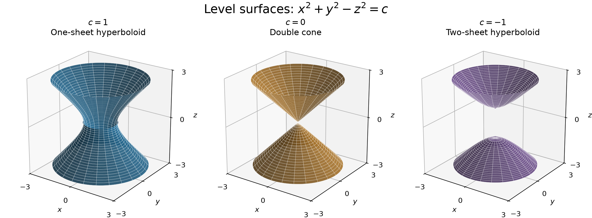
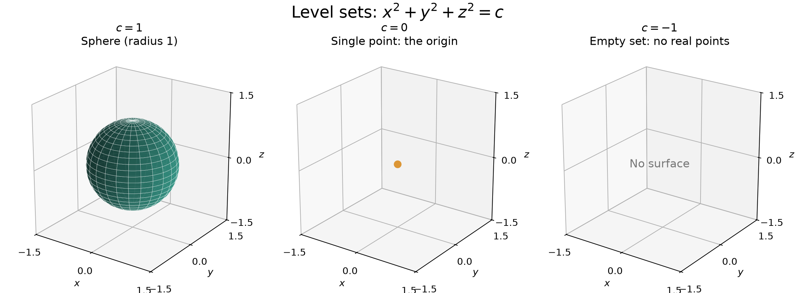

# 2026-09-18
# Math 230：等高线、变化率与等值面 / Level Curves, Rates of Change, and Level Surfaces

课程：[[Courses/2026_fall/math_230/course_overview]]。 / Course: [[Courses/2026_fall/math_230/course_overview]].

二元函数 $z=f(x,y)$ 的等高线由 $f(x,y)=c$ 定义，其中 $c$ 为常数。沿同一条等高线移动时，函数值保持不变；取不同的 $c$，可以画出不同高度对应的等高线。 / For a function of two variables, $z=f(x,y)$, a level curve is defined by $f(x,y)=c$, where $c$ is a constant. The function value remains unchanged along a level curve; choosing different values of $c$ gives contours at different heights.

等高线也能帮助我们理解变化率（rate of change）：在相邻等高线的函数值之差相同的前提下，沿局部垂直于等高线的方向，线越密，单位距离内函数值的变化通常越大。 / Level curves also help us interpret rates of change: when adjacent contours have equal differences in function value, closer spacing generally indicates a larger change per unit distance in the direction locally perpendicular to the contours.

当标量函数有两个以上的自变量时，其完整图像需要四维或更高维的空间。例如，三元函数 $w=f(x,y,z)$ 的图像由点 $(x,y,z,w)$ 组成，位于四维空间中，无法像普通三维曲面那样直接画出。 / When a scalar-valued function has more than two independent variables, its full graph requires four or more dimensions. For example, the graph of $w=f(x,y,z)$ consists of points $(x,y,z,w)$ in four-dimensional space, so it cannot be drawn directly like an ordinary three-dimensional surface.

对于三元函数，可以固定函数值，令 $f(x,y,z)=c$，并在三维空间中画出对应的等值面（level surface）。选取不同的常数 $c$，就能通过一组等值面理解函数的空间分布；这是二元函数等高线思想的推广。 / For a function of three variables, we can fix the function value by setting $f(x,y,z)=c$ and plot the corresponding level surface in three-dimensional space. Choosing different constants $c$ lets us use a family of level surfaces to understand the function's spatial distribution, extending the idea of level curves for functions of two variables.

## 1. $x^2+y^2-z^2=c$ 的等值面 / Level Surfaces of $x^2+y^2-z^2$

把方程写成 $x^2+y^2=z^2+c$，即可通过水平截面判断形状。图中依次取 $c=1,0,-1$；三种曲面都绕 $z$ 轴旋转对称，并向图示范围之外无限延伸。 / Rewrite the equation as $x^2+y^2=z^2+c$ to identify the shape from its horizontal sections. The panels show $c=1,0,-1$, respectively. All three surfaces are rotationally symmetric about the $z$-axis and extend indefinitely beyond the plotted region.

| 常数 / Constant | 图像 / Shape | 关键特征 / Key feature |
| --- | --- | --- |
| $c>0$ | 单叶双曲面 / One-sheet hyperboloid | 上下连通；$z=0$ 处的腰部圆半径为 $\sqrt{c}$。 / Connected, with a waist circle of radius $\sqrt{c}$ at $z=0$. |
| $c=0$ | 双圆锥面 / Double circular cone | $x^2+y^2=z^2$，上下两半在原点相接。 / The two halves of $x^2+y^2=z^2$ meet at the origin. |
| $c<0$ | 双叶双曲面 / Two-sheet hyperboloid | 改写为 $z^2-x^2-y^2=-c$；两片沿 $\pm z$ 方向分开，顶点为 $(0,0,\pm\sqrt{-c})$。 / Rewrite as $z^2-x^2-y^2=-c$; two separate sheets extend along $\pm z$, with vertices $(0,0,\pm\sqrt{-c})$. |

在 $z=k$ 处，截面满足 $x^2+y^2=k^2+c$：右端为正时是圆，为零时是一个点，为负时没有实点。因此，$c<0$ 时，$|z|<\sqrt{-c}$ 的区域没有曲面。 / At $z=k$, the section satisfies $x^2+y^2=k^2+c$: a positive right-hand side gives a circle, zero gives a point, and a negative value gives no real points. Thus, for $c<0$, no part of the surface lies in $|z|<\sqrt{-c}$.

## 2. $x^2+y^2+z^2=c$ 的等值面 / Level Surfaces of $x^2+y^2+z^2$

这里继续按等值面理解第二个表达式，即令 $f(x,y,z)=x^2+y^2+z^2=c$。左端是点 $(x,y,z)$ 到原点的距离的平方，因此形状由 $c$ 的符号决定。 / For the second expression, we continue with level sets by setting $f(x,y,z)=x^2+y^2+z^2=c$. The left-hand side is the squared distance from $(x,y,z)$ to the origin, so the sign of $c$ determines the shape.

| 常数 / Constant | 图像 / Shape | 关键特征 / Key feature |
| --- | --- | --- |
| $c>0$ | 球面 / Sphere | 球心为原点，半径 $r=\sqrt{c}$；例如 $c=1,4,9$ 对应半径 $1,2,3$。 / Centered at the origin with radius $r=\sqrt{c}$; for example, $c=1,4,9$ gives radii $1,2,3$. |
| $c=0$ | 一个点 / A single point | 只有原点 $(0,0,0)$。 / Only the origin $(0,0,0)$. |
| $c<0$ | 空集 / Empty set | 平方和不可能为负，因此没有实点。 / A sum of squares cannot be negative, so there are no real points. |

注意：$x^2+y^2+z^2=c>0$ 表示球面，不包括内部；包含内部的实心球应写成 $x^2+y^2+z^2\le c$。 / Note: $x^2+y^2+z^2=c>0$ describes the sphere's surface, excluding its interior; the solid ball is described by $x^2+y^2+z^2\le c$.

## 3. 多元函数极限的定义 / Definition of a Limit of a Function of Several Variables

### 直观含义 / Intuitive Meaning

对于二元函数 $f(x,y)$，记号如下： / For a function of two variables, $f(x,y)$, we write:

$$\lim_{(x,y)\to(a,b)}f(x,y)=L$$

这表示：当定义域中的点 $(x,y)$ 趋近 $(a,b)$（但不等于该点）时，无论以什么方式接近，函数值都趋近同一个数 $L$。这里考察的是整个点到 $(a,b)$ 的距离趋近于零，而不是先后分别让 $x$ 和 $y$ 趋近。 / This means that as points $(x,y)$ in the domain approach $(a,b)$, without equaling it, the function values approach the same number $L$ regardless of how the points approach. The distance of the whole point to $(a,b)$ tends to zero; this is not a successive limit in $x$ and then $y$.

### 严格定义 / The $\varepsilon$–$\delta$ Definition

设 $f:D\subseteq\mathbb{R}^2\to\mathbb{R}$，且 $(a,b)$ 是 $D$ 的聚点，即任意小的邻域内都有不同于 $(a,b)$ 的定义域中的点。若对任意 $\varepsilon>0$，都存在 $\delta>0$，使得对所有 $(x,y)\in D$，下述蕴含成立，就称 $f$ 在 $(a,b)$ 处的极限为 $L$： / Let $f:D\subseteq\mathbb{R}^2\to\mathbb{R}$, with $(a,b)$ an accumulation point of $D$, meaning that every neighborhood contains a domain point distinct from $(a,b)$. The limit of $f$ at $(a,b)$ is $L$ if, for every $\varepsilon>0$, there exists $\delta>0$ such that the following implication holds for every $(x,y)\in D$:

$$0<\sqrt{(x-a)^2+(y-b)^2}<\delta\quad\Longrightarrow\quad|f(x,y)-L|<\varepsilon$$

- $\varepsilon$ 控制输出误差：函数值与 $L$ 的距离要小于 $\varepsilon$。 / $\varepsilon$ controls the output error: the distance between the function value and $L$ must be less than $\varepsilon$.
- $\delta$ 控制输入距离：点 $(x,y)$ 必须落在以 $(a,b)$ 为圆心、半径为 $\delta$ 的去心圆盘内，并属于定义域。 / $\delta$ controls the input distance: $(x,y)$ must lie in the punctured disk of radius $\delta$ centered at $(a,b)$ and belong to the domain.
- 同一个 $\delta$ 必须对该范围内的所有定义域中的点都有效，不能针对不同路径分别选择。 / The same $\delta$ must work for every domain point in that neighborhood; it cannot be chosen separately for different paths.
- $0<$ 排除了目标点本身，因此极限不要求 $f(a,b)$ 有定义，也不要求其等于 $L$；若 $f(a,b)=L$，则函数在该点连续。 / The condition $0<$ excludes the target point itself, so the limit does not require $f(a,b)$ to be defined or equal to $L$; if $f(a,b)=L$, the function is continuous there.

### 连续性的定义 / Definition of Continuity

设 $f:D\subseteq\mathbb{R}^2\to\mathbb{R}$，且 $(a,b)\in D$ 是 $D$ 的聚点。若下式成立，则称 $f$ 在 $(a,b)$ 处连续： / Let $f:D\subseteq\mathbb{R}^2\to\mathbb{R}$, where $(a,b)\in D$ is an accumulation point of $D$. We say that $f$ is continuous at $(a,b)$ if:

$$\lim_{(x,y)\to(a,b)}f(x,y)=f(a,b)$$

也就是说，需要同时满足以下三个条件；此处的极限值 $L$ 必须恰好等于函数在该点的值。 / In other words, all three conditions below must hold; the limit value $L$ must equal the function value at that point.

1. $f(a,b)$ 有定义。 / $f(a,b)$ is defined.
2. $\lim_{(x,y)\to(a,b)}f(x,y)=L$ 存在。 / The limit $\lim_{(x,y)\to(a,b)}f(x,y)=L$ exists.
3. $L=f(a,b)$。 / The limit equals the function value: $L=f(a,b)$.

严格地说，对任意 $\varepsilon>0$，都存在 $\delta>0$，使得对所有 $(x,y)\in D$，有： / Precisely, for every $\varepsilon>0$, there exists $\delta>0$ such that, for every $(x,y)\in D$:

$$\sqrt{(x-a)^2+(y-b)^2}<\delta\quad\Longrightarrow\quad|f(x,y)-f(a,b)|<\varepsilon$$

与极限定义相比，这里把 $L$ 换成了 $f(a,b)$，且不必排除 $(x,y)=(a,b)$，因为此时输出误差为零。所有趋近都限制在定义域内，所以该定义也适用于定义域的边界点；它还直接适用于孤立点，在孤立点处函数自动连续。 / Compared with the limit definition, $L$ is replaced by $f(a,b)$, and $(x,y)=(a,b)$ need not be excluded because the output error there is zero. Approaches are restricted to the domain, so this definition also covers boundary points. It applies directly to isolated points as well, where a function is automatically continuous.

例如，将 $x^2+y^2$ 在原点的函数值改成 $1$，得到的函数仍满足 $\lim_{(x,y)\to(0,0)}f(x,y)=0$，但 $f(0,0)=1\ne0$，所以在原点不连续。 / For example, if we change the value of $x^2+y^2$ at the origin to $1$, the resulting function still has limit $0$ as $(x,y)\to(0,0)$, but $f(0,0)=1\ne0$, so it is not continuous at the origin.

对于更多变量，同样要求 $\lim_{\mathbf{x}\to\mathbf{a}}f(\mathbf{x})=f(\mathbf{a})$（在定义域的聚点处）。若函数在集合 $D$ 的每一点都连续，就称它在 $D$ 上连续。 / For more variables, the same condition is $\lim_{\mathbf{x}\to\mathbf{a}}f(\mathbf{x})=f(\mathbf{a})$ at accumulation points of the domain. A function is continuous on $D$ if it is continuous at every point of $D$.

### 推广到更多变量 / Extension to More Variables

对于 $f:D\subseteq\mathbb{R}^n\to\mathbb{R}$，且 $\mathbf{a}$ 是 $D$ 的聚点，只需用欧几里得距离 $\|\mathbf{x}-\mathbf{a}\|=\sqrt{\sum_{i=1}^{n}(x_i-a_i)^2}$ 替代二元情形的距离： / For $f:D\subseteq\mathbb{R}^n\to\mathbb{R}$, with $\mathbf{a}$ an accumulation point of $D$, replace the two-variable distance by the Euclidean distance $\|\mathbf{x}-\mathbf{a}\|=\sqrt{\sum_{i=1}^{n}(x_i-a_i)^2}$:

$$\lim_{\mathbf{x}\to\mathbf{a}}f(\mathbf{x})=L\quad\Longleftrightarrow\quad\forall\varepsilon>0,\ \exists\delta>0,\ \forall\mathbf{x}\in D:\quad0<\|\mathbf{x}-\mathbf{a}\|<\delta\ \Longrightarrow\ |f(\mathbf{x})-L|<\varepsilon$$

三元情形的输入距离为 $\sqrt{(x-a)^2+(y-b)^2+(z-d)^2}$，对应以 $(a,b,d)$ 为中心的去心球形邻域。 / In three variables, the input distance is $\sqrt{(x-a)^2+(y-b)^2+(z-d)^2}$, giving a punctured ball centered at $(a,b,d)$.

### 路径检验与例子 / Path Tests and Examples

**找到两条趋近路径，使函数值趋近不同的数，就能证明极限不存在。**例如： / **Two approach paths giving different limiting values prove that the limit does not exist.** For example:

$$f(x,y)=\frac{x^2-y^2}{x^2+y^2},\qquad(x,y)\ne(0,0)$$

沿 $y=0$ 趋近原点，$f(x,0)=1$；沿 $x=0$ 趋近原点，$f(0,y)=-1$。所以 $\lim_{(x,y)\to(0,0)}f(x,y)$ 不存在。 / Along $y=0$, $f(x,0)=1$; along $x=0$, $f(0,y)=-1$. Thus, $\lim_{(x,y)\to(0,0)}f(x,y)$ does not exist.

**几条路径给出相同结果并不足以证明极限存在；即使所有直线路径结果相同，也可能在曲线路径上不同。**证明存在时，需要控制整个邻域，例如使用上述定义或夹逼定理。 / **Agreement along a few paths does not prove existence; even agreement along every straight-line path can fail along a curved path.** To prove existence, control the entire neighborhood, for example using the definition above or the squeeze theorem.

例如，$\lim_{(x,y)\to(0,0)}(x^2+y^2)=0$：给定任意 $\varepsilon>0$，取 $\delta=\sqrt{\varepsilon}$。只要 $0<\sqrt{x^2+y^2}<\delta$，就有 $|x^2+y^2-0|<\delta^2=\varepsilon$，因此极限存在。 / For example, $\lim_{(x,y)\to(0,0)}(x^2+y^2)=0$: given any $\varepsilon>0$, choose $\delta=\sqrt{\varepsilon}$. Whenever $0<\sqrt{x^2+y^2}<\delta$, we have $|x^2+y^2-0|<\delta^2=\varepsilon$, proving the limit exists.

相关复习：[[Daily Notes/2026-09-16]]、[[Math_Calculus/6.Multivariable_Calculus/traces_and_contour_maps]]、[[Math_Calculus/6.Multivariable_Calculus/quadric_surfaces]]、[[Math_Calculus/6.Multivariable_Calculus/limits_partials_and_gradient]]。 / Related review: the September 16 daily note and the subject notes on traces, contour maps, quadric surfaces, and multivariable limits.

## 4. 偏导数 / Partial Derivatives

对于二元函数 $f(x,y)$，对某一个变量求偏导时，把另一个变量当作常数；偏导数描述只改变该变量时函数的变化率。 / For a function of two variables, $f(x,y)$, take a partial derivative with respect to one variable while treating the other as a constant. It measures the rate of change when only that variable changes.

- 对 $x$ 求偏导时，固定 $y$，记作 $f_x$ 或 $\frac{\partial f}{\partial x}$。 / When differentiating with respect to $x$, hold $y$ constant and write $f_x$ or $\frac{\partial f}{\partial x}$.
- 对 $y$ 求偏导时，固定 $x$，记作 $f_y$ 或 $\frac{\partial f}{\partial y}$。 / When differentiating with respect to $y$, hold $x$ constant and write $f_y$ or $\frac{\partial f}{\partial y}$.

在点 $(a,b)$ 处的偏导数，是先求偏导，再代入 $x=a$、$y=b$： / To evaluate a partial derivative at $(a,b)$, first differentiate, then substitute $x=a$ and $y=b$:

$$\left.\frac{\partial f}{\partial x}\right|_{(a,b)}=f_x(a,b),\qquad\left.\frac{\partial f}{\partial y}\right|_{(a,b)}=f_y(a,b)$$

补充例子：设 $f(x,y)=x^2y+3y^2$。对 $x$ 求偏导时，$3y^2$ 是常数；对 $y$ 求偏导时，$x^2$ 是常数系数。因此： / Supplementary example: let $f(x,y)=x^2y+3y^2$. When differentiating with respect to $x$, $3y^2$ is constant; when differentiating with respect to $y$, $x^2$ is a constant coefficient. Thus:

$$f_x(x,y)=2xy,\qquad f_y(x,y)=x^2+6y$$

$$f_x(1,2)=4,\qquad f_y(1,2)=13$$

概念澄清：课件中“不能同时对两个变量求导”的说法应理解为这里的偏导数一次只考察一个变量的变化。若函数可微，可以用全微分 $df=f_x\,dx+f_y\,dy$ 描述两个变量共同变化时的一阶影响。 / Clarification: the slide's statement that we cannot differentiate with respect to both variables simultaneously should be understood as describing partial derivatives, each of which varies one variable at a time. If the function is differentiable, the total differential $df=f_x\,dx+f_y\,dy$ describes the first-order effect of changes in both variables.

相关笔记：[[Math_Calculus/6.Multivariable_Calculus/limits_partials_and_gradient]]。 / Related note: multivariable limits, partial derivatives, and the gradient.

[//begin]: # "Autogenerated link references for markdown compatibility"
[//end]: # "Autogenerated link references"
