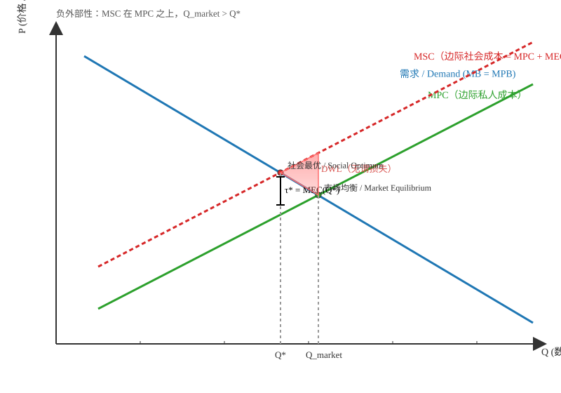

  # 外部性与社会成本 / Externalities and Social Costs

## 成本框架 / Cost Framework
- 社会成本 = 内部成本 + 外部成本；在边际层面表现为 $MSC = MPC + MEC$，若社会成本高于私人成本，则市场行为会忽视对旁观者的影响。  
  Social cost equals internal plus external cost; at the margin $MSC = MPC + MEC$. When social cost exceeds private cost, market actions overlook the impact on bystanders.
- 外部性指某项活动的部分成本或收益未由决策者承担，第三方被动受到影响。  
  An externality occurs when part of an activity’s costs or benefits is not borne by the decision makers, so third parties are involuntarily affected.

### 术语释义 / Term Definitions
- MSC（边际社会成本 / Marginal Social Cost）：多生产或消费一单位对整个社会造成的额外成本，包含私人成本与外部成本之和。  
  The extra cost to society of one more unit, equal to the sum of private and external costs.
- MPC（边际私人成本 / Marginal Private Cost）：由决策者（生产者或个体）自己直接承担的一单位额外成本，不包含对他人的外部影响。  
  The additional cost of one more unit borne directly by the decision maker (producer or individual), excluding effects on others.
- MEC（边际外部成本 / Marginal External Cost）：额外一单位活动对第三方造成的增量损害或成本；负外部性下 $MEC>0$，正外部性可对应“边际外部收益”（MEB$>0$）。  
  The incremental harm to third parties from one more unit; with negative externalities $MEC>0$, while positive externalities correspond to a marginal external benefit (MEB$>0$).

## 外部性类型 / Types of Externalities
- 负外部性呈现外部成本，如尾气污染、噪音、道路磨损等，导致社会承受的成本高于企业或个人自行承担的成本。  
  Negative externalities manifest as external costs—pollution, noise, road wear—so society bears more cost than firms or individuals internalize.
- 正外部性带来外部收益，如拼车平台提升出行便利、疫苗接种降低公共风险，社会收益高于个体自得收益。  
  Positive externalities create external benefits—ridesharing platforms improving mobility options, vaccinations reducing public risk—so social gains exceed private rewards.

## 驾车案例 / Driving Example
- 驾驶的内部成本包含燃油、维护、时间等自付支出；外部成本包括空气污染、温室气体、交通拥堵与道路损耗。  
  Driving’s internal costs cover fuel, upkeep, and time; external costs include air pollution, greenhouse emissions, congestion, and road damage.
- 若驾驶者被要求承担社会成本，边际出行成本上升，驾车频率会降低；市场自发产出通常高于社会最优水平。  
  If drivers must pay the social cost, marginal trip costs rise and driving frequency falls; laissez-faire output typically exceeds the social optimum.
- 社会最优要求设置边际私人成本 = 边际社会成本，从而把出行量压回最适水平，减轻第三方受损。  
  The social optimum equates marginal private cost with marginal social cost, trimming travel to the efficient level and relieving harm to third parties.

## 图形直觉 / Graph Intuition
- 负外部性下，边际社会成本曲线$MSC$位于边际私人成本$MPC$之上；市场均衡在$MPC$与需求（$MB$或$MPB$）相交的$Q_\mathrm{market}$，而社会最优在$MSC$与$MB$（若无消费外部性则$MSB=MPB$）相交的$Q^*$，因此$Q_\mathrm{market}>Q^*$。  
  With a negative externality, the marginal social cost $MSC$ lies above the marginal private cost $MPC$. The unregulated equilibrium is at $Q_\mathrm{market}$ where $MPC$ meets demand ($MB$ or $MPB$), while the social optimum $Q^*$ occurs where $MSC$ meets $MB$ (with no consumption externality, $MSB=MPB$). Hence $Q_\mathrm{market}>Q^*$.
- 以出租车/网约车为例：在未内生化外部成本时，均衡数量$Q_{\text{taxi}}$通常高于社会最优$Q^*$。  
  For taxis/ride-hailing, without internalizing external costs, the equilibrium quantity $Q_{\text{taxi}}$ typically exceeds the social optimum $Q^*$.

### 图示 / Figure

## 政策含义 / Policy Implications
- 政府可通过庇古税、拥堵费、排放许可或补贴等手段，让外部成本或收益计入个人决策，促使私人激励与社会目标一致。  
  Governments can rely on Pigovian taxes, congestion charges, tradable permits, or targeted subsidies so external costs or benefits enter private choices, aligning incentives with social goals.
- 关键在于将外部性“内生化”，即让决策者面对社会边际成本或收益，从而选择社会最优的活动规模。  
  The key is to internalize externalities—make decision makers face the social marginal cost or benefit—so they choose the socially optimal scale of activity.
- 案例：对进入城市中心的车辆征收拥堵费、对共享出行提供补贴或优先车道，以矫正负外部性并放大正外部性。  
  Example policies include charging congestion tolls for downtown trips, subsidizing shared rides, or granting priority lanes to correct negative externalities and amplify positive ones.
 - 最优单位税的标定思路：将税额设为在$Q^*$处的边际外部成本$MEC(Q^*)$，使$MPC+\text{tax}=MSC$，从而让私人选择与社会最优一致。  
   Calibrating a unit tax by setting it equal to the marginal external cost at $Q^*$, $MEC(Q^*)$, aligns $MPC+\text{tax}$ with $MSC$ so private choices match the social optimum.

## 网约车/出租车外部性 / Ride-hailing Externalities
- 负外部性：增加道路占用、加剧拥堵与路边停车外溢，空驶与接客巡航造成额外排放与噪音。  
  Negative externalities: added road occupancy, congestion, curb spillovers, and extra emissions/noise from cruising and deadheading.
- 正外部性：降低乘客与司机的匹配成本、缩短等待时间、补全“最后一公里”，提高出行可达性。  
  Positive externalities: reduced matching/waiting costs, improved last-mile connectivity, and better accessibility.
- 经验洞见：在拥堵高峰与密集核心区，净效应常表现为负外部性，故$Q_{\text{taxi}}>Q^*$更为常见。  
  Empirically, during peak congestion in dense cores, the net effect is often negative, making $Q_{\text{taxi}}>Q^*$ more common.

## 科斯定理与谈判 / Coase Theorem & Bargaining
- 科斯定理：若谈判无交易成本且产权界定清晰，相关各方可通过私下协商内生化外部性，达到有效配置。  
  Coase Theorem: With negligible transaction costs and well-defined property rights, parties can privately bargain to internalize externalities and reach efficiency.
- 例：两位室友其一吸烟、其二不吸；若吸烟权属于吸烟者，不吸烟者可补偿其到室外吸；若禁烟权属于不吸烟者，则吸烟者可支付以换取指定区域吸烟。  
  Example: Two roommates, one smokes and one does not. If the smoker holds the right to smoke, the non-smoker can pay for outdoor smoking; if the non-smoker holds the right, the smoker can compensate for designated smoking privileges.
- 多方污染情形（如城市空气污染）谈判成本过高、参与者众多且信息分散，难以达成科斯式协议，因此需要政府工具（税费、限排、可交易许可、动态定价停车表/收费车道等）。  
  For diffuse pollution with many parties, bargaining costs are high and information is fragmented, so Coasean bargains are impractical; policy tools (taxes/fees, caps and permits, dynamic parking meters, tolled/managed lanes) are required.

## 相关 / Related
- [[Economics/3.Demand_Supply_Market_Equilibrium/total_surplus]] · [[Economics/3.Demand_Supply_Market_Equilibrium/market_equilibrium]] · [[Economics/19.Taxes/tax_effects]] · [[Economics/1.Scope_and_Method/Positive_vs_Normative_Economics]]

## 来源与反链 / Sources & Backlinks
- 参考与整理基于课堂要点与当日卡片嵌入，已添加：[[journal/2025-11-03]]。  
  Compiled from lecture highlights and the day’s card embed; backlink added: [[journal/2025-11-03]].

[//begin]: # "Autogenerated link references for markdown compatibility"
[Economics/3.Demand_Supply_Market_Equilibrium/total_surplus]: ../3.Demand_Supply_Market_Equilibrium/total_surplus.md "总剩余 / Total Surplus"
[Economics/3.Demand_Supply_Market_Equilibrium/market_equilibrium]: ../3.Demand_Supply_Market_Equilibrium/market_equilibrium.md "市场均衡 / Market Equilibrium"
[Economics/19.Taxes/tax_effects]: ../19.Taxes/tax_effects.md "税收对供需曲线的影响 / The Impact of Taxes on Supply and Demand Curves"
[Economics/1.Scope_and_Method/Positive_vs_Normative_Economics]: ../1.Scope_and_Method/Positive_vs_Normative_Economics.md "实证经济学与规范经济学 / Positive vs Normative Economics"
[journal/2025-11-03]: ../../journal/2025-11-03.md "2025-11-03"
[//end]: # "Autogenerated link references"
