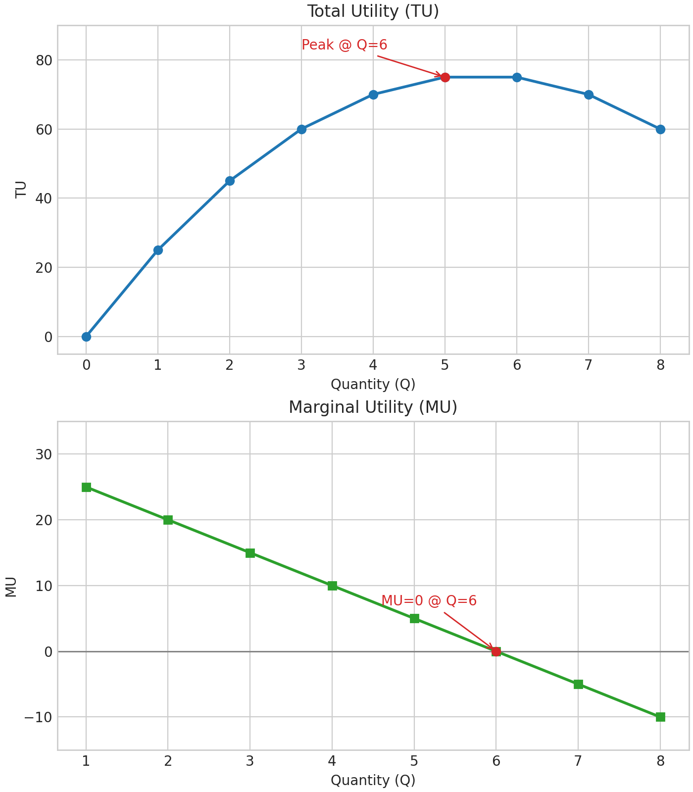

# 效用与消费者选择 / Utility and Consumer Choice

## 核心假设 / Core Assumptions
- 假设1：消费者选择效用最高的选项。  Consumers choose the alternative with the highest utility.
  - 例 / Example：若偏好 C 优于 A、B，则有 $U(C)>U(A)$ 且 $U(C)>U(B)$。  If C is preferred to A and B, then $U(C)>U(A)$ and $U(C)>U(B)$.
- 例（食物选择）/ Example (food choice)：A) 达美乐早餐披萨 / Domino’s breakfast pizza；B) 蝗虫拌面 / Grasshoppers & noodles；C) 高端牛排馆 / Premium steakhouse。若你选 C，则表示 $U(C)>U(A)$ 且 $U(C)>U(B)$。  Choosing C implies $U(C)>U(A)$ and $U(C)>U(B)$.
- 假设2：商品之间可替代，皆可赋予数值效用。  Goods are substitutable and receive numeric utilities.
  - 例（传家戒指）/ Example (heirloom ring)：若“不论多少钱都不卖”，等于视其不可替代，违背可替代性假设。  Saying “no price would make me sell” treats it as irreplaceable and violates substitutability.
- 假设3：信息不完备亦能做出最优可得选择。  With imperfect information, people choose their best feasible option.
- 假设4：多并非永远更好，存在边际效用递减。  More is not always better; diminishing marginal utility applies.

## 边际效用 MU / Marginal Utility
- 定义 / Definition：消费额外一单位商品所带来的额外满足。  The added satisfaction from one more unit.
- 公式 / Formula：$MU=\frac{\Delta TU}{\Delta Q}$。
- 说明 / Notes：效用难以度量，主要用于刻画偏好排序；边际效用对理解消费者行为尤为关键。  Utility measures preference ranking; MU is a workhorse concept.
- 思考（披萨）/ Prompt (pizza)：吃到第几片时，再来一片会产生负的边际效用？  After how many slices would the next slice yield negative MU?

## 例：布朗尼 / Brownies Example
| # of Brownies | Total Utility | Marginal Utility |
| :-- | :-- | :-- |
| 0 | 0 | — |
| 1 | 25 | 25 |
| 2 | 45 | 20 |
| 3 | 60 | 15 |
| 4 | 70 | 10 |
| 5 | 75 | 5 |
| 6 | 75 | 0 |
| 7 | 70 | -5 |
| 8 | 60 | -10 |

- 观察 / Observations：自第2块起 MU 递减；第6块处 $TU$ 达峰且 $MU=0$，其后 $MU<0$。  DMU appears early; $TU$ peaks at 6 where $MU=0$, then MU turns negative.

## 消费者目标 / Consumer Goal
- 以“每元带来效用”最大化为目标进行购买。  Purchase to maximize utility per dollar (bang for the buck).

## 效用最大化规则 / Utility Maximization Rule
1) 每元边际效用相等 / Equalize MU per dollar：$\dfrac{MU_x}{P_x}=\dfrac{MU_y}{P_y}$。
2) 支出不超预算 / Satisfy budget constraint：$P_x\cdot Q_x+P_y\cdot Q_y\leq \text{Budget}$。

## 预算与组合示例 / Budget and Choice Example
- 已知 / Given：披萨 $P_{pizza}=\$2$ 每片；百事可乐 $P_{pepsi}=\$1$ 每罐；预算 $\$8$。  Pizza $P_{pizza}=\$2$ per slice; Pepsi $P_{pepsi}=\$1$ per can; budget $\$8$.
- 规则 / Rule：选择使每元边际效用相等，且总支出等于预算。  Choose bundles where MU per dollar is equalized and total spending equals the budget.
- 图像 / Graph：横轴百事数量、纵轴披萨数量；预算线向下倾斜，表示权衡取舍；两种商品均呈边际效用递减，最优点通常为“分散购买”。  X-axis Pepsi, Y-axis Pizza; downward-sloping budget line; with DMU for both goods, optimum often involves splitting spending.

## 效用最大化示例 / Utility Maximization Example
- 设置 / Setup：披萨每片 $\$2$；百事每罐 $\$1$；预算 $\$8$。  Pizza $\$2$/slice; Pepsi $\$1$/can; budget $\$8$.
- 边际效用表 / MU table：左侧为百事，右侧为披萨；列出 MU 及每元边际效用。  Left is Pepsi, right is Pizza; MU and MU per dollar shown.

| Q Pepsi | MU Pepsi | MU/Price Pepsi | Q Pizza | MU Pizza | MU/Price Pizza |
| :--: | :--: | :--: | :--: | :--: | :--: |
| 1 | 9 | 9/1 = 9 | 1 | 20 | 20/2 = 10 |
| 2 | 8 | 8/1 = 8 | 2 | 16 | 16/2 = 8 |
| 3 | 7 | 7/1 = 7 | 3 | 12 | 12/2 = 6 |
| 4 | 6 | 6/1 = 6 | 4 | 8 | 8/2 = 4 |
| 5 | 5 | 5/1 = 5 | 5 | 4 | 4/2 = 2 |
| 6 | 4 | 4/1 = 4 | 6 | 0 | 0/2 = 0 |
| 7 | 3 | 3/1 = 3 | 7 | -4 | -4/2 = -2 |
| 8 | 2 | 2/1 = 2 | 8 | -8 | -8/2 = -4 |

- 购买顺序 / Purchase sequence：依照当前最高的“每元 MU”依次购买。  Buy in order of highest current MU per dollar.
  1) 买披萨一片 → 余 $6$。  Buy 1 slice of pizza → $6 left$.
  2) 买百事一罐 → 余 $5$。  Buy 1 can of Pepsi → $5 left$.
  3) 买披萨一片 → 余 $3$。  Buy another pizza slice → $3 left$.
  4) 买百事一罐 → 余 $2$。  Buy 1 Pepsi → $2 left$.
  5) 买百事一罐 → 余 $1$。  Buy 1 Pepsi → $1 left$.
  6) 买百事一罐 → 余 $0$。  Buy 1 Pepsi → $0 left$.

- 最优组合 / Optimal bundle：4 罐百事 + 2 片披萨。  4 cans of Pepsi + 2 slices of pizza.
- 备注 / Note：在离散选择下，$MU/P$ 不一定逐项严格相等，但在“尽量接近”时达到效用最大化。  With discrete units, $MU/P$ may not match exactly; near-equality suffices for utility maximization.

## 钻石与水的悖论 / Diamond–Water Paradox
- 问题 / Question：水对生命必不可少却便宜；钻石非必需却昂贵，为什么？  Water is essential yet cheap; diamonds are nonessential yet expensive — why?
- 解释 / Explanation：价格反映边际效用而非总效用；水极其充裕导致“最后一单位”的 MU 很低，钻石稀少使 MU 很高。  Prices reflect marginal, not total, utility; abundance lowers water’s MU, scarcity raises diamond’s MU.

| 项目 / Item | 水 / Water | 钻石 / Diamonds |
| :-- | :--: | :--: |
| 边际效用 MU / Marginal utility | 小 / Low | 大 / High |
| 总效用 TU / Total utility | 大 / High | 小 / Low |

- 关键点 / Key point：需求曲线建立在边际效用之上，体现边际效用递减。  Demand curves are grounded in marginal utility and diminishing MU.

## 回链 / Backlink
- 来源日记 / Source journal：[[journal/2025-11-08]]，[[journal/2025-11-11]]
- 卡片嵌入 / Card embed：card![[journal/2025-11-11]]

[//begin]: # "Autogenerated link references for markdown compatibility"
[//end]: # "Autogenerated link references"
