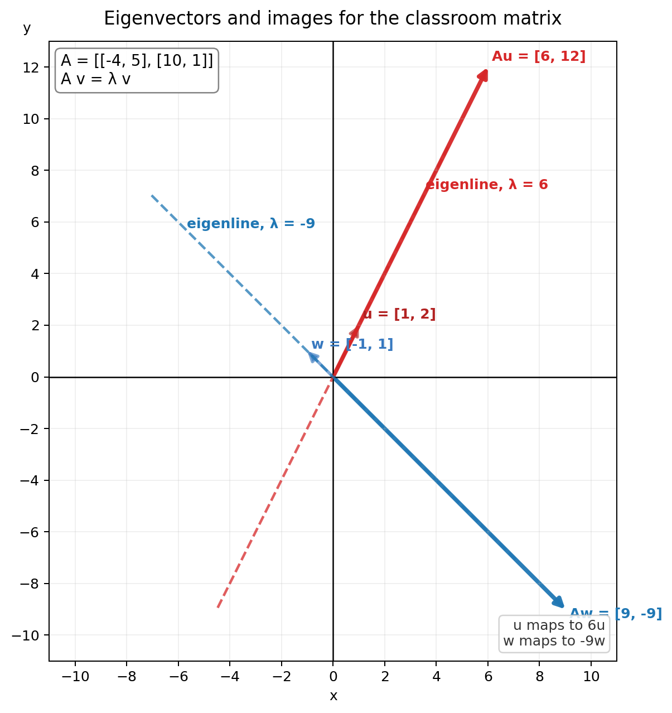

# 特征值、特征向量与特征子空间 / Eigenvalues, Eigenvectors, and Eigenspaces

## 定义与直观 / Definition and Intuition
- 如果非零向量$\vec{v}$满足$A\vec{v}=\lambda\vec{v}$，那么$\vec{v}$是矩阵$A$的特征向量（eigenvector），而$\lambda$是对应的特征值（eigenvalue）。  
  If a nonzero vector $\vec{v}$ satisfies $A\vec{v}=\lambda\vec{v}$, then $\vec{v}$ is an eigenvector of $A$, and $\lambda$ is the corresponding eigenvalue.
- 几何上，特征向量在矩阵变换后不会改变方向，只会被拉长、压缩，或在$\lambda<0$时翻到相反方向。  
  Geometrically, an eigenvector keeps its direction under the matrix transformation; it is only stretched, compressed, or flipped when $\lambda<0$.
- 判断一个向量是不是特征向量，最快的方法是计算$A\vec{v}$，再检查结果是否为$\vec{v}$的标量倍数。  
  The quickest test is to compute $A\vec{v}$ and check whether the result is a scalar multiple of $\vec{v}$.

## 代数框架 / Algebraic Framework
- 系统求特征值与特征向量时，从
  To compute eigenvalues and eigenvectors systematically, start from
  $$
  A\vec{v}=\lambda\vec{v}
  \iff
  (A-\lambda I)\vec{v}=\vec{0}.
  $$
- 因为我们要求的是非零解$\vec{v}\neq\vec{0}$，所以$A-\lambda I$必须不可逆，于是得到特征方程$\det(A-\lambda I)=0$。  
  Because we want a nonzero solution $\vec{v}\neq\vec{0}$, the matrix $A-\lambda I$ must be non-invertible, which leads to the characteristic equation $\det(A-\lambda I)=0$.
- 与特征值$\lambda$对应的特征子空间记作$E_\lambda(A)=Nul(A-\lambda I)$；它包含该方向上的所有特征向量以及零向量。  
  The eigenspace corresponding to $\lambda$ is written as $E_\lambda(A)=Nul(A-\lambda I)$; it contains all eigenvectors in that direction together with the zero vector.

## 课堂例题：一个$2\times2$矩阵 / Worked Example: A $2\times2$ Matrix
课堂例题使用矩阵
The class example used the matrix
$$
A=
\begin{bmatrix}
-4&5\\
10&1
\end{bmatrix},
$$
并测试三个向量
and tested three vectors
$$
\vec{u}=\begin{bmatrix}1\\2\end{bmatrix},\quad
\vec{v}=\begin{bmatrix}3\\1\end{bmatrix},\quad
\vec{w}=\begin{bmatrix}-1\\1\end{bmatrix}.
$$
- 计算可得$A\vec{u}=6\vec{u}$，所以$\vec{u}$是特征向量，对应特征值为$6$。  
  We compute $A\vec{u}=6\vec{u}$, so $\vec{u}$ is an eigenvector with eigenvalue $6$.
- 计算可得$A\vec{v}=\begin{bmatrix}-7\\31\end{bmatrix}$，它不是$\vec{v}$的倍数，所以$\vec{v}$不是特征向量。  
  We compute $A\vec{v}=\begin{bmatrix}-7\\31\end{bmatrix}$, which is not a multiple of $\vec{v}$, so $\vec{v}$ is not an eigenvector.
- 计算可得$A\vec{w}=-9\vec{w}$，所以$\vec{w}$也是特征向量，对应特征值为$-9$。  
  We compute $A\vec{w}=-9\vec{w}$, so $\vec{w}$ is also an eigenvector with eigenvalue $-9$.

这个例子对应两条经过原点的特征方向：$y=2x$对应特征值$6$，$y=-x$对应特征值$-9$。同一条特征线上的任意非零向量，经过$A$变换后仍留在这条线上。  
This example gives two eigendirections through the origin: $y=2x$ corresponds to eigenvalue $6$, and $y=-x$ corresponds to eigenvalue $-9$. Any nonzero vector on one of these lines stays on that line after applying $A$.

对这个矩阵，特征方程是
For this matrix, the characteristic equation is
$$
\det(A-\lambda I)
=
\begin{vmatrix}
-4-\lambda&5\\
10&1-\lambda
\end{vmatrix}
=
\lambda^2+3\lambda-54
=
(\lambda-6)(\lambda+9),
$$
因此特征值是$\lambda=6$与$\lambda=-9$。回代可得
so the eigenvalues are $\lambda=6$ and $\lambda=-9$. Substituting back gives
$$
E_6(A)=\operatorname{span}\!\left\{\begin{bmatrix}1\\2\end{bmatrix}\right\},\qquad
E_{-9}(A)=\operatorname{span}\!\left\{\begin{bmatrix}1\\-1\end{bmatrix}\right\}.
$$

## 补充例题：重根与特征平面 / Additional Example: Repeated Root and Eigenplane
再看一个$3\times3$矩阵
Now consider a $3\times3$ matrix
$$
B=
\begin{bmatrix}
0&-2&2\\
2&-4&2\\
4&-4&2
\end{bmatrix}.
$$
它的特征方程为
Its characteristic equation is
$$
\det(B-\lambda I)=-(\lambda-2)(\lambda+2)^2.
$$
因此特征值是$\lambda=2$与$\lambda=-2$，其中$\lambda=-2$的代数重数为$2$。  
Therefore the eigenvalues are $\lambda=2$ and $\lambda=-2$, and $\lambda=-2$ has algebraic multiplicity $2$.

回代求解得到
Substituting back gives
$$
E_2(B)=\operatorname{span}\!\left\{\begin{bmatrix}1\\1\\2\end{bmatrix}\right\},
$$
以及
and
$$
E_{-2}(B)=\operatorname{span}\!\left\{
\begin{bmatrix}1\\1\\0\end{bmatrix},
\begin{bmatrix}-1\\0\\1\end{bmatrix}
\right\}.
$$
这说明虽然$\lambda=-2$是重根，但它对应的特征子空间不是一条线，而是一个二维平面。  
This shows that even though $\lambda=-2$ is a repeated root, its eigenspace is not a line but a two-dimensional plane.

## 特征子空间维数与重数 / Eigenspace Dimension and Multiplicity
- 如果$\lambda$是矩阵$A$的一个特征值，那么对应特征子空间$E_\lambda(A)$的维数至少是$1$，但不会超过$\lambda$的代数重数。  
  If $\lambda$ is an eigenvalue of a matrix $A$, then the dimension of the corresponding eigenspace $E_\lambda(A)$ is at least $1$ but never larger than the algebraic multiplicity of $\lambda$.
- 写成公式就是
  In symbols,
  $$
  1\leq\dim(E_\lambda(A))\leq\operatorname{mult}(\lambda).
  $$
- 这里$\dim(E_\lambda(A))$叫几何重数（geometric multiplicity），而$\operatorname{mult}(\lambda)$叫代数重数（algebraic multiplicity）。  
  Here $\dim(E_\lambda(A))$ is the geometric multiplicity, while $\operatorname{mult}(\lambda)$ is the algebraic multiplicity.
- 在上面的矩阵$B$里，$\lambda=-2$的代数重数是$2$，而$\dim(E_{-2}(B))=2$，所以它对应一个 eigenplane；$\lambda=2$的代数重数与几何重数都为$1$，所以它对应一条 eigenline。  
  In the matrix $B$ above, the algebraic multiplicity of $\lambda=-2$ is $2$ and $\dim(E_{-2}(B))=2$, so it gives an eigenplane; for $\lambda=2$, both multiplicities are $1$, so it gives an eigenline.

## 补充性质 / Additional Properties
- 对上三角矩阵或下三角矩阵，特征值就是主对角线上的元素。  
  For an upper triangular or lower triangular matrix, the eigenvalues are exactly the diagonal entries.
- 矩阵$A$的行列式等于全部特征值之积，并且要把代数重数也算进去。  
  The determinant of $A$ equals the product of all eigenvalues, counting algebraic multiplicity.
- 如果$0$是$A$的特征值，那么$A$不可逆；等价地，$A$可逆当且仅当所有特征值都不等于$0$。  
  If $0$ is an eigenvalue of $A$, then $A$ is not invertible; equivalently, $A$ is invertible if and only if all eigenvalues are nonzero.
- 若$A\vec{v}=\lambda\vec{v}$，则对任意$n\geq1$都有
  If $A\vec{v}=\lambda\vec{v}$, then for any $n\geq1$,
  $$
  A^n\vec{v}=\lambda^n\vec{v}.
  $$
- 若$A$可逆且$\lambda\neq0$，则同一个特征向量对$A^{-1}$仍然有效，并满足
  If $A$ is invertible and $\lambda\neq0$, then the same eigenvector also works for $A^{-1}$ and satisfies
  $$
  A^{-1}\vec{v}=\frac{1}{\lambda}\vec{v}.
  $$

## 为什么这些结论重要 / Why These Results Matter
从计算角度看，如果一个矩阵有足够多的线性无关特征向量，那么求$A^n$会比直接连乘容易得多。  
From a computational point of view, if a matrix has enough linearly independent eigenvectors, then computing $A^n$ can be much easier than multiplying $A$ repeatedly.

从建模角度看，特征值常用来判断系统的稳定性与长期行为；绝对值最大的特征值往往主导“长时间以后会发生什么”。  
From a modeling point of view, eigenvalues are often used to analyze stability and long-term behavior; the eigenvalue with the largest absolute value often dominates what happens in the long run.

## 应用：应力张量与主应力 / Application: Stress Tensor and Principal Stresses
在线性代数的应用里，三维物体内部的应力常写成一个$3\times3$矩阵
In applications of linear algebra, the internal stress of a three-dimensional object is often written as a $3\times3$ matrix
$$
\Sigma=
\begin{bmatrix}
\sigma_{xx}&\sigma_{xy}&\sigma_{xz}\\
\sigma_{yx}&\sigma_{yy}&\sigma_{yz}\\
\sigma_{zx}&\sigma_{zy}&\sigma_{zz}
\end{bmatrix}.
$$
在静力平衡的常见情形下，这个矩阵通常是对称的，也就是$\sigma_{xy}=\sigma_{yx}$、$\sigma_{xz}=\sigma_{zx}$、$\sigma_{yz}=\sigma_{zy}$。  
In common static-equilibrium settings, this matrix is usually symmetric, meaning $\sigma_{xy}=\sigma_{yx}$, $\sigma_{xz}=\sigma_{zx}$, and $\sigma_{yz}=\sigma_{zy}$.

这时，$\Sigma$的特征值叫做主应力（principal stresses），对应的特征向量给出主方向（principal directions）。课堂例子使用了
In that setting, the eigenvalues of $\Sigma$ are called the principal stresses, and the corresponding eigenvectors give the principal directions. The class example used
$$
\Sigma=
\begin{bmatrix}
1.2&1.5&1.3\\
1.5&2.1&0.7\\
1.3&0.7&2.0
\end{bmatrix},
$$
并得到近似特征值$\lambda\approx4.11,\ 1.35,\ -0.16$。其中最大的特征值对应最主要的应力量级，约为$4.11\text{ Pa}$。  
and obtained approximate eigenvalues $\lambda\approx4.11,\ 1.35,\ -0.16$. The largest eigenvalue corresponds to the dominant stress scale, about $4.11\text{ Pa}$.

与最大特征值对应的特征向量大致沿着$\begin{bmatrix}1.17\\1.11\\1.00\end{bmatrix}$的方向，因此它给出了主要应力的作用方向。  
The eigenvector associated with the largest eigenvalue is approximately in the direction of $\begin{bmatrix}1.17\\1.11\\1.00\end{bmatrix}$, so it gives the direction of the dominant stress.

## 关联笔记 / Related Notes
- 零空间与解集 / Null spaces and solution sets: [[Math_Linear-Algebra/null_space_column_space_solution_sets]]
- 线性变换与标准矩阵 / Linear transformations and standard matrix: [[Math_Linear-Algebra/linear_transformations_standard_matrix]]
- 行列式与可逆性 / Determinants and invertibility: [[Math_Linear-Algebra/determinant_laplace_properties]]
- 矩阵求逆 / Matrix inverse: [[Math_Linear-Algebra/matrix_inverse_gauss_jordan]]

## 来源 / Source
- 来源 / Source: [[journal/2026-03-27]]

[//begin]: # "Autogenerated link references for markdown compatibility"
[//end]: # "Autogenerated link references"
