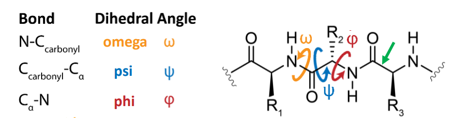
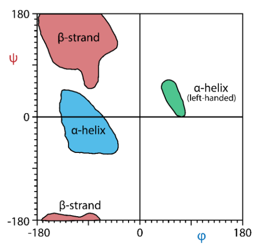

# 2025-10-14

## 讲座 22：蛋白质结构要点 / Lecture 22: Protein Structure Highlights
- 蛋白质序列自发折叠以降低能量；形状由氨基酸序列决定 / Proteins spontaneously fold to lower energy; shape determined by amino acid sequence.
- 四级层次：一级（线性序列）、二级（局部折叠，H 键稳定）、三级（整体三维折叠，侧链相互作用与疏水效应）、四级（多亚基相互作用） / Four levels: primary, secondary (H-bond stabilized), tertiary (side-chain interactions + hydrophobic effect), quaternary (multi-subunit interactions).
- 肽键具强偶极（约 3.7 D），比水更大；N–H 为良好氢键供体，C=O 氧为良好受体 / Peptide bond has strong dipole (~3.7 D), larger than water; N–H is a strong H-bond donor, carbonyl O a strong acceptor.
- 二级结构的本质是不同肽键之间的氢键网络 / Secondary structure arises from H-bonds between peptide bonds.
- 三级与四级结构本质上由与三级相同的作用力稳定（分子间作用力与疏水效应）/ Tertiary and quaternary structures are stabilized by similar forces (IMFs and hydrophobic effect).
(picture)[attachments/image.png]
- 相关链接 / Related: [[Chemistry/6.Intermolecular_Forces/intermolecular_forces]]
- 原始讲义 / Source handout: [[attachments/lecture_22_pla.pdf]]
 - 提炼为 / Extracted to：card![[Chemistry/7.Biological_Macromolecules/protein_structure_highlights]]

## 多肽链构象与二面角 / Polypeptide Conformation & Dihedral Angles
- 主题 / Topic: 多肽主链的三种可旋转键及其对应二面角描述构象；三维形状主要由 φ、ψ、ω 的取值决定 / Three rotatable backbone bonds and their dihedral angles describe conformation; 3D shape is governed by φ, ψ, and ω.

| 键类型 / Bond | 二面角 / Dihedral | 符号 / Symbol | 说明 / Note |
| --- | --- | --- | --- |
| N–C′(carbonyl) | omega | ω | 肽键平面之间的扭转角，通常约 180°（反式），顺式约 0° 罕见 / Torsion between peptide planes; typically ~180° (trans), cis ~0° is rare |
| C′–Cα | psi | ψ | 羰基碳与 α 碳之间的旋转角 / Rotation about C′–Cα |
| Cα–N | phi | φ | α 碳与氮之间的旋转角 / Rotation about Cα–N |

- 图示说明 / Diagram note:
  - φ（phi）在 N–Cα；ψ（psi）在 Cα–C′；ω（omega）在肽键 N–C′ / φ about N–Cα; ψ about Cα–C′; ω about peptide bond N–C′.
  - ω 受部分双键特性限制，近乎平面固定；主要构象变化来自 φ 与 ψ 的旋转 / ω is constrained by partial double-bond character; main variability comes from φ and ψ.

- 结论 / Takeaway: 多肽链可及构象空间主要由 φ、ψ 决定；ω 近似固定为反式，使主链呈准平面片段相连 / Accessible conformations are largely determined by φ and ψ; ω is near-fixed (trans), so the backbone is a chain of quasi-planar segments.
 - 提炼为 / Extracted to：card![[Chemistry/7.Biological_Macromolecules/polypeptide_dihedrals]]

## Ramachandran 图 / Ramachandran Plot
- 核心 / Essence: 多肽主链的原子存在空间位阻，只有某些 φ（Cα–N）与 ψ（Cα–C′）角度组合能避免原子冲突而稳定；这些被“允许”的区域在图中以色块显示 / Backbone atoms experience steric hindrance; only specific φ (Cα–N) and ψ (Cα–C′) angle combinations avoid clashes and are stable; allowed regions are shown as colored patches.

| 区域 / Region | 结构类型 / Structure | 特征 / Feature |
| --- | --- | --- |
| 左下（φ≈−60°, ψ≈−45°） | 右手 α-helix | 最常见的螺旋构象 / Most frequent helical conformation |
| 左上（φ≈−120°, ψ≈120°） | β-strand | β-折叠的基本单元 / Building block of β-sheets |
| 右上（φ≈60°, ψ≈60°） | 左手 α-helix | 较少见，常见于甘氨酸等灵活残基 / Rarer; enriched for flexible residues like glycine |

- 总结 / Summary: 横轴为 φ，纵轴为 ψ；彩色允许区对应能量较低、避免位阻冲突的构象，蛋白质的二级结构（α-helix 与 β-sheet）主要落在这些区域 / X-axis φ, Y-axis ψ; colored allowed regions correspond to low-energy, clash-free conformations; secondary structures (α-helix, β-sheet) reside within these regions.
 - 提炼为 / Extracted to：card![[Chemistry/7.Biological_Macromolecules/ramachandran_plot]]

# Economics

## 自然垄断 / Natural Monopoly

- 定义 / Definition: 当某一企业在相关产量范围内以低于多家企业的总成本供给全市场需求时，称为自然垄断；其成本函数在该范围内具“可加性不足”（次可加）/ A market is a natural monopoly if one firm can supply the entire demand at lower total cost than multiple firms; cost is subadditive over relevant output. 形式化 / Formal: 对任意拆分 $Q=q_1+q_2+\cdots$，有 $C(Q)<C(q_1)+C(q_2)+\cdots$；且平均成本随产量下降 / Average cost declines over the demand range.
- 成本结构 / Cost structure: 高固定成本、低边际成本（网络/基础设施行业常见）；典型地 $AC(Q)=F/Q+c$ 且在需求范围内递减 / High fixed costs and low marginal costs (networks/infrastructure); typically $AC(Q)=F/Q+c$ decreasing over the relevant demand.
- 福利与定价 / Welfare & pricing: 社会最优为 $P=MC$，但若 $AC>MC$ 则企业亏损；可用“边际成本定价+财政补贴 $S=(AC-MC)\cdot Q$”/ Efficient price is $P=MC$, but if $AC>MC$ the firm loses; use MC pricing plus subsidy $S=(AC-MC)\cdot Q$.
- 两部定价 / Two-part tariff: 令单位价 $p=MC$，并收取一次性接入费 $T$（约等于该价位下的消费者剩余）以实现收支平衡并尽量无扭曲 / Set $p=MC$ and an access fee $T$ (≈ consumer surplus at that price) to recover fixed costs with minimal distortion.
- 成本补偿定价 / Average-cost pricing: 令 $P=AC$ 可“收支平衡”，但 $P>MC$ 仍产生无谓损失 / Setting $P=AC$ breaks even but $P>MC$ creates deadweight loss.
- 监管框架 / Regulation: 传统“成本加成/收益率监管”易致过度资本化；“价格上限（RPI−X）”激励降本；多产品情形可用拉姆齐定价，满足 $(P_i-MC_i)/P_i\propto 1/|\varepsilon_i|$ / Rate-of-return risks overcapitalization; price-cap (RPI−X) encourages efficiency; for multiproducts, Ramsey pricing: $(P_i-MC_i)/P_i\propto 1/|\varepsilon_i|$.
- 比较 / Comparison: 无监管的自然垄断仍按 $MR=MC$ 定价，$P>MC$、产出低于有效规模，存在无谓损失 / Unregulated natural monopoly sets $MR=MC$, yields $P>MC$ and output below efficient level with DWL.
- 例子 / Examples: 自来水、燃气、电力输配、固定宽带本地环路、铁路轨道 / Water, gas, electricity distribution, local loop broadband, rail tracks.
- 相关 / Related：[[Economics/13.Monopoly_Antitrust/monopoly_characteristics]]；[[Economics/9.Long_Run_Costs/long_run_costs]]；[[Economics/Economics_Notes_Summary]]
- 提炼为 / Extracted to：card![[Economics/13.Monopoly_Antitrust/monopoly_characteristics]]

[//begin]: # "Autogenerated link references for markdown compatibility"
[Chemistry/6.Intermolecular_Forces/intermolecular_forces]: ../Chemistry/6.Intermolecular_Forces/intermolecular_forces.md "分子间作用力（IMFs）/ Intermolecular Forces (Lecture 19, CHEM 110B)"
[attachments/lecture_22_pla.pdf]: ../attachments/lecture_22_pla.pdf "lecture_22_pla.pdf"
[Chemistry/7.Biological_Macromolecules/protein_structure_highlights]: ../Chemistry/7.Biological_Macromolecules/protein_structure_highlights.md "蛋白质结构要点 / Protein Structure Highlights"
[Chemistry/7.Biological_Macromolecules/polypeptide_dihedrals]: ../Chemistry/7.Biological_Macromolecules/polypeptide_dihedrals.md "多肽链构象与二面角 / Polypeptide Conformation & Dihedral Angles"
[Chemistry/7.Biological_Macromolecules/ramachandran_plot]: ../Chemistry/7.Biological_Macromolecules/ramachandran_plot.md "Ramachandran 图 / Ramachandran Plot"
[Economics/13.Monopoly_Antitrust/monopoly_characteristics]: ../Economics/13.Monopoly_Antitrust/monopoly_characteristics.md "垄断特征 / Monopoly Characteristics"
[Economics/9.Long_Run_Costs/long_run_costs]: ../Economics/9.Long_Run_Costs/long_run_costs.md "长期成本 / Long-Run Costs"
[//end]: # "Autogenerated link references"
