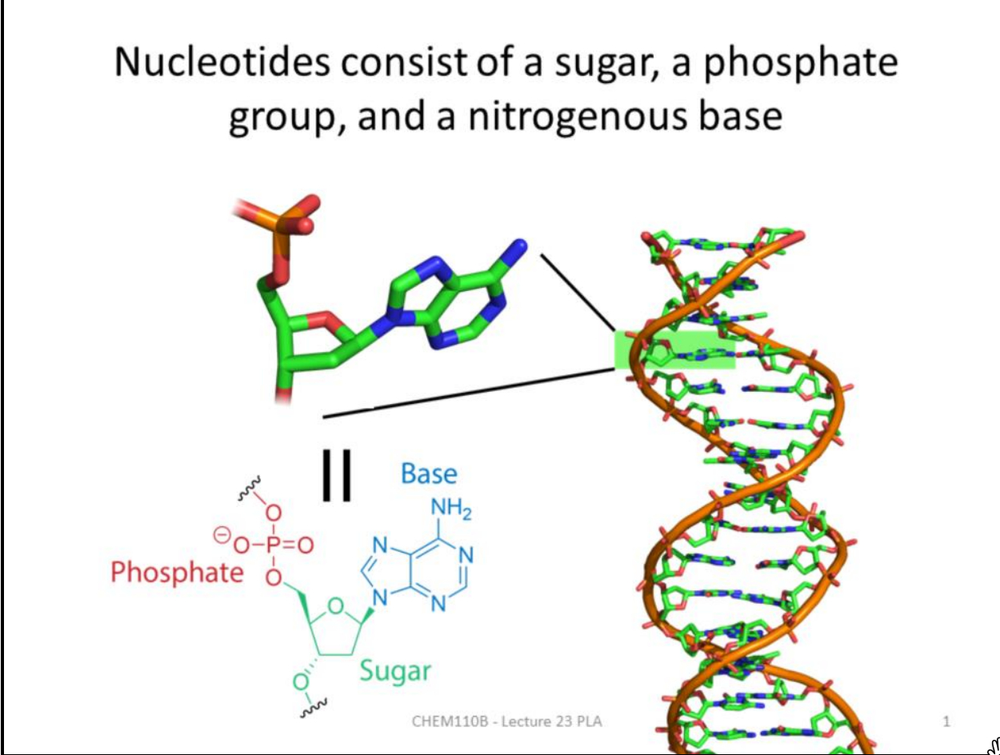
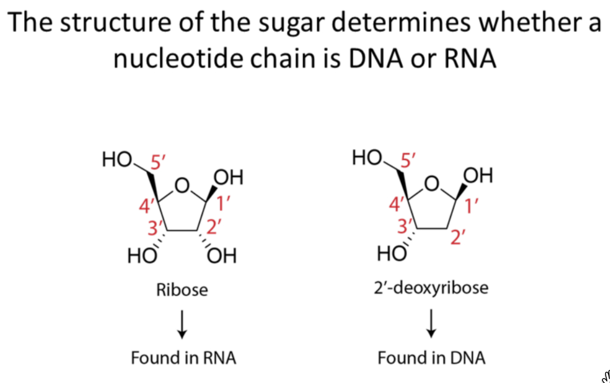
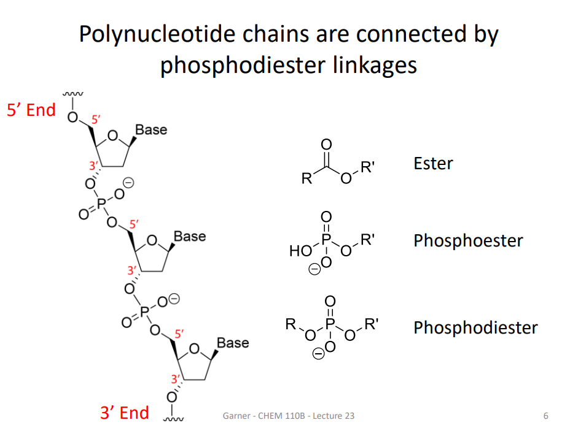
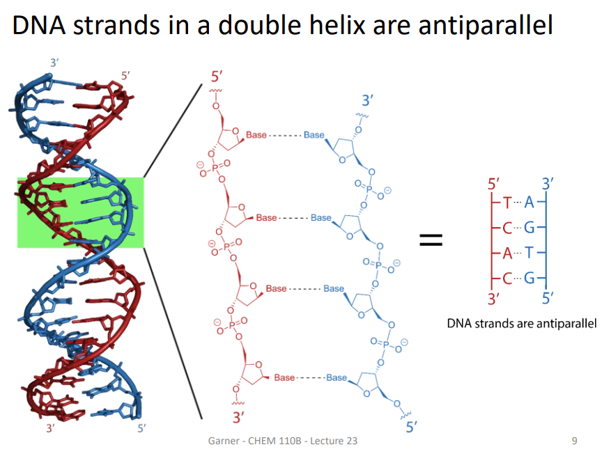

# 2025-10-17

## 核酸与核苷酸基础 / Nucleic Acids and Nucleotides

- 概念：核酸包括 DNA 与 RNA；名称来源于最早在细胞核中发现，骨架含磷酸基团呈酸性。/ Concept: Nucleic acids include DNA and RNA; named for initial discovery in nucleus, and the phosphate backbone is acidic.
- 单体：核苷酸由三部分构成：戊糖（糖）、磷酸基、含氮碱基；核酸的信息由单体顺序决定。/ Monomer: A nucleotide has three parts: a pentose sugar, a phosphate, and a nitrogenous base; information is encoded by monomer order.
- 骨架：糖-磷酸骨架基本不变，差异主要体现在碱基序列。/ Backbone: Sugar–phosphate backbone is invariant; variation lies in base sequence.
  

### DNA vs RNA 关键差异 / Key Differences Between DNA and RNA

- 糖的差异：RNA 为核糖（ribose），DNA 为 2'-脱氧核糖（2'-deoxyribose），即 2' 位无羟基而为氢。/ Sugar: RNA uses ribose; DNA uses 2'-deoxyribose (2' position H replaces OH).
- 链数差异：细胞中 DNA 通常双链，RNA 通常单链。/ Strandedness: Cellular DNA is typically double-stranded; RNA is single-stranded.
- 记号与方向：糖碳编号用撇号（1'–5'）；该编号用于描述多核苷酸链的方向性。/ Numbering and direction: Sugar carbons use primes (1'–5'), underpinning chain directionality.
  

### 含氮碱基 / Nitrogenous Bases

- 两大类：嘌呤（双环）与嘧啶（单环）。/ Two classes: purines (bicyclic) and pyrimidines (single ring).
- 嘌呤：腺嘌呤 A、鸟嘌呤 G；嘧啶：胞嘧啶 C、胸腺嘧啶 T、尿嘧啶 U（T 主要见于 DNA，U 主要见于 RNA）。/ Purines: adenine A, guanine G; Pyrimidines: cytosine C, thymine T, uracil U (T in DNA, U in RNA).
- 共轭芳香性：环上原子多为 sp2 杂化，平面结构有利于堆叠与配对。/ Aromaticity: ring atoms are mostly sp2 and planar, enabling stacking and pairing.

# Economics

## 寻租与垄断政策 / Rent Seeking and Monopoly Policy

- 寻租行为 / Rent seeking：企业为获得或维持市场保护（如垄断地位）而将资源用于游说、购买特权等非生产性用途，造成无谓损失与效率下降。/ Firms expend resources to obtain or maintain protection (e.g., monopoly) via lobbying and privilege-seeking, generating deadweight loss and lower efficiency.
- 例子 / Example：政治竞选与游说影响政策、维持垄断或贸易壁垒。/ Political campaigns and lobbying shape policy to sustain monopolies or trade barriers.

### 应对垄断 / How to Deal with Monopolies

- 重组 / Restructuring：将大型垄断企业拆分为多个实体以引入竞争（如 AT&T 拆分）。/ Break up large monopolists into multiple firms to increase competition (e.g., AT&T breakup).
- 防止并购 / Prevent mergers：审查并阻止可能显著减少竞争的并购。/ Review and block mergers that would substantially lessen competition.
- 降低贸易壁垒 / Reduce trade barriers：引入外部/外国竞争者以打破市场封闭性。/ Allow outside/foreign entrants to erode market protection.
- 价格管制 / Price controls：在必要时设定价格上限（如 Medicare 胰岛素 $35 封顶）；详见 / see: [[Economics/4.Market/price_controls]]. / Set price ceilings where appropriate (e.g., $35 insulin cap for Medicare); see: [[Economics/4.Market/price_controls]].

### 注意事项 / Notes

- 自然垄断的管制风险 / Risks in natural monopolies：对电力、水务等自然垄断实施过低的价格上限，可能削弱维护与投资激励，危及长期供给；参见 / see also：[[Economics/9.Monopoly/monopoly_characteristics]]. / For natural monopolies (utilities), overly low price caps can undercut maintenance and investment, harming long‑run supply; see also: [[Economics/9.Monopoly/monopoly_characteristics]].

### 价格上限图示 / Price Ceiling Diagram

- 图中要素 / Elements：需求 D、边际收益 MR、平均总成本 ATC、边际成本 MC；假定价格上限设在 MC。/ Demand D, marginal revenue MR, average total cost ATC, and marginal cost MC; suppose the price ceiling is set at MC.
- 方块一 / Box 1：标注为“PM”），位于较高价格处的长方形区域。/ Labeled “PM” (as on whiteboard), the upper rectangle near the higher price level.
- 方块二 / Box 2：标注为“Loss at Price Ceiling”，位于价格上限线附近的长方形区域。/ Labeled “Loss at Price Ceiling”, the rectangle around the price‑ceiling line.

## 反垄断政策 / Antitrust Policy

- 定义：政府制定法规以防止企业获得或滥用市场力量。/ Definition: Government rules to prevent firms from acquiring or abusing market power.
- 目的：抑制垄断与操纵行为，维护竞争与效率。/ Purpose: Deter monopoly and manipulation, preserve competition and efficiency.
- 一种选择：不作为（让市场自行调整），需权衡短期损失与长期动态效率。/ One option: Do nothing (let markets self-correct), weighing short‑run losses vs. long‑run dynamic efficiency.
- 参见 / See: [[Economics/9.Monopoly/antitrust_policy]].

## 价格歧视 / Price Discrimination

- 定义：同一产品向不同买家收取与成本无关的不同价格。/ Definition: Selling the same product at more than one price for reasons unrelated to cost.
- 目标：提取消费者剩余、扩大产出（相对单一价格垄断）、可能改善或恶化福利取决于情形。/ Goal: Extract consumer surplus and expand output (vs. single price monopoly); welfare effects vary by case.
- 参见 / See: [[Economics/9.Monopoly/price_discrimination]].

### 实施条件 / Conditions for Practice

- 买方差异 / Buyer heterogeneity：存在不同的需求弹性或支付意愿差异（elasticity of demand / willingness to pay）。/ Buyers differ in demand elasticities or willingness to pay.
- 防止转售 / No resale：企业能阻止顾客间的转售（resale）以维持价格差异。/ The firm can prevent resale among customers to sustain price differences.

