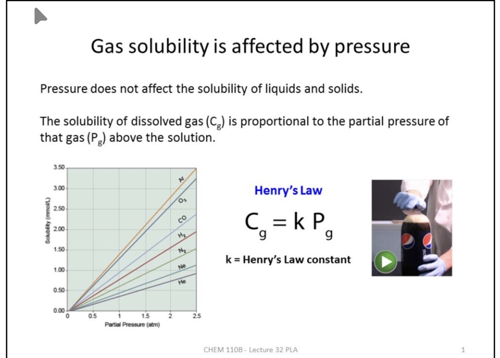

# 2025-11-08
# Chemistry
card![[solutions_and_solubility]]
## 亨利定律与气体溶解度 / Henry's Law & Gas Solubility
- 仅气体溶解度随外部压力显著变化，而液体与固体在常见范围内几乎不受影响。  Only dissolved gases respond strongly to pressure changes; liquids and solids are nearly pressure-independent.
- 亨利定律表述为 $C_g=kP_g$，其中 $C_g$ 为气体溶解度、$P_g$ 为气体分压、$k$ 为与溶剂间分子间作用力相关的常数。  Henry's law uses $C_g=kP_g$ where $k$ captures IMF strength between the gas and solvent.
- 强氢键或偶极作用的气体拥有更大的 $k$ 值，因此在相同分压下溶解更多；图像上体现为更陡的斜率。  Gases forming stronger IMFs with water have larger $k$ and steeper solubility–pressure slopes, so more dissolves at the same partial pressure.
- 碳酸饮料装瓶时在 1.5–2.0 atm 的 $\text{CO}_2$ 分压下达到高溶解度；开盖后分压骤降至近 0 atm，溶解度降低导致气泡逸出。  Soda stays saturated under 1.5–2.0 atm $\text{CO}_2$ headspace, but once opened the drop to ~0 atm drives supersaturation and bubbling.

- 要点来源：[[attachments/Lecture+32+PLA.pdf]]。  Source: [[attachments/Lecture+32+PLA.pdf]].
# Economics

- 已整理归档 / Filed to: [[Economics/6.Household_Behavior_Consumer_Choice/utility_and_consumer_choice]]

## 效用理论讲义笔记 / Utility Theory Lecture Notes

### 1. 核心假设 / Core Assumptions

- 假设1：消费者选择效用最高的选项。Consumers choose the alternative with the highest utility.
  - 例 / Example：若偏好 C 优于 A、B，则有 $U(C)>U(A)$ 且 $U(C)>U(B)$。If C is preferred to A and B, then $U(C)>U(A)$ and $U(C)>U(B)$.
  - 一组一致的效用赋值 / A consistent utility assignment：

| Option | Utility |
| :-- | :-- |
| A (Pizza) | 6 |
| B (Grasshoppers) | 1 |
| C (Steakhouse) | 30 |

- 假设2：商品之间可替代，皆可赋予数值效用。Goods are substitutable and receive numeric utilities.
  - 若认为“祖父遗物戒指不可售”，等于将其视为不可替代，违背此假设。If you would never sell a cherished ring at any price, you violate substitutability.

- 假设3：信息不完备亦能做出最优可得选择。With imperfect information, people choose their best feasible option.

- 假设4：多并非永远更好，存在边际效用递减。More is not always better; diminishing marginal utility (DMU) applies.

### 2. 边际效用 MU / Marginal Utility

- 定义 / Definition：消费额外一单位商品所带来的额外满足。The added satisfaction from one more unit.
- 公式 / Formula：

$$ MU=\frac{\Delta TU}{\Delta Q} $$

- 说明 / Notes：效用难以度量，主要用于刻画偏好排序；边际效用对理解消费者行为尤为关键。Utility measures preference ranking; MU is the workhorse concept.
- 思考 / Prompt：吃到第几片披萨后，下一片的边际效用为负？After how many slices does MU turn negative?

### 3. 例：布朗尼 / Brownies Example

| # of Brownies | Total Utility | Marginal Utility |
| :-- | :-- | :-- |
| 0 | 0 | — |
| 1 | 25 | 25 |
| 2 | 45 | 20 |
| 3 | 60 | 15 |
| 4 | 70 | 10 |
| 5 | 75 | 5 |
| 6 | 75 | 0 |
| 7 | 70 | -5 |
| 8 | 60 | -10 |

- 观察 / Observations：自第2块起 MU 递减；第6块处 $TU$ 达峰且 $MU=0$，其后 $MU<0$。DMU appears early; $TU$ peaks at 6 where $MU=0$, then MU turns negative.
- 图像 / Graph：$TU$ 先升后降；$MU$ 向下倾斜并在第6处过零。$TU$ rises then falls; $MU$ downward sloping, crossing zero at 6.

![[attachments/utility_brownies_tu_mu.png]]

### 4. 消费者目标 / Consumer Goal

- 以“每元带来效用”最大化为目标进行购买。Purchase to maximize utility per dollar (“bang for the buck”).

### 5. 效用最大化规则 / Utility Maximization Rule

1) 每元边际效用相等 / Equalize MU per dollar：

$$ \frac{MU_x}{P_x}=\frac{MU_y}{P_y} $$

2) 支出不超预算 / Satisfy budget constraint：

$$ P_x\cdot Q_x+P_y\cdot Q_y\leq \text{Budget} $$

- 例 / Example（Pizza & Pepsi）：$P_{pizza}=2$，$P_{pepsi}=1$，预算 $=8$。在两个商品均存在边际效用递减下，最优选择满足 $MU/P$ 相等且总支出为 8。With diminishing MU, choose a bundle where $MU/P$ is equalized and total spending equals 8.

### 6. 要点总结 / Key Takeaways

- 效用 Utility：偏好/满足的数值表征。Numerical representation of preference/satisfaction.
- 总效用 TU：消费所有单位获得的总满足。Total satisfaction from all units.
- 边际效用 MU：增加一单位带来的额外满足。Extra satisfaction from one more unit.
- 边际效用递减：消费越多，$MU$ 越低。As consumption increases, $MU$ falls.
- 最大化条件 / Maximization condition：

$$ \frac{MU_x}{P_x}=\frac{MU_y}{P_y} $$

且满足预算约束。Hold subject to the budget constraint.

[//begin]: # "Autogenerated link references for markdown compatibility"
[solutions_and_solubility]: ../Chemistry/9.Solutions/solutions_and_solubility.md "溶液与溶解度 / Solutions & Solubility"
[attachments/Lecture+32+PLA.pdf]: ../attachments/Lecture%2B32%2BPLA.pdf "Lecture+32+PLA.pdf"
[attachments/utility_brownies_tu_mu.png]: ../attachments/utility_brownies_tu_mu.png "utility_brownies_tu_mu.png"
[//end]: # "Autogenerated link references"
