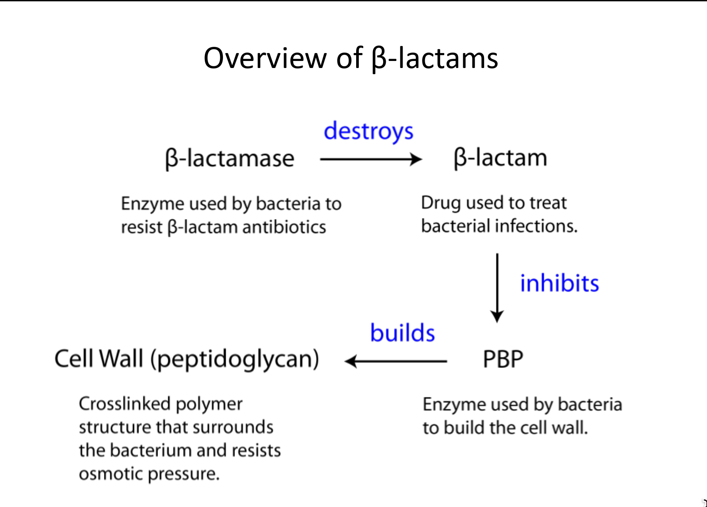
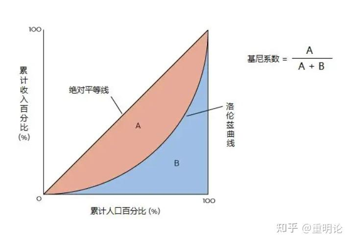

# 2025-12-03

# Chemistry

## β-内酰胺、β-内酰胺酶与 PBP 关系 / β-Lactams, β-Lactamase, and PBPs
- β-内酰胺酶作用（P2–3）：β-内酰胺酶利用水解开β-内酰胺环中的关键键，失活药物以保护细菌；β-lactamases hydrolyze the β-lactam ring with water, inactivating the drug and protecting bacteria.
- 进化关系（P2）：β-内酰胺酶与 PBP 序列和折叠相似，提示由 PBP 进化而来；β-lactamases share sequence and fold with PBPs, suggesting they evolved from PBPs.
- 活性位对比（P3）：PBP 位点常见 Lys、Ser；β-内酰胺酶位点含 Lys、Ser 及额外的催化 Glu，使其能释放水解产物并重复使用；PBP active sites use Lys and Ser, whereas β-lactamases add a catalytic Glu that enables product release and enzyme reuse.

## β-内酰胺机制与细菌对策 / How β-Lactams Work and Bacterial Counters
- 抑制机理（P4）：β-内酰胺抑制 PBP 催化的跨肽化，阻断细胞壁交联与合成；β-lactams inhibit PBP transpeptidation, blocking cell-wall crosslinking.
- 研发与耐药军备竞赛（P4–5）：科学家不断设计对 β-内酰胺酶更耐受的新药，但 β-内酰胺酶家族数量随时间指数级增长并持续进化拆解新药；New β-lactams are designed to resist β-lactamases, yet β-lactamase families have grown exponentially and keep evolving to destroy each generation.

## 万古霉素机理与区别 / Vancomycin Mechanism (Distinct from β-Lactams)
- 结构特征（P5）：万古霉素是大型复杂分子，含肽骨架与糖基，是“最后防线”抗生素之一；Vancomycin is a large, complex peptide with sugars, often a last-resort antibiotic.
- 作用机理（P6–7）：不直接抑制 PBP，而是通过多重氢键紧密结合肽聚糖前体的 D-Ala-D-Ala 末端，物理阻挡跨肽化，使细胞壁无法交联；It binds D-Ala-D-Ala on peptidoglycan precursors via multiple H-bonds, physically blocking transpeptidation rather than targeting PBPs.

## 万古霉素耐药获得方式 / Acquisition of Vancomycin Resistance
- 难度对比（P7）：β-内酰胺耐药通常仅需一条 β-内酰胺酶基因；万古霉素耐药需五条基因：两条传感基因检测药物，三条酶基因合成 D-Lac、切除末端 D-Ala 并加入 D-Lac，生成 D-Ala-D-Lac；β-lactam resistance may require one β-lactamase gene, whereas vancomycin resistance needs five genes (two sensors plus three enzymes to synthesize D-Lac, remove terminal D-Ala, and add D-Lac).
- 亲和力下降机制（P8）：D-Ala-D-Lac 使万古霉素失去关键氢键，结合亲和力大幅下降，无法再阻断跨肽化，细胞壁继续合成；Replacing D-Ala-D-Ala with D-Ala-D-Lac removes a key H-bond, sharply lowering vancomycin affinity so crosslinking proceeds.

## 考点速记 / Ultra-Condensed Exam Review
- β-内酰胺耐药：酶=β-内酰胺酶；动作=水解 β-内酰胺环；关键额外 Glu；家族快速扩张；Resistance: β-lactamase hydrolyzes the ring, catalytic Glu, rapidly expanding families.
- 万古霉素机理：多重氢键结合 D-Ala-D-Ala，物理阻断跨肽化；Vancomycin binds D-Ala-D-Ala via H-bonds to block transpeptidation.
- 万古霉素耐药（难）：需五基因将 D-Ala-D-Ala→D-Ala-D-Lac，失去关键氢键，结合显著降低；Hard resistance: five-gene cassette converts D-Ala-D-Ala to D-Ala-D-Lac, losing the key H-bond and binding potency.

# Economics
# Chapter 18
## 收入不平等性与基尼系数 / Income Inequality & Gini Coefficient
- 基尼系数定义：以洛伦兹曲线与完全平等线夹面积计算，$G=\dfrac{A}{A+B}=1-2\int_0^1 L(p)\,dp$，$G\to0$ 表示更平等，$G\to1$ 表示高度集中；Defined via the Lorenz curve: $$G=A/(A+B)=1-2\int_0^1 L(p)\,dp$$, with $G\to0$ meaning equality and $G\to1$ meaning high concentration.
- Also:
$$G = \frac{1}{n\mu} \sum_{i=1}^{n} (2i - n - 1)x_i$$
$$G = \frac{1}{2n^2\mu} \sum_{i=1}^{n} \sum_{j=1}^{n} |x_i - x_j|$$

- 度量要点：需明确税前/税后、个人/家庭与等价收入调整，否则跨国或跨期比较会失真；For measurement, specify pre/post-tax, individual vs household, and equivalence adjustments or comparisons will mislead.
- 变化解读：基尼下降可能源自底层收入提升，也可能是高收入受税负冲击，需要结合分位点收入与政策背景解读；A falling Gini may reflect rising lower incomes or tax hits to the top, so pair it with quantile incomes and policy context.
- 政策含义：累进税、现金转移和公共服务可压低基尼，但若扭曲劳动/投资激励，长期增长与可持续性需权衡；Progressive taxes, transfers, and public services can lower Gini, yet incentive distortions may affect growth and sustainability.
- 复习链接：详见 [[Economics/18.Income_Distribution_Poverty/income_distribution_overview]]；See [[Economics/18.Income_Distribution_Poverty/income_distribution_overview]] for a broader review.
