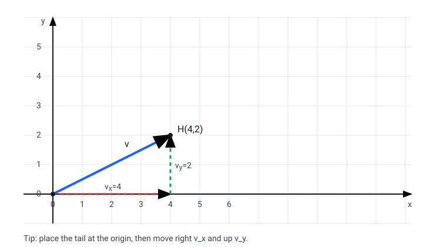

# 2026-01-16

# Math 141

## Differential Equations / 微分方程
### General Definition / 一般定义
微分方程（differential equation）是包含未知函数及其导数的方程。  
A differential equation is an equation involving an unknown function and its derivatives.

常见记号：$y'=\frac{dy}{dx}$，$y''=\frac{d^2y}{dx^2}$，或更一般的$\frac{\partial u}{\partial t}$等。  
Common notation: $y'=\frac{dy}{dx}$, $y''=\frac{d^2y}{dx^2}$, or more generally $\frac{\partial u}{\partial t}$.

### Examples / 例子
- $y'=3x^2$（一阶常微分方程）。  
  $y'=3x^2$ (a first-order ODE).
- $y''+y=0$（二阶常微分方程）。  
  $y''+y=0$ (a second-order ODE).
- $\frac{dy}{dx}=y(1-y)$（非线性）。  
  $\frac{dy}{dx}=y(1-y)$ (nonlinear).

### Order / 阶
方程中出现的最高阶导数称为微分方程的阶（order）。  
The highest derivative appearing in the equation is the order.

### Solution / 解
“解”通常是一族函数（通解 general solution），用常数参数描述；给定初值/边值后得到特解。  
A “solution” is often a family of functions (general solution) with constants; initial/boundary conditions pick out a particular solution.

相关预备知识：导数记号与基本法则见[[Math_Calculus/3.Derivatives/derivatives_basics]]与[[Math_Calculus/3.Derivatives/derivative_rules]]。  
Prereqs: derivative notation and rules in [[Math_Calculus/3.Derivatives/derivatives_basics]] and [[Math_Calculus/3.Derivatives/derivative_rules]].

### Two Common First-Order Types / 两类常见一阶方程
可分离变量（Separable）：若$\frac{dy}{dx}=g(x)h(y)$，则可写成$\frac{1}{h(y)}\,dy=g(x)\,dx$并两边积分。  
Separable: if $\frac{dy}{dx}=g(x)h(y)$, rewrite as $\frac{1}{h(y)}\,dy=g(x)\,dx$ and integrate both sides.

一阶线性（Linear 1st order）：标准形$y'+p(x)y=q(x)$；常用积分因子$\mu(x)=e^{\int p(x)\,dx}$化为$\big(\mu y\big)'=\mu q(x)$.  
Linear 1st order: standard form $y'+p(x)y=q(x)$; use integrating factor $\mu(x)=e^{\int p(x)\,dx}$ so $\big(\mu y\big)'=\mu q(x)$.

### Geometry Intuition / 几何直觉
把$y'=f(x,y)$看作“斜率场”：在每个点$(x,y)$给出切线斜率，解曲线沿着这些小线段走。  
View $y'=f(x,y)$ as a “slope field”: each point $(x,y)$ has a tangent slope, and solution curves follow these segments.

# Physics / 物理

## Vector vs. Scalar / 矢量 vs. 标量
**标量（scalar）**：只有大小（magnitude），没有方向；可用一个实数描述。  
**Scalar**: has magnitude only (no direction); described by a single real number.

例子：质量$m$、时间$t$、温度$T$、能量$E$。  
Examples: mass $m$, time $t$, temperature $T$, energy $E$.

**矢量/向量（vector）**：既有大小也有方向；常写作$\vec{v}$或粗体$\mathbf{v}$。  
**Vector**: has both magnitude and direction; often written as $\vec{v}$ or bold $\mathbf{v}$.

例子：位移$\vec{r}$、速度$\vec{v}$、加速度$\vec{a}$、力$\vec{F}$。  
Examples: displacement $\vec{r}$, velocity $\vec{v}$, acceleration $\vec{a}$, force $\vec{F}$.

常见运算：向量加法、数乘；点积$\vec{a}\cdot\vec{b}$给出标量，叉积$\vec{a}\times\vec{b}$（三维）给出矢量。  
Common operations: vector addition and scalar multiplication; dot product $\vec{a}\cdot\vec{b}$ yields a scalar, cross product $\vec{a}\times\vec{b}$ (in 3D) yields a vector.

### Graphing a Vector / 矢量的作图

在二维平面中，把$\vec{v}=\langle v_x,v_y\rangle$画成“有向线段”：从原点$O(0,0)$出发，先沿$x$方向走$v_x$，再沿$y$方向走$v_y$，终点就是向量的“头”（head）。  
In 2D, graph $\vec{v}=\langle v_x,v_y\rangle$ as a directed segment: start at the origin $O(0,0)$, move $v_x$ along $x$ and $v_y$ along $y$; the endpoint is the vector’s head.

同一矢量可以平移到任意位置（只要大小与方向不变）；做向量加法时常用“首尾相接”（head-to-tail）来画$\vec{a}+\vec{b}$。  
The same vector can be translated anywhere (as long as magnitude and direction stay the same); for addition, use the head-to-tail method to sketch $\vec{a}+\vec{b}$.

# Meth 220
